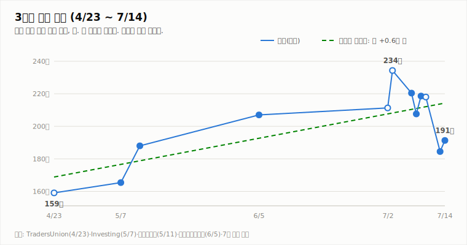
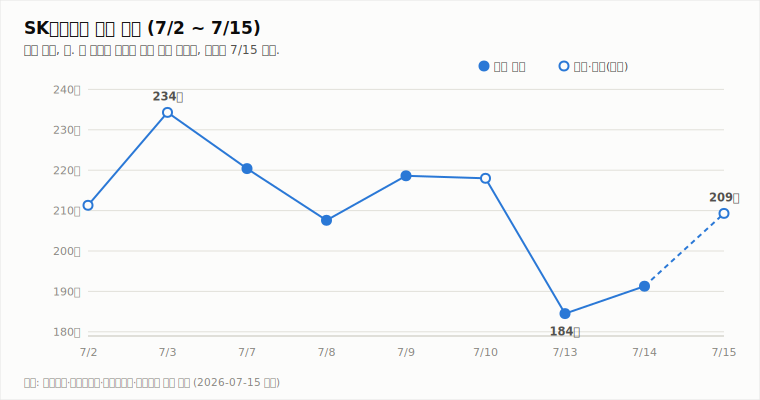
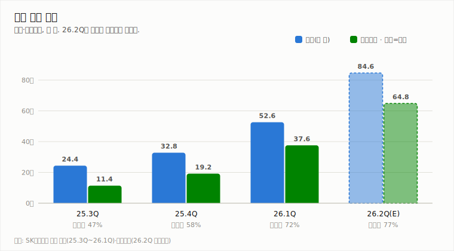
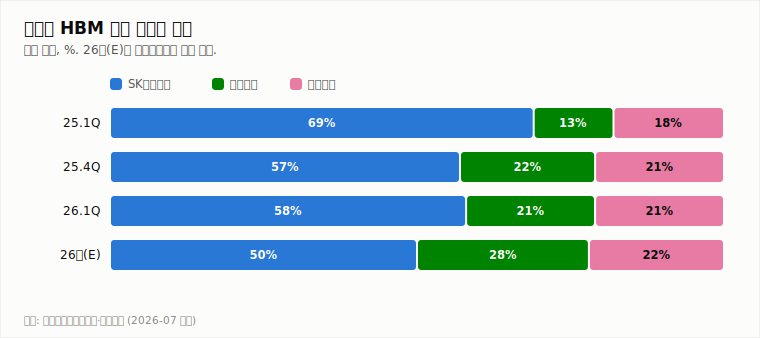
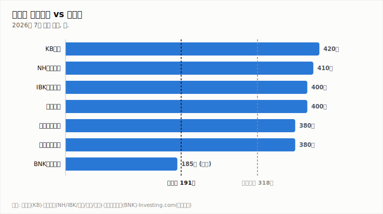

# SK하이닉스 (000660.KS)

## AI 메모리 슈퍼사이클 위 조정 — 펀더멘털과 수급의 괴리

**Company Report | 반도체/메모리 | 2026-07-15**

| 투자의견 | 현재가 (7/14 종가) | 컨센서스 목표주가 | 상승여력 | 차기 촉매 |
|:---:|:---:|:---:|:---:|:---:|
| **매수** | ₩1,913,000 | ₩3,175,529 (37개사) | **+66.0%** | 7/29 2Q 실적 발표 |

> 작성 시점: 2026-07-15 10:15 KST (11:00 갱신) · 본 자료는 정보 제공 목적이며 투자 권유가 아닙니다.

---

## 1. 투자 요약 (Investment Summary)

- **업황은 유례없는 강세.** 6월 D램 모듈 단가 +11%, HBM 단가 +12%, D램 수출액 +51% MoM. 메모리 공급 부족이 최소 2028년까지 지속된다는 전망(바클레이스·KB증권)이 확산되고 있습니다.
- **실적은 분기마다 신기록.** 1분기 영업이익 37.6조 원(이익률 72%)에 이어 2분기 컨센서스는 매출 84.6조 원, 영업이익 64.8조 원(이익률 77%)의 사상 최대치입니다.
- **주가만 흔들렸다.** 나스닥 상장(7/10) 전후 신주 발행·차익 실현 수급 부담으로 7/13 하루 -15.4% 급락했으나, 바클레이스 목표가 $330 제시에 ADR이 27% 폭등하며 7/15 국내 주가도 8%대 반등 중입니다.
- **결론: 매수 의견.** 펀더멘털 대비 과도한 수급성 조정으로 판단합니다. 단, 변동성이 극단적이므로 분할 접근이 합리적입니다.

### 핵심 지표

| 구분 | 값 | 기준·출처 |
|---|---|---|
| 종가 | ₩1,913,000 (+3.69%) | 7/14, 한국경제 |
| 주간 등락 | 약 -18% (7/3 고점 대비) | 역산 포함, 보도 종합 |
| 2Q26 컨센서스 | 매출 84.6조 / 영업이익 64.8조 원 | 중부매일 |
| HBM 점유율 | 58% (26.1Q 매출 기준, 1위) | 카운터포인트 |
| 52주 최고/최저 · 시총 · PER | 확인 불가 | 신주 발행으로 주식 수 변동 가능성 |

---

## 2. 주가 동향

3개월 시계열로 보면 1분기 실적 발표일(4/23) 급등을 기점으로 일평균 약 +0.6만 원의 우상향 추세가 이어져 왔고, 7월 중순 급락 후에도 주가는 추세선 부근에 머물러 있습니다.

7월 첫 2주는 **업황 호재와 수급 악재가 정면충돌한 구간**입니다. 7/3 급등(+10.9%)으로 234만 원을 찍은 뒤, 나스닥 상장을 전후한 차익 실현과 신주 발행 부담으로 7/13 하루에만 -15.4% 급락(184.5만 원)했습니다. 7/14 반등(+3.7%)에 이어 7/15는 바클레이스 리포트발 ADR 급등(+27%)을 따라 장중 8%대 상승 중입니다.

| 날짜 | 7/2* | 7/3* | 7/7 | 7/8 | 7/9 | 7/10* | 7/13 | 7/14 | 7/15(장중) |
|---|---|---|---|---|---|---|---|---|---|
| 종가(만 원) | 211.3 | 234.3 | 220.4 | 207.6 | 218.6 | 218.0 | 184.5 | 191.3 | 209.3 |

*표시는 등락률 보도 기반 역산치. 7/15는 14:51 KST 장중 (야후 파이낸스).

**전일(7/14) 상세 시세** (출처: 야후 파이낸스)

| 시가 | 고가 | 저가 | 종가 | 등락 | 거래량 |
|---|---|---|---|---|---|
| ₩1,825,000 | ₩1,936,000 | ₩1,678,000 | ₩1,913,000 | +3.69% | 10,447,011주 |

전일은 장중 저가 167.8만 원까지 밀렸다가 종가를 191.3만 원까지 끌어올린 변동폭 15%의 극단적 장세였으며, 저점 대비 종가 반등폭(+14%)은 매수세 유입 신호로 해석됩니다.

---

## 3. 최신 뉴스 Top 5

1. **뉴욕 ADR 27% 폭등, 국내 주가 8%대 반등 (7/15)** 🟢 — 바클레이스가 메모리 공급 부족 장기화를 근거로 목표주가 $330(직전 종가 대비 +117%)를 제시하며 급반등 촉발 ([서울경제](https://www.sedaily.com/article/20067839))
2. **2분기 실적 발표 7/29 예정 — 사상 최대 전망** 🟢 — 컨센서스 매출 84.6조 원, 영업이익 64.8조 원(이익률 76~77%) ([중부매일](https://www.jbnews.com/news/articleView.html?idxno=1507136), [허핑턴포스트](https://www.huffingtonpost.kr/article/258190))
3. **KB증권 "주가 하락은 매수 기회", 목표가 420만 원 유지 (7/15)** 🟢 — AI 데이터센터 투자 확대로 메모리 공급 부족 최소 2028년까지 지속 전망 ([이데일리](https://edaily.co.kr/News/Read?mediaCodeNo=257&newsId=02469846645514848))
4. **나스닥 공식 상장(7/10), SOX 편입 예상** ⚪ — 글로벌 수급 저변 확대 기대와 신주 발행·차익 실현 부담 병존 ([TradingKey](https://www.tradingkey.com/kr/analysis/stocks/us-stocks/262014488-stock-skhynix-adr-ipo-meta-ai-hbm-sox-tradingkey))
5. **한국투자증권 "2분기 실적 컨센서스 하회 전망" (7/14)** 🔴 — 목표가 380만 원 유지. 현대차증권도 전망 하향 속 매수 유지 ([이투데이](https://www.etoday.co.kr/news/view/2602859), [파이낸셜뉴스](https://www.fnnews.com/news/202607141009380799))

---

## 4. 실적 분석

세 분기 연속 사상 최대 실적 경신 중이며 기울기가 가팔라지고 있습니다. 25.3Q → 26.1Q 사이 매출은 2.2배, 영업이익은 3.3배로 늘었고 영업이익률은 47% → 72%로 확대됐습니다. HBM·고용량 서버 D램·eSSD 등 고부가 제품 믹스가 이익률 개선을 견인했습니다 ([SK하이닉스 1Q 실적 발표](https://news.skhynix.co.kr/q1-2026-business-results/)).

2분기 컨센서스(매출 84.6조, 영업이익 64.8조)가 현실화되면 **분기 영업이익률 77%**라는 제조업에서 전례 드문 수익성에 도달합니다. 다만 한국투자증권 등 일부는 컨센서스 하회를 전망하고 있어(뉴스 5), 7/29 발표치와 3분기 가이던스가 단기 주가의 최대 분기점입니다.

---

## 5. 산업 동향 — HBM 경쟁 구도

- **가격**: 6월 D램 모듈 단가 +11%, HBM 단가 +12%. HBM·서버 D램·eSSD 수급 부족은 단기 해소가 어려워 상승 사이클 장기화 전망 ([EBN](https://kr.investing.com/news/stock-market-news/article-1990546))
- **수요**: AI 학습·추론 확대 시 GPU보다 HBM이 먼저 병목이 되는 구조. 2026년 HBM 시장 규모는 $54B 이상 전망
- **경쟁**: SK하이닉스 점유율은 25.1Q 69% → 26.1Q 58%로 하락 추세이며, 2026년 연간 50%(삼성 28%, 마이크론 22%) 전망 — 독주 프리미엄은 점진적으로 축소 ([카운터포인트](https://korea.counterpointresearch.com/global-dram-and-hbm-market-share-quarterly/), [포쓰저널](https://www.4th.kr/news/articleView.html?idxno=2107631))
- **차세대**: 하반기 HBM4 납품 가시화, HBM3E 12단 대비 10%대 중반 가격 프리미엄 추정 ([SK hynix Newsroom](https://news.skhynix.co.kr/2026-market-outlook/))

---

## 6. 밸류에이션 — 증권사 목표주가

국내 주요 증권사는 매수 의견 일색(37개사 중 35개사 매수)이나 목표가 스펙트럼이 185만~420만 원으로 **2.3배** 벌어져 있습니다. 강세론(KB·바클레이스)은 2028년까지의 공급 부족을, 신중론(BNK)은 HBM 공급 과잉 가능성을 근거로 합니다. 컨센서스 317.5만 원 기준 상승여력은 +66%입니다 ([Investing.com](https://www.investing.com/equities/sk-hynix-inc-consensus-estimates), [인베스트조선](https://www.investchosun.com/site/data/html_dir/2026/07/09/2026070980118.html)).

---

## 7. Bull vs Bear

| 🟢 투자 포인트 (Bull) | 🔴 리스크 요인 (Bear) |
|---|---|
| HBM 점유율 1위(58%) + 단가 상승 지속 | 나스닥 상장 신주 발행·차익 실현 수급 부담 |
| 2Q 사상 최대 실적 전망 (이익률 77%) | 2Q 컨센서스 하회 전망 일부 존재 (한투 등) |
| 공급 부족 2028년까지 장기화 전망 | HBM 공급 과잉 우려 + 점유율 하락 추세 (69%→50%E) |
| 나스닥 상장·SOX 편입발 글로벌 수급 유입 | 일 ±10%를 넘나드는 극단적 변동성 |

---

## 8. 투자 판단

**의견: 매수** (변동성 대응 위해 분할 접근 권장)

- **근거 1 — 업황**: 메모리 공급 부족의 2028년 장기화 전망(뉴스 1·3)에 D램·HBM 단가와 수출액 급등이 실측되고 있어(§5), 펀더멘털 방향이 뚜렷한 상승입니다.
- **근거 2 — 실적**: 세 분기 연속 신기록에 이어 2Q 사상 최대 실적이 예상돼(§4), 최근 조정의 논리를 실적이 반박하는 구도입니다.
- **근거 3 — 수급 전환**: 상장 후 차익 실현으로 눌렸던 수급이 ADR +27% 급등(뉴스 1)으로 전환 신호를 보였고, 컨센서스 대비 괴리(+66%)도 큽니다.
- **판단을 바꿀 조건**: ① 7/29 실적이 컨센서스를 크게 하회하거나 3Q 가이던스 부진 시 → 중립 하향 검토. ② HBM 가격 하락 전환·재고 급증 등 공급 과잉의 실측 근거 확인 시 → 중립 이하 하향 검토.

---

*본 자료는 공개 보도·자료를 종합해 작성한 정보 제공 목적의 리포트이며 투자 권유가 아닙니다. 수치는 조사 시점 기준이며 오류가 있을 수 있습니다. 투자 판단과 책임은 투자자 본인에게 있습니다.*
