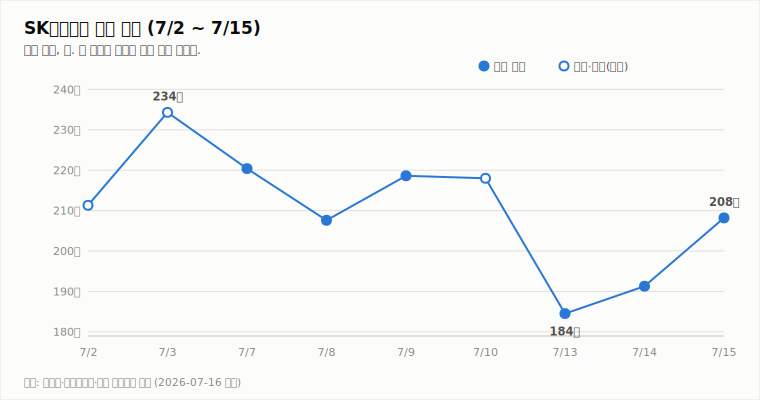
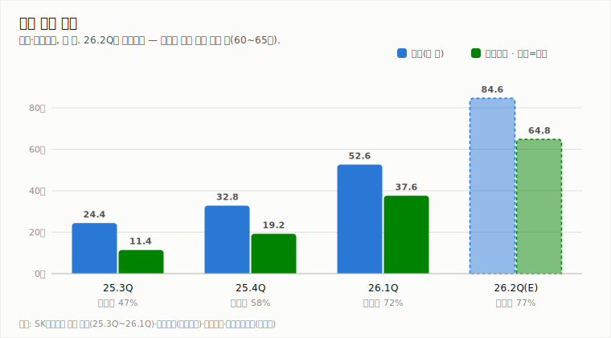
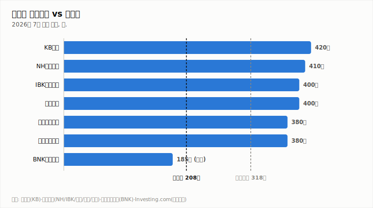

# SK하이닉스 (000660.KS)

## V자 반등 이틀째, 매수 사이드카까지 — 공은 7/29 실적으로

**Company Report | 반도체/메모리 | 2026-07-16**

| 투자의견 | 현재가 (7/15 종가) | 컨센서스 목표주가 | 상승여력 | 차기 촉매 |
|:---:|:---:|:---:|:---:|:---:|
| **매수** | ₩2,082,000 | ₩3,175,529 (37개사) | **+52.5%** | 7/29 2Q 실적 발표 |

> 작성 시점: 2026-07-16 09:10 KST · 본 자료는 정보 제공 목적이며 투자 권유가 아닙니다.

---

## 1. 투자 요약 (Investment Summary)

- **수급이 돌아섰다.** 바클레이스 리포트(ADR 목표가 $330)발 훈풍에 ADR +27.3%, 국내 주가는 장 초반 +12%(매수 사이드카 발동) 후 +8.83%로 마감. 7/13 급락(-15.4%) 저점 대비 이틀간 +12.8%의 V자 반등입니다.
- **업황 전망은 더 강해졌다.** 바클레이스는 메모리 공급 부족이 2027년 더 심화되고 2028년에도 해소 폭이 제한적이라고 전망 — 국내 강세론(KB증권 목표가 420만 유지)과 같은 방향입니다.
- **단, 2분기 눈높이는 내려가는 중.** 미래에셋 영업이익 전망 -12%(62.3조), 한국투자 60.4조(컨센서스 65조 대비 -8%). 증권가는 "최근 급락에 선반영됐다"고 평가합니다.
- **결론: 매수 유지.** 반등의 지속성은 7/29 실적 발표에서 하향된 눈높이를 실제 실적이 방어하는지에 달렸습니다. 변동성(ATR 11.4%)이 극단적이라 분할 접근을 유지합니다.

### 핵심 지표

| 구분 | 값 | 기준·출처 |
|---|---|---|
| 종가 | ₩2,082,000 (+8.83%) | 7/15, [뉴스핌](https://www.newspim.com/news/view/20260715001192) |
| 저점 대비 반등 | +12.8% (7/13 종가 184.5만 →) | 야후 파이낸스 |
| 2Q26 컨센서스 | 매출 84.6조 / 영업이익 60~65조 원 (하향 진행) | [아주경제](https://www.ajunews.com/view/20260714091656781) |
| HBM 점유율 | 58% (26.1Q 매출 기준, 1위) | 카운터포인트 |
| 52주 최고/최저 · 시총 · PER | 확인 불가 | 신주 발행으로 주식 수 변동 가능성 |

---

## 2. 주가 동향

3개월 큰 그림은 웹 리포트의 일봉 캔들차트(야후 실데이터) 기준으로, 4월 이후 강한 상승 사이클이 이어지다 **6월 말 고점(298만 원 부근) 대비 -30%대 급조정** 후 반등 중인 구도입니다 ([헤럴드경제](https://biz.heraldcorp.com/article/10809393): "3주새 298만→167만→213만원"). 종전 리포트의 뉴스 앵커 기반 3개월 추세선 차트는 6월 말 고점 구간을 반영하지 못해 오늘부터 실데이터 캔들차트로 대체했습니다.

| 날짜 | 7/2* | 7/3* | 7/7 | 7/8 | 7/9 | 7/10* | 7/13 | 7/14 | 7/15 |
|---|---|---|---|---|---|---|---|---|---|
| 종가(만 원) | 211.3 | 234.3 | 220.4 | 207.6 | 218.6 | 218.0 | 184.5 | 191.3 | 208.2 |

*표시는 등락률 보도 기반 역산치.

**전일(7/15) 상세 시세** (출처: 야후 파이낸스)

| 시가 | 고가 | 저가 | 종가 | 등락 | 거래량 |
|---|---|---|---|---|---|
| ₩2,120,000 | ₩2,171,000 | ₩2,070,000 | ₩2,082,000 | +8.83% | 6,591,561주 |

갭 상승 출발(시가 +10.8%) 후 장중 고가 217.1만을 찍고 상승분 일부를 반납하며 마감 — 강한 반등이지만 위꼬리가 길어 차익 매물도 여전함을 보여줍니다.

**기술적 지표** (7/15 종가 기준, 일봉)

| 지표 | 값 | 해석 |
|---|---|---|
| MACD (12,26,9) | -6.1만 / 시그널 2.2만 | 하락 모멘텀 잔존 (급락 여파) |
| ATR (14) | 23.8만 (11.4%) | 변동성 매우 큼 |
| ADX/DMI (14) | ADX 27.2 · -DI 32.7 우위 | 추세 강함, 방향 전환은 미확인 |
| KDJ (9,3,3) | K 28.7 · D 22.7 | 중립 구간, K>D 단기 상승 우위 |
| 거래량/20일 이평 | 659만 주 (1.0배) | 평균 수준 |

---

## 3. 최신 뉴스 Top 5

1. **장 초반 +12% 급등, 매수 사이드카 발동 — 종가 +8.83% (7/15)** 🟢 — ADR +27.3% 훈풍에 코스피도 7300선 회복. 7/13 급락의 V자 회복 ([이지경제](https://www.ezyeconomy.com/news/articleView.html?idxno=237546), [서울경제](https://www.sedaily.com/article/20067903), [이투데이](https://www.etoday.co.kr/news/view/2603915))
2. **바클레이스, ADR 목표가 $330 제시 (직전가 대비 +117%)** 🟢 — 메모리 공급 부족이 2027년 심화, 2028년에도 해소 제한 전망. 이번 반등의 방아쇠 ([서울경제](https://www.sedaily.com/article/20067839))
3. **증권가, 2분기 영업이익 눈높이 하향** 🔴 — 미래에셋 70.7→62.3조(-12%, DRAM ASP 전망 -8%), 한국투자 60.4조(컨센서스 -8%). 다만 "주가 급락에 선반영" 평가 ([아주경제](https://www.ajunews.com/view/20260714091656781), [서울경제TV](https://www.sentv.co.kr/article/view/sentv202607140012))
4. **KB증권 매수·목표가 420만 원 유지 (7/15)** 🟢 — 메모리 공급 부족 최소 2028년 지속, 조정은 비중 확대 기회 ([이데일리](https://edaily.co.kr/News/Read?mediaCodeNo=257&newsId=02469846645514848))
5. **7/29 2분기 실적 발표 예정** ⚪ — 하향된 눈높이(60~65조) 방어 여부와 장기공급계약(LTA) 기반 수익성 지속성이 관전점 ([중부매일](https://www.jbnews.com/news/articleView.html?idxno=1507136), [서울경제TV](https://www.sentv.co.kr/article/view/sentv202607140012))

---

## 4. 실적 분석

세 분기 연속 사상 최대 실적 행진은 유효하나, **2분기 컨센서스의 질이 달라졌습니다**. 공식 컨센서스(영업이익 64.8조)는 유지되고 있지만 미래에셋(62.3조)·한국투자(60.4조) 등 하향 리포트가 이어지며 실질 눈높이는 60조 초반대로 내려오는 중입니다. 하향 사유는 DRAM/NAND ASP 전망 조정과 HBM 매출 비중이 높아 전체 ASP 상승률이 시장 평균을 밑돈다는 점입니다.

역설적으로 이는 7/29 발표의 부담을 낮춥니다 — 하향된 눈높이만 방어하면 "우려 해소" 랠리의 조건이 됩니다. 증권가도 단기 실적보다 LTA(장기공급계약) 확대에 따른 수익성 지속성이 더 중요하다는 논조입니다.

---

## 5. 산업 동향 — HBM·NAND

**HBM/DRAM**

- **공급 부족 장기화 전망 강화** — 바클레이스: 2027년 부족 심화, 2028년에도 해소 폭 제한. 국내 증권가(KB)와 방향 일치 (뉴스 2·4)
- **가격**: 6월 D램 모듈 단가 +11%, HBM 단가 +12% 상승 흐름 유지 ([EBN](https://kr.investing.com/news/stock-market-news/article-1990546))
- **경쟁**: SK하이닉스 점유율 26.1Q 58% → 2026년 연간 50% 전망(삼성 28%, 마이크론 22%) — 독주 프리미엄 점진 축소 ([카운터포인트](https://korea.counterpointresearch.com/global-dram-and-hbm-market-share-quarterly/))
- **차세대**: 하반기 HBM4 납품 가시화, HBM3E 12단 대비 10%대 중반 가격 프리미엄 추정 ([SK hynix Newsroom](https://news.skhynix.co.kr/2026-market-outlook/))

**NAND**

- **시장 급팽창**: 26년 1분기 낸드 시장 매출이 전년 동기 대비 **3.5배**(전분기 대비 +90%) 성장 — AI 수요발 가격 상승이 견인 ([카운터포인트](https://korea.counterpointresearch.com/2026%EB%85%84-1%EB%B6%84%EA%B8%B0-%EB%82%B8%EB%93%9C-%EB%A9%94%EB%AA%A8%EB%A6%AC-%EC%8B%9C%EC%9E%A5-%EC%95%BD-70%EC%A1%B0460%EC%96%B5-%EB%8B%AC%EB%9F%AC-%EA%B7%9C%EB%AA%A8%EB%A1%9C-%EC%A7%80/))
- **eSSD가 성장 축**: AI 데이터센터 수요로 eSSD가 26.1Q 낸드 시장의 43%를 차지, 연말 60% 이상으로 확대 전망. 공급 부족 지속 ([카운터포인트](https://korea.counterpointresearch.com/global-nand-memory-market-share-quarterly/))
- **가격 전망**: UBS는 낸드 계약가가 3분기 전분기 대비 +30%, 4분기 +12% 오르고 인상 사이클이 2027년까지 지속된다고 전망 (UBS 산업 조사, 7/4)
- **점유율**: 26.1Q 삼성 29% 1위, **SK하이닉스 18% 2위**, 키옥시아 14% — SK하이닉스는 eSSD(솔리다임 포함) 라인업으로 낸드 상승 사이클의 수혜권 ([카운터포인트](https://korea.counterpointresearch.com/global-nand-memory-market-share-quarterly/))

---

## 6. 밸류에이션 — 증권사 목표주가

반등 후에도 컨센서스(317.6만) 대비 상승여력은 +52.5%로 큽니다. 목표가 스펙트럼은 185만(BNK, 보유)~420만(KB)으로 갈려 있고, 여기에 바클레이스 ADR $330까지 더해져 해외 강세론이 새 변수로 등장했습니다. 2분기 실적 하향 리포트들도 목표가는 유지(한투 380만)하고 있다는 점이 특징입니다 ([Investing.com](https://www.investing.com/equities/sk-hynix-inc-consensus-estimates), [이투데이](https://www.etoday.co.kr/news/view/2602859)).

---

## 7. Bull vs Bear

| 🟢 투자 포인트 (Bull) | 🔴 리스크 요인 (Bear) |
|---|---|
| 공급 부족 2027년 심화 전망 (바클레이스·KB) | 2Q 영업이익 눈높이 하향 진행 (60조 초반대) |
| V자 반등 + 매수 사이드카 — 수급 전환 확인 | 7/15 위꼬리 — 차익 매물 잔존, MACD 하락 모멘텀 |
| 컨센서스 대비 +52.5% 괴리, 하향 리포트도 목표가 유지 | HBM 점유율 하락 추세 (58%→50%E) + 공급 과잉 우려 |
| HBM4 하반기 납품 가시화 | ATR 11.4%의 극단적 변동성 지속 |

---

## 8. 투자 판단

**의견: 매수** (직전 리포트와 동일 · 변동성 대응 위해 분할 접근 유지)

- **근거 1 — 수급 전환 확인**: 직전 리포트에서 "전환 신호"로 본 ADR 급등이 실제 국내 수급 전환(+8.83%, 매수 사이드카)으로 이어졌습니다 (뉴스 1). 기술적으로도 KDJ K>D 회복이 진행 중입니다.
- **근거 2 — 업황 전망 강화**: 공급 부족 장기화 논거가 바클레이스 리포트로 보강됐고(뉴스 2), D램·HBM 단가 상승 흐름도 유지되고 있습니다 (§5).
- **근거 3 — 실적 부담 완화**: 2Q 눈높이가 60조 초반으로 내려와(뉴스 3) 7/29 발표가 "하향된 기대 방어" 구도로 바뀌었습니다. 급락 선반영 평가가 지배적입니다.
- **판단을 바꿀 조건**: ① 7/29 실적이 하향된 눈높이(60조 초반)마저 하회하거나 3Q 가이던스 부진 시 → 중립 하향 검토. ② HBM 가격 하락 전환·재고 급증 등 공급 과잉 실측 시 → 중립 이하 검토. ③ 기술적으로 7/13 저점(184.5만) 이탈 시 수급 재악화 신호로 재평가.

**직전(7/15) 대비 변화**: 투자의견 매수 유지. 상승여력 +66.0% → +52.5% (주가 반등 반영). 새 변수: 매수 사이드카·바클레이스 목표가(긍정), 2Q 눈높이 하향 공식화(부정).

---

*본 자료는 공개 보도·자료를 종합해 작성한 정보 제공 목적의 리포트이며 투자 권유가 아닙니다. 수치는 조사 시점 기준이며 오류가 있을 수 있습니다. 투자 판단과 책임은 투자자 본인에게 있습니다.*
