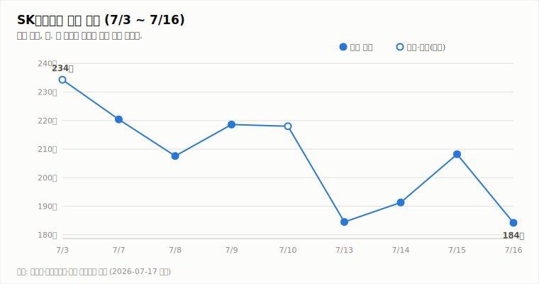
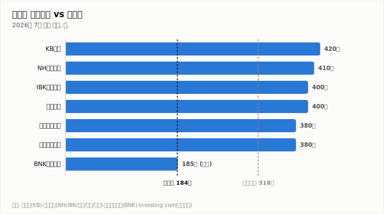

# SK하이닉스 (000660.KS)

## 하루 만의 반등 반납, 저점 이탈 — 중립으로 후퇴, 7/29가 시험대

**Company Report | 반도체/메모리 | 2026-07-17**

| 투자의견 | 현재가 (7/16 종가) | 컨센서스 목표주가 | 상승여력 | 차기 촉매 |
|:---:|:---:|:---:|:---:|:---:|
| **중립** (매수→하향) | ₩1,842,000 | ₩3,175,529 (37개사) | +72.4% | 7/29 2Q 실적 발표 |

> 작성 시점: 2026-07-17 09:15 KST · 본 자료는 정보 제공 목적이며 투자 권유가 아닙니다.

---

## 1. 투자 요약 (Investment Summary)

- **반등이 하루 만에 반납됐다.** 7/16 -11.53% 급락(184.2만 원)으로 전일 상승분(+8.83%)을 전부 되돌렸고, **7/13 저점 종가(184.5만)를 이탈**했습니다. 직전 리포트에서 명시한 "판단 재평가 조건"이 발동된 것입니다.
- **이번엔 수급이 아니라 수요 우려다.** 모건스탠리가 전력요금·환경 부담으로 AI 데이터센터 프로젝트의 취소·지연이 확대되고 있다고 분석 — 마이크론 -8%, SK하이닉스 ADR -9%. "AI 수요 무한" 논거에 첫 균열이 생겼습니다.
- **변동성이 구조화됐다.** ADR은 상장 나흘간 +12.8%/-9.3%/+27.3%/-9.0%로 널뛰기 중이며, 신규 레버리지 단일종목 ETF가 장중 움직임을 기계적으로 증폭하고 있습니다. ATR 13.0%는 이번 조사 이래 최고치입니다.
- **결론: 중립 하향.** 공급 부족 논거(HBM·NAND)는 유효하나, 자체 설정한 기술적 조건 발동 + 수요측 리스크 부상 + 방향성 상실을 종합해 7/29 실적 확인 전까지 관망으로 후퇴합니다.

### 핵심 지표

| 구분 | 값 | 기준·출처 |
|---|---|---|
| 종가 | ₩1,842,000 (-11.53%) | 7/16, 야후 파이낸스·[금강일보](https://www.ggilbo.com/news/articleView.html?idxno=1169707) |
| 7월 조정폭 | 고점(7/3 종가 234.3만) 대비 -21.4% | 야후·보도 종합 |
| 2Q26 컨센서스 | 영업이익 60~65조 원 (하향 진행) | [아주경제](https://www.ajunews.com/view/20260714091656781) |
| ADR | $176.46 (-9.0%, 7/15 현지) | [뉴스1](https://www.news1.kr/world/international-economy/6229654) |
| 52주 최고/최저 · 시총 · PER | 확인 불가 | 신주 발행으로 주식 수 변동 가능성 |

---

## 2. 주가 동향

3개월 큰 그림(웹 리포트 일봉 캔들차트, 야후 실데이터)은 4월 이후 상승 사이클이 6월 말 고점(298만 원 부근)에서 꺾인 뒤 **고점 대비 -38% 조정** 구간입니다. 7월 들어 급락(7/13)-반등(7/14~15)-재급락(7/16)의 톱니 장세가 이어지며 방향성을 잃었습니다.

| 날짜 | 7/3* | 7/7 | 7/8 | 7/9 | 7/10* | 7/13 | 7/14 | 7/15 | 7/16 |
|---|---|---|---|---|---|---|---|---|---|
| 종가(만 원) | 234.3 | 220.4 | 207.6 | 218.6 | 218.0 | 184.5 | 191.3 | 208.2 | **184.2** |

*표시는 등락률 보도 기반 역산치.

**전일(7/16) 상세 시세** (출처: 야후 파이낸스)

| 시가 | 고가 | 저가 | 종가 | 등락 | 거래량 |
|---|---|---|---|---|---|
| ₩1,902,000 | ₩1,919,000 | ₩1,821,000 | ₩1,842,000 | -11.53% | 6,380,544주 |

갭 하락 출발(-8.6%) 후 반등 시도 없이 저가권 마감 — 7/15의 "위꼬리(차익 매물)" 경고가 하루 만에 현실화됐습니다. 장중 저가 182.1만은 7월 조정의 새 저점입니다.

**기술적 지표** (7/16 종가 기준, 일봉)

| 지표 | 값 | 해석 |
|---|---|---|
| MACD (12,26,9) | -8.3만 / 시그널 0.1만 | 하락 모멘텀 확대 |
| ATR (14) | 24.0만 (**13.0%**) | 변동성 조사 이래 최고 |
| ADX/DMI (14) | ADX 27.5 · -DI 37.6 (확대) | 하락 추세 강화 |
| KDJ (9,3,3) | K 25.8 · D 23.8 | 과매도 접근, K>D는 유지 |
| 거래량/20일 이평 | 638만 주 (1.0배) | 평균 수준 — 투매 급증은 아님 |

---

## 3. 최신 뉴스 Top 5

1. **-11.53% 급락, 7/13 저점 이탈 (7/16)** 🔴 — 코스피 동반 급락 속 반등분 전량 반납, 종가 184.2만 원 ([금강일보](https://www.ggilbo.com/news/articleView.html?idxno=1169707), [헤럴드경제](https://biz.heraldcorp.com/article/10810947))
2. **모건스탠리 "AI 데이터센터 취소·지연 확대"** 🔴 — 전력요금 상승·환경 부담이 원인. AI 인프라 투자 둔화 우려 재부각으로 마이크론 -8%, 인텔 -4.7% ([Investing.com](https://kr.investing.com/news/stock-market-news/article-93CH-2017368))
3. **ADR -9.0% ($176.46), 나흘간 널뛰기** 🔴 — 상장 후 +12.8%/-9.3%/+27.3%/-9.0%. 레버리지 단일종목 ETF가 변동을 기계적으로 증폭 ([뉴스1](https://www.news1.kr/world/international-economy/6229654), [Investing.com](https://kr.investing.com/news/stock-market-news/article-93CH-2017368))
4. **증권가 2Q 눈높이 하향 지속** ⚪ — 미래에셋 62.3조(-12%)·한국투자 60.4조. "급락 선반영" 평가는 유지 ([아주경제](https://www.ajunews.com/view/20260714091656781))
5. **7/29 2분기 실적 발표** ⚪ — 하향된 눈높이 방어 여부가 추세 복원의 관건. NAND 포함 가격 사이클 코멘트 주목 ([중부매일](https://www.jbnews.com/news/articleView.html?idxno=1507136))

---

## 4. 실적 분석

실적 축은 변한 게 없습니다 — 세 분기 연속 사상 최대, 2Q 눈높이는 60조 초반으로 하향 진행. 달라진 것은 **시장이 실적이 아니라 2027년 이후의 AI 수요 지속성을 의심하기 시작했다**는 점입니다. 모건스탠리의 데이터센터 취소·지연 분석(뉴스 2)이 맞다면 "공급 부족 2028년까지"라는 강세 논거의 수요 전제가 흔들립니다. 7/29 실적 발표에서 회사의 수주·LTA(장기공급계약) 코멘트가 이 논쟁의 1차 판정이 될 것입니다.

---

## 5. 산업 동향 — HBM·NAND

**HBM / DRAM**

- **강세 논거 vs 새 리스크** — 바클레이스(공급 부족 2027년 심화)와 모건스탠리(AI 데이터센터 취소·지연 확대)가 정면으로 충돌하는 국면. 수요측 논쟁이 시작됐습니다 (뉴스 2)
- **가격**: 6월 D램 모듈 단가 +11%, HBM 단가 +12% — 실측 가격은 아직 상승 흐름 유지 ([EBN](https://kr.investing.com/news/stock-market-news/article-1990546))
- **경쟁**: SK하이닉스 HBM 점유율 26.1Q 58% → 2026년 연간 50% 전망 ([카운터포인트](https://korea.counterpointresearch.com/global-dram-and-hbm-market-share-quarterly/))
- **차세대**: 하반기 HBM4 납품 가시화 ([SK hynix Newsroom](https://news.skhynix.co.kr/2026-market-outlook/))

**NAND**

- **시장 급팽창**: 26.1Q 낸드 시장 매출 전년 대비 3.5배(전분기 +90%) — AI 수요발 가격 상승 견인 ([카운터포인트](https://korea.counterpointresearch.com/global-nand-memory-market-share-quarterly/))
- **eSSD가 성장 축**: 26.1Q 낸드 시장의 43% → 연말 60% 이상 전망, 공급 부족 지속
- **가격 전망**: UBS — 낸드 계약가 3Q +30%, 4Q +12%, 인상 사이클 2027년까지 (UBS 산업 조사, 7/4)
- **점유율**: 삼성 29% / **SK하이닉스 18%(2위)** / 키옥시아 14% — eSSD(솔리다임 포함)로 낸드 사이클 수혜권

---

## 6. 밸류에이션 — 증권사 목표주가

급락으로 컨센서스(317.6만) 대비 괴리는 +72.4%까지 다시 벌어졌습니다. 그러나 이 괴리는 "싸다"의 근거이면서 동시에 **증권가 전망과 시장 가격의 인식 차가 그만큼 크다**는 뜻이기도 합니다. BNK의 보유 의견(185만)이 현재가와 거의 일치하게 된 점이 상징적입니다 ([Investing.com](https://www.investing.com/equities/sk-hynix-inc-consensus-estimates)).

---

## 7. Bull vs Bear

| 🟢 투자 포인트 (Bull) | 🔴 리스크 요인 (Bear) |
|---|---|
| HBM·NAND 가격 실측치는 여전히 상승 중 | AI 캐펙스 둔화 — 수요 전제에 첫 균열 (모건스탠리) |
| 컨센서스 대비 +72.4% 괴리, KDJ 과매도 접근 | 7/13 저점 이탈 — 하락 추세 강화 (-DI 37.6) |
| 2Q 눈높이 하향으로 실적 서프라이즈 문턱 낮아짐 | 레버리지 ETF발 변동성 구조화 (ATR 13%) |
| NAND 사이클 수혜 (점유율 2위, eSSD 60%+ 전망) | 신주 발행·차익 실현 수급 부담 지속 |

---

## 8. 투자 판단

**의견: 중립** (매수 → 하향 · 7/29 실적 확인까지 관망)

- **하향 근거 1 — 자체 조건 발동**: 직전 리포트의 재평가 조건 ③(7/13 저점 184.5만 이탈)이 종가 기준 발동됐습니다(184.2만). 규칙을 세웠으면 따르는 것이 원칙입니다.
- **하향 근거 2 — 수요측 리스크 부상**: 지금까지의 조정은 수급(차익·신주) 요인이었으나, 모건스탠리의 AI 데이터센터 취소·지연 분석은 **펀더멘털 전제(AI 수요)에 대한 의심**입니다. 공급 부족 논거와 정면 충돌하는 첫 메이저 반론입니다.
- **하향 근거 3 — 방향성 상실**: 급락-반등-재급락의 톱니 장세, MACD 하락 확대, -DI 37.6. 변동성(ATR 13%)만 남고 추세가 사라진 구간에서는 관망의 기대손실이 가장 작습니다.
- **매수 복귀 조건**: ① 7/29 실적이 하향 눈높이(60조 초반)를 방어하고 수주·LTA 코멘트로 수요 우려를 반박할 때. ② 종가 기준 200만 회복(직전 급락 갭 메움)과 함께 -DI 우위가 해소될 때.
- **추가 하향(매도 검토) 조건**: AI 데이터센터 취소가 하이퍼스케일러 실적·가이던스에서 실측되거나, HBM/NAND 가격이 하락 전환할 때.

**직전(7/16) 대비 변화**: **매수 → 중립 하향**. 트리거: 저점 이탈(기술적) + AI 캐펙스 둔화 우려(수요측). 공급 부족·NAND 사이클 등 강세 논거 자체는 폐기하지 않으며, 7/29가 복귀 여부의 1차 시험대입니다.

---

*본 자료는 공개 보도·자료를 종합해 작성한 정보 제공 목적의 리포트이며 투자 권유가 아닙니다. 수치는 조사 시점 기준이며 오류가 있을 수 있습니다. 투자 판단과 책임은 투자자 본인에게 있습니다.*
