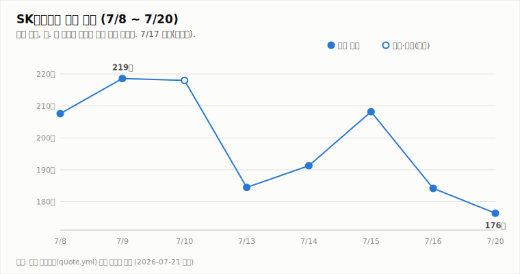
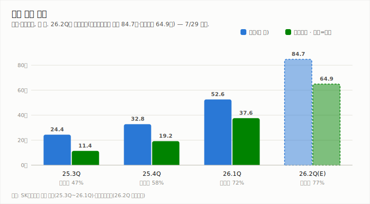
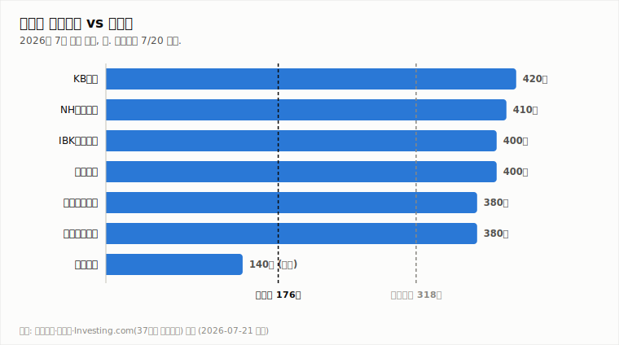

# SK하이닉스 (000660.KS)

## 첫 거래일 -4.23%, 182만 지지 이탈 — 역대 실적(D-8) 앞 기술적 경계

**Company Report | 반도체/메모리 | 2026-07-21 (화)**

| 투자의견 | 현재가 (7/20 종가) | 컨센서스 목표주가 | 상승여력 | 차기 촉매 |
|:---:|:---:|:---:|:---:|:---:|
| **중립** (유지) | ₩1,764,000 | ₩3,175,529 (37개사) | +80.0% | 7/29 2Q 실적 발표 (D-8) |

> 작성 시점: 2026-07-21 09:15 KST · 개장 직후 당일 시세는 데이터 지연으로 미확정 — 장중 자동 갱신으로 반영됩니다. 본 자료는 정보 제공 목적이며 투자 권유가 아닙니다.

---

## 1. 투자 요약 (Investment Summary)

- **첫 거래일(7/20)에 또 밀렸다.** 사흘 무거래(제헌절+주말) 후 첫 거래일인 월요일, 본주는 **-4.23% (184.2만 → 176.4만)** 로 마감했습니다. 장중 189.2만(+2.7%)까지 반등을 시도했으나 되밀려 저가(173.5만) 부근에서 약세로 끝났습니다 — ADR 프리미엄발 반등 기대가 무산된 하루입니다.
- **7/16 저가(182.1만) 지지선을 이탈했습니다.** 7/20 리포트에서 "추가 하향 조건"으로 지목했던 레벨입니다. MACD 히스토그램 확대(-8.6만), ADX -DI 우위(38.4 vs 18.4)로 단기 하락 추세가 뚜렷합니다.
- **그러나 펀더멘털은 정반대로 강합니다.** 3분기 D램 +13~18%·낸드 +10~15% 추가 상승 전망(트렌드포스), HBM 실수요 +95% YoY, SK하이닉스 2026년분 **전 제품 완판**. 7/29 2Q 실적은 매출 84.7조·영업이익 64.9조로 **분기 역대 최대** 컨센서스입니다.
- **결론: 중립 유지 (7/17 하향 이후 4연속).** 기술적으로 하향 트리거가 그레이즈됐지만, 역대급 실적 발표를 8일 앞두고 ATR 13.3%의 극단적 변동성 속 하루 종가 이탈만으로 매도 전환하는 것은 성급합니다. 7/29 이중 판정(실적+수요 논쟁) 전까지 관망을 유지하되, 하단 레벨을 173.5만으로 좁혀 관리합니다.

### 핵심 지표

| 구분 | 값 | 기준·출처 |
|---|---|---|
| 종가 | ₩1,764,000 (7/20, -4.23%) | 야후 파이낸스 |
| 전일 레인지 | 173.5만 ~ 189.2만 (시 174.5만) | 야후 파이낸스 |
| 기술 지표 | MACD히스트 -8.6만 · ADX 28.1(-DI 우위) · KDJ K21.5<D23.0 · ATR 13.3% | 7/20 종가 기준 |
| 2Q26 컨센서스 | 매출 84.7조 · 영업이익 64.9조 (역대 최대) | 에프앤가이드 |
| ADR | $154.03 (7/17 현지) · 본주 대비 약 +25% 프리미엄 | 서울경제·뉴스1 |
| 52주 최고/최저 · 시총 · PER | 확인 불가 | 신주 발행으로 주식 수 변동 |

---

## 2. 주가 동향

7/13 급락(-15.4%) → 7/14~15 반등 → 7/16 -11.5% → **7/20 -4.23%** 로, 2주간 고점(7/9 218.6만) 대비 약 -19% 낮은 자리입니다. 반등할 때마다 되밀리는 전형적 하락 추세대입니다.

**전일(7/20) 상세 시세**

| 항목 | 값 |
|---|---|
| 시가 | ₩1,745,000 |
| 고가 | ₩1,892,000 (장중 +2.7%) |
| 저가 | ₩1,735,000 |
| 종가 | ₩1,764,000 (**-4.23%**, 전일 대비 -78,000) |
| 거래량 | 5,876,444주 (20일 평균의 0.89배) |
| 거래대금 | 확인 불가 |

시가를 저가 부근에서 출발해 장중 반등을 시도했지만 종가를 저가 근처로 되돌린 **약세 마감(weak close)** 입니다. 거래량은 평균 수준으로, 투매보다는 매수 공백에 가까운 흐름이었습니다.

**기술적 지표 (7/20 종가 기준, quote.yml 자동 산출)**

| 지표 | 값 | 해석 |
|---|---|---|
| MACD | -106,497 / 시그널 -20,664 / 히스트 **-85,833** | 하락 모멘텀 (히스토그램 음 확대) |
| ADX / DMI | ADX 28.1 · +DI 18.4 · **-DI 38.4** | 추세 강함 · 하락 우위 |
| KDJ | K 21.5 · D 23.0 · J 18.5 | 중립권, K<D 단기 하락 우위 |
| ATR | 233,843 (13.3%) | 일 변동폭 매우 큼 |

**일별 종가**

| 날짜 | 7/13 | 7/14 | 7/15 | 7/16 | 7/17 | 7/20 |
|---|---|---|---|---|---|---|
| 종가(만 원) | 184.5 (-15.4%) | 191.3 (+3.7%) | 208.2 (+8.8%) | 184.2 (-11.5%) | 휴장 | **176.4 (-4.2%)** |

*3개월 캔들·거래량·MACD·KDJ·ADX 차트는 웹 리포트(다크)에서 확인할 수 있습니다.*

---

## 3. 최신 뉴스 Top 5

1. **본주, 첫 거래일 -4.23% 약세 마감 (176.4만)** 🔴 — 장중 189.2만까지 반등했으나 되밀려 저가권 마감. ADR 프리미엄 기대에도 매수세 부재 ([Investing.com](https://www.investing.com/equities/sk-hynix-inc-historical-data), 야후 파이낸스)
2. **7/29 2Q 실적 발표 D-8 — 매출 84.7조·영업이익 64.9조 '역대 최대' 컨센서스** 🟢 — 오전 IR 컨퍼런스콜. AI 메모리 호황·HBM 확대 반영. 발표 당일 저녁 실적 리뷰 특별판 예정 ([뉴스1](https://www.news1.kr/industry/general-industry/6217708), [중부매일](https://www.jbnews.com/news/articleView.html?idxno=1507136))
3. **3분기 D램·낸드 가격 추가 상승 전망 (트렌드포스)** 🟢 — 3Q 범용 D램 +13~18%, 낸드 +10~15% QoQ. 2Q(+58~63%/+55~60%) 대비 둔화됐으나 상승세 지속 ([허프포스트](https://www.huffingtonpost.kr/article/258505), [카운터포인트](https://korea.counterpointresearch.com/memory-price-tracker-january-2026/))
4. **UBS "HBM4 시장서도 SK하이닉스 70% 점유" 전망** 🟢 — 엔비디아 차세대 Rubin 플랫폼 탑재 HBM4에서 리더십 유지 전망. HBM 실수요 42.3억GB(+95% YoY) ([불스토리 종합](https://bullstory.io/blog/sk%ED%95%98%EC%9D%B4%EB%8B%89%EC%8A%A4-%EC%A3%BC%EA%B0%80-%EC%A0%84%EB%A7%9D-%EB%82%98%EC%8A%A4%EB%8B%A5-adr-%EC%83%81%EC%9E%A5%EA%B3%BC-2026%EB%85%84-%ED%95%98%EB%B0%98%EA%B8%B0-%EB%AA%A9%ED%91%9C%EC%A3%BC%EA%B0%80-%EC%B4%9D%EC%A0%95%EB%A6%AC))
5. **ADR '역김치 프리미엄' 25% 유지 — 본주 반등 재료 vs 절대가 약세 병존** ⚪ — 7/17 현지 $154.03. 저평가된 본주에 외국인 매수 유인이라는 기대와, ADR 절대가 하락이라는 부담이 공존 ([서울경제](https://www.sedaily.com/article/20069098), [뉴스1](https://www.news1.kr/world/international-economy/6229654))

---

## 4. 실적 분석

2Q26 컨센서스(에프앤가이드)는 **매출 84.7조 원·영업이익 64.9조 원·영업이익률 약 77%** 로, 분기 기준 역대 최대입니다. 26.1Q(매출 52.6조·영업이익 37.6조) 대비 한 분기 만에 매출 +61%, 영업이익 +73% 급증하는 그림입니다.

관전 포인트는 **숫자 자체보다 3분기 가이던스와 수주·LTA(장기공급계약) 코멘트**입니다. 모건스탠리가 제기한 'AI 데이터센터 취소·지연' 논쟁에 대해, 실제 수요가 견조하다는 근거(HBM 완판·LTA)를 회사가 제시하면 그간의 수급 조정을 되돌릴 1차 판정이 됩니다. (7/29 특별판에서 확정 실적으로 차트를 교체합니다.)

---

## 5. 산업 동향 — HBM·NAND

**HBM · DRAM**
- **HBM 실수요 42.3억GB(+95% YoY)** — HBM4는 HBM3E 12단 대비 10%대 중반 높은 가격으로 형성 전망. UBS는 HBM4에서도 SK하이닉스 **70% 점유** 예상.
- **점유율**: 26.1Q 매출 기준 SK하이닉스 58%(삼성 21%·마이크론 21%). 연간(E)로는 경쟁사 진입으로 50%대로 수렴 전망 — 리더십은 유지하나 독점도는 완화.
- **범용 D램**: 3Q +13~18% QoQ 추가 상승. 투자가 HBM·첨단공정에 집중돼 범용 D램 증설 여력이 제한적(연 용량 +10~15%)인 점이 가격을 지지.

**NAND**
- **3Q 낸드 +10~15% QoQ** — 2Q(+55~60%) 대비 둔화됐으나 상승 지속. SSD 가격은 연초 대비 약 2배.
- **eSSD 수요 확대**로 SK하이닉스 NAND 부문 2026년 영업이익 5조 원까지 급증 전망. 2026년 낸드 수요 +13.8%·공급 +14.0%로 수급 균형 양호.
- HBM에 가렸던 **낸드가 하반기 이익 기여의 '숨은 축'** 으로 부각되는 국면입니다.

---

## 6. 밸류에이션 — 증권사 목표주가

37개사 컨센서스 목표주가는 **317.6만 원**으로, 7/20 종가(176.4만) 대비 **+80.0%** 괴리입니다. 최고 신한·미래에셋 380만, 최저 흥국 140만으로 편차가 큽니다.

- **강세론**: 역대 실적·HBM 슈퍼사이클·전 제품 완판 → 실적 발표가 밸류에이션 리레이팅 트리거.
- **신중론**: AI 캐펙스 지속성 논쟁, ADR 상장 후 극단적 변동성, HBM4 수율 리스크. 목표가 괴리(+80%)가 큰 만큼 실적으로 증명이 필요.

---

## 7. Bull vs Bear

| 🟢 투자 포인트 (Bull) | 🔴 리스크 요인 (Bear) |
|---|---|
| 2Q 역대 최대 실적 컨센서스(매출 84.7조·영업이익 64.9조) | 첫 거래일 -4.23%, 182만 지지 이탈 — 하락 추세 지속 |
| 3Q D램·낸드 추가 가격 상승, 전 제품 완판 | AI 데이터센터 캐펙스 취소·지연 논쟁(모건스탠리) |
| HBM4 70% 점유 전망(UBS), HBM 실수요 +95% | ADR 절대가 약세 + 극단적 변동성(ATR 13.3%) |
| 낸드 eSSD 수요로 이익 기여 확대(영업익 5조 전망) | 컨센서스 +80% 괴리 — 실적 미검증 시 되돌림 |

---

## 8. 투자 판단

**의견: 중립 유지** (7/17 하향 이후 4연속 유지)

- **근거 ①**: 첫 거래일 약세 마감과 182.1만 지지 이탈로 단기 기술적 그림은 악화됐습니다(–DI 우위·MACD 음 확대). 7/20 리포트가 제시한 하향 트리거가 그레이즈된 상태입니다.
- **근거 ②**: 그러나 3분기 가격 상승·전 제품 완판·역대 실적 컨센서스 등 **펀더멘털은 정반대로 강합니다.** 역대급 실적을 8일 앞두고, ADR발 변동성(ATR 13.3%) 속 하루 종가 이탈만으로 매도 전환하는 것은 근거가 약합니다.
- **근거 ③**: 7/29은 실적과 수요 논쟁이 한꺼번에 판정되는 이벤트입니다. 방향 확인 전 관망이 합리적입니다.

**매수 복귀 조건**: ① 7/29 실적이 컨센서스(매출 84.7조·영업이익 64.9조) 부합·상회 + 수주·LTA로 수요 우려 반박 ② 종가 200만 회복 + -DI 우위 해소.

**매도 전환 조건**: ① 7/29 실적/가이던스가 기대를 하회하거나 AI 수요 둔화가 확인 ② **종가 173.5만(7/20 저가) 이탈 후 추가 하락** ③ HBM/낸드 가격 상승세의 하락 반전.

---

*본 자료는 공개 보도·자료를 종합해 작성한 정보 제공 목적의 리포트이며 투자 권유가 아닙니다. 수치는 조사 시점 기준이며 오류가 있을 수 있습니다. 투자 판단과 책임은 투자자 본인에게 있습니다.*
