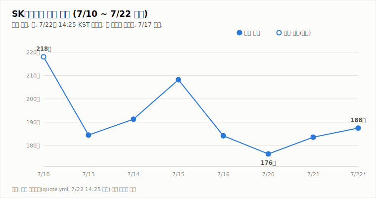
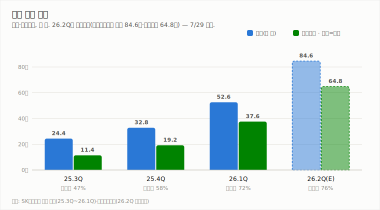
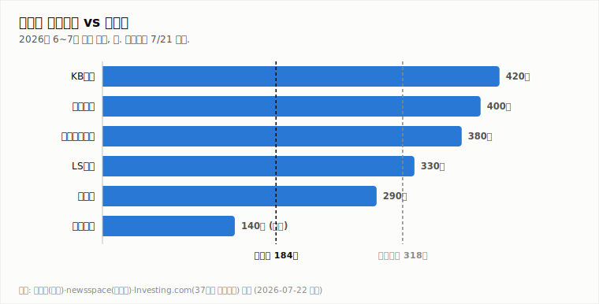

# SK하이닉스 (000660.KS)

## [장중 업데이트] 장중 200만 터치 후 +2.12% — 매수 복귀 조건 근접, 종가 확인 대기

**Company Report | 반도체/메모리 | 2026-07-22 (수) 14:45 KST 장중**

| 투자의견 | 현재가 (7/22 14:25 장중) | 컨센서스 목표주가 | 상승여력 | 차기 촉매 |
|:---:|:---:|:---:|:---:|:---:|
| **중립** (유지·상향 관찰) | ₩1,875,000 (+2.12%) | ₩3,175,529 (37개사) | +69.4% | 7/29 2Q 실적 발표 (D-7) |

> 작성 시점: 2026-07-22 14:45 KST · **장중 실시간 업데이트**(마감 15:30 전). 시세는 약 10~20분 지연될 수 있으며 장 마감 시 확정치와 다를 수 있습니다. 본 자료는 정보 제공 목적이며 투자 권유가 아닙니다.

---

## 1. 투자 요약 (Investment Summary)

- **장중 200만 돌파 후 되밀림.** 7/22 본주는 **+7.7% 갭업(1,977,000)** 으로 출발해 장중 **2,006,000(고가)** 까지 200만을 넘었으나, 오후 들어 상승폭을 반납해 14:25 현재 **1,875,000 (+2.12%)** 입니다. 이틀 연속 반등이지만 오전 강세 대비 탄력은 둔화됐습니다.
- **반도체 랠리가 배경.** 미 반도체주 반등 + 7월 반도체 수출 사상 최대(+180.6%) + 저가매수로 삼성·SK하이닉스가 동반 강세, 코스피도 급등 출발했습니다.
- **기술적 신호 개선 진행.** KDJ가 **K>D로 전환(단기 상승 우위)**, −DI(34.6)·+DI(20.2) 격차가 축소, MACD 히스토그램(−6.5만)·ATR(12.0%)도 완화됐습니다. 다만 **−DI가 여전히 우위**이고 현재가는 200만 아래입니다.
- **결론: 중립 유지(상향 관찰).** 매수 복귀 2조건(종가 200만 회복 + −DI 우위 해소) 중 어느 쪽도 아직 확정되지 않았습니다 — 장중 200만은 터치했으나 **종가 확인이 필요**하고 −DI 우위도 미해소입니다. 오늘 종가가 200만 부근에서 마감하고 −DI 축소가 이어지면 다음 리포트에서 매수 복귀를 검토합니다.

### 핵심 지표

| 구분 | 값 | 기준·출처 |
|---|---|---|
| 현재가 | ₩1,875,000 (+2.12%) | 야후 파이낸스 14:25 KST |
| 당일 레인지 | 186.9만 ~ **200.6만** (시 197.7만) | 야후 파이낸스(장중) |
| 기술 지표 | MACD히스트 -6.5만(축소) · ADX 28.4(-DI 우위·격차↓) · KDJ **K25.4>D23.7** · ATR 12.0% | 14:25 장중 기준 |
| 2Q26 컨센서스 | 매출 84.6조 · 영업이익 64.8조 (이익률 76%대) | 에프앤가이드 |
| 7월 반도체 수출 | $221억 (7/1~20, +180.6% YoY, 역대 최대) | 산업부·뉴스핌 |
| 52주 최고/최저 · 시총 · PER | 확인 불가 | 신주 발행으로 주식 수 변동 |

---

## 2. 주가 동향 (장중)

7/20 저점(176.4만) → 7/21 반등(183.6만) → 7/22 **갭업 후 200만 터치**로, 사흘 만에 저점 대비 약 +6% 회복했습니다. 다만 오늘 장중 고가(200.6만)에서 상승폭을 상당 부분 반납한 점은 200만대 매물벽을 시사합니다.

**당일(7/22) 장중 시세 — 14:25 KST 기준**

| 항목 | 값 |
|---|---|
| 시가 | ₩1,977,000 (+7.68%) |
| 고가 | ₩2,006,000 (200만 돌파) |
| 저가 | ₩1,869,000 |
| 현재가 | ₩1,875,000 (**+2.12%**, +39,000) |
| 거래량(장중) | 3,527,797주 (아직 진행 중) |

전일(7/21) 확정 종가는 1,836,000(+4.08%)입니다. 오늘은 갭업 출발 후 되밀리는 **윗꼬리** 형태가 진행 중으로, 종가가 시가·고가 대비 어디서 마감하는지가 관건입니다.

**기술적 지표 (14:25 장중 기준, quote.yml 자동 산출)**

| 지표 | 값 | 해석 |
|---|---|---|
| MACD | -121,845 / 시그널 -56,411 / 히스트 **-65,433** | 하락 모멘텀(음), 히스토그램 3일 연속 축소 |
| ADX / DMI | ADX 28.4 · +DI **20.2(↑)** · -DI **34.6(↓)** | 하락 우위지만 격차 축소 |
| KDJ | K 25.4 · D 23.7 · J 28.9 | **K>D로 전환 — 단기 상승 우위** |
| ATR | 224,187 (12.0%) | 변동성 큼(3일째 완화) |

지표 흐름은 **하락 강도 둔화 + 단기 반등**을 가리킵니다. KDJ의 K>D 전환과 −DI/+DI 격차 축소는 반등 신호이나, 추세 지표(−DI 우위)가 완전히 돌아서진 않았습니다.

**일별 종가**

| 날짜 | 7/16 | 7/20 | 7/21 | 7/22(장중) |
|---|---|---|---|---|
| 종가(만 원) | 184.2 (-11.5%) | 176.4 (-4.2%) | 183.6 (+4.1%) | **187.5 (+2.1%)** |

---

## 3. 최신 뉴스 Top 5

1. **삼성·SK하이닉스 동반 급등, 코스피 랠리 — SK 장중 200만 터치** 🟢 — 반도체주 강세로 코스피 7000선 급등 출발. SK하이닉스 장중 최고 200.6만 ([아시아뉴스통신](https://m.anewsa.com/article_sub3.php?number=3181074), [국제뉴스](https://www.gukjenews.com/news/articleView.html?idxno=3642497))
2. **7월(1~20일) 반도체 수출 $221억, +180.6% YoY '사상 최대'** 🟢 — 전체 수출의 40.3%. AI 서버 HBM·고용량 SSD 수요가 견인 ([뉴스핌](https://www.newspim.com/news/view/20260721000263), [이데일리](https://edaily.co.kr/News/Read?mediaCodeNo=257&newsId=03125846645516816))
3. **7/29 2Q 실적 D-7 — 컨센 매출 84.6조·영업이익 64.8조, KB "컨센 상회 예상"** 🟢 — 이익률 76%대 역대 최대 전망 ([stockplus](https://newsroom.stockplus.com/breaking-news/25404), [중부매일](https://www.jbnews.com/news/articleView.html?idxno=1507136))
4. **메모리 2028년 공급격차 확대…삼성·하이닉스 HBM 증설 가속** 🟢 — HBM 공급난 장기화 전망이 목표가 상향(교보 400·LS 330·맥쿼리 290) 근거 ([테크월드](https://www.epnc.co.kr/news/articleView.html?idxno=401451), [뉴스핌](https://www.newspim.com/news/view/20260701000135))
5. **"삼성 이어 SK하이닉스도 역대급 실적…HBM 주도권 안 놓는다"** 🟢 — HBM 1위(출하량 62%·매출 57%) 지위 방어 의지, M15X 가동으로 증설 가속 ([MBC](https://imnews.imbc.com/replay/2026/nwdesk/article/6817558_37004.html))

---

## 4. 실적 분석

2Q26 컨센서스는 **매출 84.6조·영업이익 64.8조·영업이익률 76%대**로 분기 역대 최대입니다(에프앤가이드). KB증권은 컨센서스 상회를 전망했습니다. 관전 포인트는 **3분기 가이던스와 수주·LTA 코멘트** — 7월 수출 급증이 방증하는 수요 견조를 회사가 확인해주면 'AI 캐펙스 취소' 우려(모건스탠리)를 되받는 1차 판정이 됩니다. (7/29 특별판에서 확정 실적으로 차트를 교체합니다.)

---

## 5. 산업 동향 — HBM·NAND

**HBM · DRAM**
- **공급난 장기화** — 메모리 2028년 공급격차 확대 전망 속 삼성·SK 모두 HBM 증설 가속(SK는 청주 M15X 가동). 맥쿼리는 이를 목표가 상향 근거로 제시.
- **점유율** — SK하이닉스 HBM 출하량 62%·매출 57%로 1위 유지(25.2~3Q). 연간(E)로는 경쟁 진입에 50%대 수렴.
- **가격** — 2026년 D램 평균 +62%, 낸드 +75% 전망(교보). 3Q도 D램·낸드 추가 상승(트렌드포스).

**NAND**
- **가격 강세 지속** — eSSD·고용량 SSD 수요가 수출을 견인, 2026년 낸드 +75% 전망.
- **이익 기여 확대** — SK하이닉스 NAND 부문 2026년 영업이익 5조 원 전망, 수급 균형 양호.

---

## 6. 밸류에이션 — 증권사 목표주가

37개사 컨센서스 목표주가 **317.6만 원**은 현재가(187.5만) 대비 **+69.4%** 괴리입니다. 최근 상향 릴레이(교보 400만·LS 330만·맥쿼리 290만)로 눈높이가 오르는 국면입니다. **강세론**은 역대 실적·수출 사상 최대·HBM 공급난 장기화, **신중론**은 AI 캐펙스 논쟁·변동성(ATR 12%)·괴리 부담을 근거로 실적 증명을 요구합니다.

---

## 7. Bull vs Bear

| 🟢 투자 포인트 (Bull) | 🔴 리스크 요인 (Bear) |
|---|---|
| 이틀 연속 반등, 장중 200만 터치 | 200만 매물벽에 되밀림(윗꼬리 진행) |
| 7월 반도체 수출 +180.6% 사상 최대 | −DI 우위 지속 — 추세 전환 미확정 |
| KDJ K>D 전환·−DI 격차 축소 등 지표 개선 | 컨센 +69% 괴리 — 실적 미검증 시 되돌림 |
| 2Q 역대 최대 실적 컨센(84.6조/64.8조), HBM 공급난 장기화 | AI 데이터센터 캐펙스 취소·지연 논쟁(모건스탠리) |

---

## 8. 투자 판단

**의견: 중립 유지 (상향 관찰)** — 7/17 하향 이후 유지, 매수 복귀 조건에 근접

- **근거 ①**: 이틀 연속 반등 + 장중 200만 터치 + 지표 개선(KDJ K>D 전환, −DI 격차 축소, MACD 히스토그램 3일 연속 축소)으로 **하락 추세가 약화**되고 있습니다.
- **근거 ②**: 그러나 **매수 복귀 2조건이 아직 미충족**입니다 — 장중 200만은 터치했으나 종가 확인 전이고, −DI가 여전히 +DI 우위입니다. 오늘도 오전 고점 대비 되밀리는 중이라 200만 안착은 미확인입니다.
- **근거 ③**: 7/29 실적(D-7)이 방향을 확정하는 이벤트로 임박했습니다. 종가·실적 확인 전 관망이 합리적입니다.

**매수 복귀 조건**: ① **종가 200만 회복 + −DI 우위 해소** ② 7/29 실적이 컨센서스(84.6조/64.8조) 부합·상회 + 수주·LTA로 수요 우려 반박. → 오늘 종가가 200만 부근 안착 시 다음 리포트에서 상향 검토.

**매도 전환 조건**: ① 7/29 실적/가이던스가 기대 하회 또는 AI 수요 둔화 확인 ② 종가 173.5만(7/20 저가) 이탈 후 추가 하락 ③ HBM/낸드 가격 상승세의 하락 반전.

---

*본 자료는 공개 보도·자료를 종합해 작성한 정보 제공 목적의 리포트이며 투자 권유가 아닙니다. 장중 수치는 미확정이며 오류가 있을 수 있습니다. 투자 판단과 책임은 투자자 본인에게 있습니다.*
