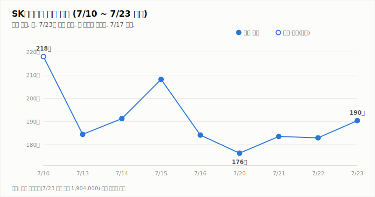
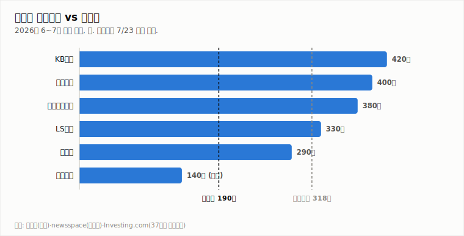

# SK하이닉스 (000660.KS)

## [장중 업데이트] 장중 +1.9%로 상승폭 축소 — 오전 194만 고점 후 되밀림, 186만대 지지 확인 중

**Company Report | 반도체/메모리 | 2026-07-23 (목) 12:05 KST · 장중 업데이트(11:42 기준)**

| 투자의견 | 현재가 (7/23 11:42 장중) | 컨센서스 목표주가 | 상승여력 | 차기 촉매 |
|:---:|:---:|:---:|:---:|:---:|
| **중립** (유지) | ₩1,865,000 (+1.91%) | ₩3,175,529 (37개사) | +70.3% | 7/29 2Q 실적 발표 (D-6) |

> 작성 시점: 2026-07-23 12:05 KST · **장중 실시간 업데이트**(11:42 KST 기준, 마감 전). 시세는 약 10~20분 지연될 수 있으며 장 마감 시 확정치와 다를 수 있습니다. 본 자료는 정보 제공 목적이며 투자 권유가 아닙니다.

---

## 1. 투자 요약 (Investment Summary)

- **반등하되 상승폭은 축소.** 어제(7/22) 저가(183.0만)로 마감했던 본주가 오늘 **+4.4% 갭업(191.0만)** 으로 출발해 장중 **194.8만(고가)** 까지 올랐으나, 오전 후반 되밀려 11:42 현재 **186.5만(+1.91%, +35,000)** 입니다. 오전 고점 대비 −4.3% 반납하며 **1차 저항(188.9만) 아래로 되돌아왔습니다**.
- **지표는 개선세이나 탄력 둔화.** MACD 히스토그램은 −6.8만 → **−5.6만으로 축소**(전일 대비 개선), KDJ K25.3 > D23.7로 K>D는 유지되나 오전(J33.7 → J28.5)보다 탄력은 약해졌습니다. −DI(33.2)가 여전히 +DI(19.4)에 우위입니다.
- **실적 눈높이 하향은 상수.** 한국투자증권(영업이익 60.4조)·미래에셋(62.3조) 등이 D램·낸드 ASP 현실화(LTA 반영)로 2Q 추정을 낮췄으나 **목표주가(한투 380만·미래 420만)·매수의견은 유지**, '주가 급락에 이미 선반영·저점 매수 기회' 시각도 병존합니다.
- **결론: 중립 유지.** 반등은 살아있으나 오전 고점을 지키지 못하며 **탄력이 둔화**됐고, 매수 복귀 2조건(종가 200만 회복 + −DI 우위 해소)은 여전히 미충족입니다. 종가로 **186만 지지·거래량 동반**을 확인하는 것이 관건이며, 방향은 7/29 실적(D-6)이 확정합니다.

### 핵심 지표

| 구분 | 값 | 기준·출처 |
|---|---|---|
| 현재가 | ₩1,865,000 (+1.91%) | 야후 파이낸스 11:42 KST 장중 |
| 당일 레인지 | 184.5만 ~ **194.8만** (시 191.0만) | 야후 파이낸스(장중) |
| 기술 지표 | MACD히스트 -5.6만(축소) · ADX 28.3(-DI 우위) · KDJ **K25.3>D23.7** · ATR 11.6% · 거래량 0.32배(장중) | 11:42 장중 |
| 2Q26 컨센서스 | 매출 84.6조 · 영업이익 64.8조 — 단, 눈높이 하향 중 | 에프앤가이드 |
| 7월 반도체 수출 | $221억 (7/1~20, +180.6% YoY, 역대 최대) | 산업부·뉴스핌 |

---

## 2. 주가 동향 (장중)

7/20 저점(176.4만) → 7/21 반등(183.6만) → 7/22 저가 마감(183.0만) → 7/23 **갭업 후 194만 고점, 되밀려 186만대**로, 어제 약세 마감은 되돌렸으나 오전 고점을 지키지 못했습니다. 장중 고가 194.8만으로 200만에 다시 근접했다가 **1차 저항(188.9만) 아래로 되밀린** 상태입니다. 저가 184.5만으로 7/22 종가(183.0만)는 지키고 있습니다.

**당일(7/23) 장중 시세 — 11:42 KST 기준**

| 항목 | 값 |
|---|---|
| 시가 | ₩1,910,000 (+4.37%) |
| 고가 | ₩1,948,000 |
| 저가 | ₩1,845,000 |
| 현재가 | ₩1,865,000 (**+1.91%**, +35,000) |
| 거래량(장중) | 2,022,791주 (20일 평균의 0.32배) |

전일(7/22) 종가 1,830,000 대비 +35,000원(+1.91%)입니다. 오전 고가(194.8만)에서 저가(184.5만)까지 **약 −5.3%(-10.3만 원) 되밀림** 후 186만대에서 등락 중으로, 오전 강세 대비 탄력이 둔화됐습니다.

**기술적 지표 (11:42 장중 기준, quote.yml 자동 산출)**

| 지표 | 값 | 해석 |
|---|---|---|
| MACD | -127,353 / 시그널 -71,175 / 히스트 **-56,177** | 하락 모멘텀(음)이나 히스토그램 축소 |
| ADX / DMI | ADX 28.3 · +DI **19.4** · -DI **33.2** | -DI 우위 지속(하락), 격차 소폭 축소 |
| KDJ | K 25.3 · D 23.7 · J 28.5 | **K>D 유지**, 단기 탄력은 둔화(J 33.7→28.5) |
| ATR | 217,000 (11.6%) | 변동성 매우 큼 |
| 거래량(장중) / 20일 이평 | 202만 / 631만 주 (0.32배) | 장중 진행 — 마감 시 갱신 |

지표는 **하락 우위 속 반등이 진행되나 탄력이 둔화**된 모습입니다. MACD 히스토그램은 전일 대비 축소됐으나 KDJ J값이 오전 고점(33.7)에서 28.5로 내려왔습니다. 추세 지표(−DI 우위)는 아직 돌아서지 않았습니다.

**일별 종가**

| 날짜 | 7/20 | 7/21 | 7/22 | 7/23(장중) |
|---|---|---|---|---|
| 종가(만 원) | 176.4 (-4.2%) | 183.6 (+4.1%) | 183.0 (-0.3%) | **186.5 (+1.9%)** |

---

## 3. 최신 뉴스 Top 5

1. **증권가 2Q 실적 눈높이 하향 릴레이 — 한투 영업익 60.4조·미래 62.3조로 하향** ⚪ — D램·낸드 ASP 전망 하향(LTA 가격 현실화). "수요 우려 아냐, 이미 주가 급락에 선반영" — 목표가·매수의견은 유지(한투 380만·미래 420만) ([서울경제TV](https://www.sentv.co.kr/article/view/sentv202607140012), [머니투데이](https://www.mt.co.kr/stock/2026/07/14/2026071408500455654), [네이트](https://m.news.nate.com/view/20260713n03223))
2. **7/22 장중 200만 터치 후 저가 마감(−0.33%) — "200만 찍고 와르르" 변동성** ⚪ — 갭업(+7.7%) 출발·고가 200.6만 후 전량 반납해 저가 183.0만 마감. 개미 변동성 주의 ([파이낸셜뉴스](https://www.fnnews.com/news/202607221606287620))
3. **7/29 2Q 실적 D-6 — 컨센 매출 84.6조·영업이익 64.8조, 역대 최대 전망** 🟢 — 이익률 76%대 역대 최대 전망(에프앤가이드 83.9조/64.2조). KB "컨센 상회 예상" ([stockplus](https://newsroom.stockplus.com/breaking-news/25404), [중부매일](https://www.jbnews.com/news/articleView.html?idxno=1507136))
4. **7월(1~20일) 반도체 수출 $221억, +180.6% YoY '사상 최대'** 🟢 — 전체 수출의 40.3%. AI 서버 HBM·고용량 SSD 수요가 견인 ([뉴스핌](https://www.newspim.com/news/view/20260721000263), [이데일리](https://edaily.co.kr/News/Read?mediaCodeNo=257&newsId=03125846645516816))
5. **목표가 격차 185만(BNK) vs 420만 — 37개사 평균 317.6만, 35곳 '매수'** ⚪ — AI 캐펙스 지속성·ADR 상장 효과 해석차로 목표가 편차 확대. HBM 공급난 장기화는 상향론 근거 ([인베스트조선](https://www.investchosun.com/site/data/html_dir/2026/07/09/2026070980118.html), [뉴스핌](https://www.newspim.com/news/view/20260709000201))

---

## 4. 실적 분석

2Q26 컨센서스(에프앤가이드)는 **매출 84.6조·영업이익 64.8조·영업이익률 76%대**로 분기 역대 최대입니다. 26.1Q(매출 52.6조·영업이익 37.6조) 대비 매출 +61%, 영업이익 +72% 급증입니다. 다만 발표 직전 **증권가는 2Q 눈높이를 낮추는 중** — 한국투자증권 영업이익 60.4조(컨센 −8%), 미래에셋 62.3조(기존比 −12%)로, D램·낸드 ASP 가정을 체결 LTA 기준으로 현실화한 결과라는 설명입니다. 관전 포인트는 숫자보다 **3분기 가이던스와 수주·LTA 코멘트**로, 회사가 수요 견조를 확인해주면 'AI 캐펙스 취소' 우려(모건스탠리)를 되받는 1차 판정이 됩니다. (7/29 특별판에서 확정 실적으로 차트를 교체합니다.)

---

## 5. 산업 동향 — HBM·NAND

**HBM · DRAM**
- **공급난 장기화** — 메모리 2028년 공급격차 확대 전망 속 삼성·SK 모두 HBM 증설 가속(SK는 청주 M15X 가동). 맥쿼리는 이를 목표가 상향 근거로 제시.
- **점유율** — 26.1Q 매출 기준 SK하이닉스 58%(삼성 21%·마이크론 21%). 연간(E)로는 50%대 수렴 — 리더십 유지, 독점도는 완화.
- **가격** — 2026년 D램 평균 +62%, 낸드 +75% 전망(교보). 3Q도 D램·낸드 추가 상승(트렌드포스). 단, 증권가는 최근 ASP 가정을 소폭 하향(LTA 현실화).

**NAND**
- **가격 강세 지속** — eSSD·고용량 SSD 수요가 수출을 견인, 2026년 낸드 +75% 전망.
- **이익 기여 확대** — SK하이닉스 NAND 부문 2026년 영업이익 5조 원 전망, 수급 균형 양호.

---

## 6. 밸류에이션 — 증권사 목표주가

37개사 컨센서스 목표주가 **317.6만 원**은 장중가(186.5만) 대비 **+70.3%** 괴리입니다. 목표가 편차가 큰 국면으로 **최저 185만(BNK)~최고 420만(미래에셋)** 까지 벌어져 있습니다. **강세론**은 역대 실적·수출 사상 최대·HBM 공급난 장기화, **신중론**은 AI 캐펙스 지속성 논쟁·변동성(ATR 12%)·괴리 부담을 근거로 실적 증명을 요구합니다. 실적 눈높이 하향에도 매수의견·목표가가 대체로 유지된다는 점은 하방을 지지합니다.

---

## 7. Bull vs Bear

| 🟢 투자 포인트 (Bull) | 🔴 리스크 요인 (Bear) |
|---|---|
| +1.9% 반등, 7/22 종가(183.0만) 지지 유지 | 오전 고점(194.8만)서 되밀려 188.9만 아래로 복귀 |
| MACD 히스토그램 전일 대비 축소·K>D 유지 | −DI(33.2) 우위 지속, KDJ J값 둔화 — 탄력 약화 |
| 실적 눈높이 하향에도 목표가·매수의견 유지(한투 380·미래 420) | 거래량 0.32배로 얇음 — 반등 신뢰 낮음, 2Q 컨센 하향 |
| 2Q 역대 최대 실적 전망(84.6조/64.8조), HBM 공급난 장기화 | 컨센 +70% 괴리 — 실적 미검증 시 되돌림, 캐펙스 논쟁(모건스탠리) |

---

## 8. 투자 판단

**의견: 중립 유지** — 반등 탄력 둔화, 7/29 실적(D-6)까지 관망

- **반등하되 오전 고점을 지키지 못함**: 어제 저가 마감(183.0만)에서 오늘 갭업해 장중 194.8만까지 올랐으나 되밀려 11:42 현재 186.5만(+1.91%)입니다. 7/22 종가(183.0만)는 지지하나 1차 저항(188.9만) 아래로 복귀했고, KDJ J값도 오전 고점(33.7→28.5)에서 둔화됐습니다.
- **매수 복귀 2조건 판정 → 아직 미충족**: ① 종가 200만 회복 = **미충족**(장중 186.5만, 200만 대비 −6.8%) ② −DI 우위 해소 = **미충족**(−DI 33.2 vs +DI 19.4). 오전 대비 오히려 200만과의 거리가 벌어졌습니다.
- **매도 전환 3조건 판정 → 모두 미해당**: ① 7/29 실적 하회 미발생(D-6) ② 173.5만 이탈 미발생(저가 184.5만 지지) ③ HBM·낸드 가격 반전 미발생.
- **결론**: 반등은 살아있으나 **탄력이 둔화**됐고 매수·매도 어느 조건도 미충족입니다. 종가로 186만 지지·거래량 동반이 확인되고 200만에 재접근해야 매수 복귀를 검토합니다. 방향은 7/29 실적(D-6)이 확정합니다. → **중립 유지**.

**매수 복귀 조건**: ① **종가 200만 회복 + −DI 우위 해소**(거래량 동반 필수) ② 7/29 실적이 컨센서스(84.6조/64.8조) 부합·상회 + 수주·LTA로 수요 우려 반박.

**매도 전환 조건**: ① 7/29 실적/가이던스 기대 하회 또는 AI 수요 둔화 확인 ② 종가 173.5만(7/20 저가) 이탈 후 추가 하락 ③ HBM/낸드 가격 상승세의 하락 반전.

**직전(7/23 10:05) 대비 변화**: 중립 유지, 톤 '상향 관찰' → 중립 환원 — 오전 고점 반납·탄력 둔화 반영, 종가 미확정으로 의견은 유지.

---

## 9. 오늘(7/23 목) 관전 포인트

| 구분 | 레벨·내용 |
|---|---|
| **저항** | 1차 **188.9만**(7/21 고가·되밀린 레벨) · 2차 **194.8만**(당일 고가) · 3차 **200만**(매물벽) |
| **지지** | 1차 **184.5만**(당일 저가) · 2차 **183.0만**(7/22 종가) · 3차 **176.4만**(7/20 종가) |
| **예정 이벤트** | **7/29 2Q 실적 D-6**(컨센 매출 84.6조·영업이익 64.8조) · 그 사이 미 반도체주·환율·외국인 수급 |
| **체크리스트** | ① 종가 **186만·183만 지지 유지** 여부 ② 반등에 **거래량 동반**(현재 0.32배) ③ 188.9만 재돌파 여부 ④ −DI/+DI 격차 축소 ⑤ 실적 프리뷰 뉴스플로우 |

- **상방 시나리오**: 오후 거래량 실리며 188.9만 재돌파 시 194.8만→200만 재도전.
- **기본(중립) 시나리오**: **184만~189만 박스권**에서 갭업분 일부를 지키며 7/29 실적 대기.
- **하방 시나리오**: 되밀림 지속으로 184.5만·183.0만 지지 이탈 시 갭 메우기(176.4만 방향) 경계.

※ 전망은 7/23 장중(11:42) 시세·지표 기준의 시나리오이며 확정 예측이 아닙니다. 장중가는 미확정입니다.

---

*본 자료는 공개 보도·자료를 종합해 작성한 정보 제공 목적의 리포트이며 투자 권유가 아닙니다. 장중 수치는 미확정이며 오류가 있을 수 있습니다. 투자 판단과 책임은 투자자 본인에게 있습니다.*
