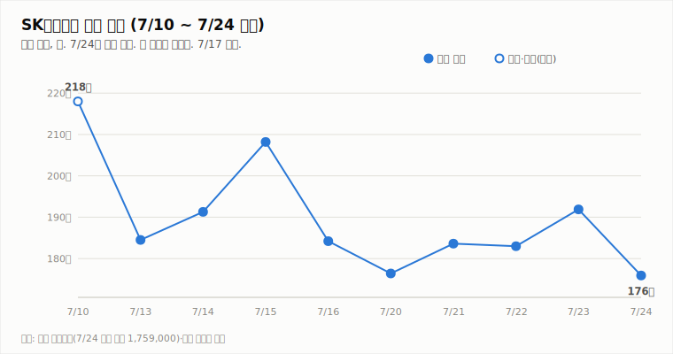
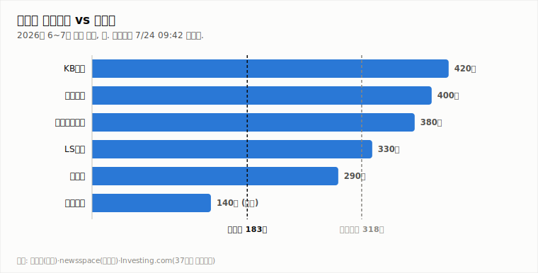

# SK하이닉스 (000660.KS)

## [장중 업데이트] 낙폭 −8.0%(176.6만) — 1차 방어선 176.4만 시험, 173.5만 매도 전환 라인 주시

**Company Report | 반도체/메모리 | 2026-07-24 (금) 14:05 KST · 장중 업데이트(13:42 기준)**

| 투자의견 | 현재가 (7/24 13:42 장중) | 컨센서스 목표주가 | 상승여력 | 차기 촉매 |
|:---:|:---:|:---:|:---:|:---:|
| **중립** (유지·하방 경계 강화) | ₩1,766,000 (−7.97%) | ₩3,175,529 (37개사) | +79.8% | 7/29 2Q 실적 발표 (D-5) |

> 작성 시점: 2026-07-24 14:05 KST · **장중 실시간 업데이트**(13:42 KST 기준, 마감 전). 시세는 약 10~20분 지연될 수 있으며 장 마감 시 확정치와 다를 수 있습니다. 본 자료는 정보 제공 목적이며 투자 권유가 아닙니다.

---

## 1. 투자 요약 (Investment Summary)

- **오후에도 낙폭 심화(−8.0%).** 12시(−6.62%)보다 더 밀려 13:42 현재 **176.6만(−7.97%, −153,000)**, 장중 저가 **175.2만**으로 **1차 방어선(176.4만, 7/20 종가)을 시험**하고 있습니다. 어제 강세분(+4.86%)을 반납한 데 더해 낙폭을 키웠습니다.
- **KDJ 단기 우위마저 소멸.** KDJ가 **K≈D(24.7)** 로 수렴해 마지막 남은 단기 상승 신호가 사라졌고, −DI(34.5)는 +DI(18.3)에 우위를 더 넓혔습니다. MACD도 음(-)으로 **하락 추세가 전면화**됐습니다.
- **거래량은 아직 투매급은 아님.** 333만 주(20일 평균의 0.54배)로 오전보다 늘었으나 평균 이하로, 급락 대비 거래는 제한적입니다 — 실적(7/29)을 앞둔 관망·차익실현 성격이 강합니다.
- **결론: 중립 유지(하방 경계 강화).** 매수 복귀는 요원하고, 매도 전환 조건(종가 173.5만 이탈)에는 **아직 미해당**이나 근접했습니다(현재 176.6만>173.5만, 저가 175.2만). **176.4만·173.5만 방어선을 종가로 지키는지**가 관건이며, 종가 173.5만 이탈 시 매도 전환을 검토합니다. 방향은 7/29 실적(D-5)이 확정합니다.

### 핵심 지표

| 구분 | 값 | 기준·출처 |
|---|---|---|
| 현재가 | ₩1,766,000 (−7.97%) | 야후 파이낸스 13:42 KST 장중 |
| 당일 레인지 | **175.2만** ~ 189.4만 (시 189.4만) | 야후 파이낸스(장중) |
| 기술 지표 | MACD히스트 -4.9만 · ADX 28.4(-DI 우위 강화) · KDJ **K≈D(24.7)** · ATR 12.1% · 거래량 0.54배 | 13:42 장중 |
| 2Q26 컨센서스 | 매출 84.6조 · 영업이익 64.8조 (이익률 80% 관전) | 에프앤가이드 |
| 7월 반도체 수출 | $221억 (7/1~20, +180.6% YoY, 역대 최대) | 산업부·뉴스핌 |

---

## 2. 주가 동향 (장중)

7/23 강세 마감(191.9만) → 7/24 **−8.0% 급락(176.6만)**으로, 어제 상승분을 반납한 데 이어 낙폭을 키웠습니다. 갭다운(189.4만) 출발 후 오후까지 흘러내려 장중 저가 **175.2만**으로 **1차 방어선(176.4만, 7/20 종가)을 시험**했습니다. 이 아래는 **173.5만(7/20 저가·매도 전환 라인)** 이 최후 지지입니다.

**당일(7/24) 장중 시세 — 13:42 KST 기준**

| 항목 | 값 |
|---|---|
| 시가 | ₩1,894,000 (−1.30%) |
| 고가 | ₩1,894,000 |
| 저가 | ₩1,752,000 |
| 현재가 | ₩1,766,000 (**−7.97%**, −153,000) |
| 거래량(장중) | 3,332,236주 (20일 평균의 0.54배) |

전일(7/23) 종가 1,919,000 대비 −153,000원(−7.97%)입니다. 시가(189.4만)가 당일 고가로 개장 후 **줄곧 흘러내린 약세 흐름**이며, 저가(175.2만)는 1차 방어선을 잠시 이탈했습니다. 거래량 333만 주(20일 평균의 0.54배)는 늘었으나 여전히 평균 이하로, 급락 대비 거래는 제한적입니다.

**기술적 지표 (13:42 장중 기준, quote.yml 자동 산출)**

| 지표 | 값 | 해석 |
|---|---|---|
| MACD | -131,972 / 시그널 -82,642 / 히스트 **-49,330** | 하락 모멘텀(음) 지속 |
| ADX / DMI | ADX 28.4 · +DI **18.3** · -DI **34.5** | -DI 우위 강화(하락), 격차 확대 |
| KDJ | K 24.7 · D 24.7 · J 24.8 | **K≈D로 수렴 — 단기 상승 우위 소멸** |
| ATR | 213,430 (12.1%) | 변동성 매우 큼 |
| 거래량(장중) / 20일 이평 | 333만 / 614만 주 (0.54배) | 장중 진행 — 마감 시 갱신 |

지표는 **하락 추세가 전면화**된 모습입니다. −DI/+DI 격차가 더 벌어졌고 MACD도 음(-)입니다. KDJ가 K≈D로 수렴하며 **마지막 단기 상승 신호마저 소멸**했습니다. 종가까지 176.4만·173.5만 방어선을 지키는지가 관건입니다.

**일별 종가**

| 날짜 | 7/21 | 7/22 | 7/23 | 7/24(장중) |
|---|---|---|---|---|
| 종가(만 원) | 183.6 (+4.1%) | 183.0 (-0.3%) | 191.9 (+4.9%) | **176.6 (-8.0%)** |

---

## 3. 최신 뉴스 Top 5

1. **증권가 2Q 실적 눈높이 하향 릴레이 — 한투 영업익 60.4조·미래 62.3조로 하향** ⚪ — D램·낸드 ASP 전망 하향(LTA 가격 현실화). "수요 우려 아냐, 이미 주가 급락에 선반영" — 목표가·매수의견은 유지(한투 380만·미래 420만) ([서울경제TV](https://www.sentv.co.kr/article/view/sentv202607140012), [머니투데이](https://www.mt.co.kr/stock/2026/07/14/2026071408500455654), [네이트](https://m.news.nate.com/view/20260713n03223))
2. **미 관세 이슈 진정에 외국인 반도체 '사자' 회복 — SK 7/23 +4.86% 강세** 🟢 — 관세 불확실성 완화로 외국인이 반도체주 순매수 재개(7/24 장중은 실적 앞둔 차익실현으로 −8% 되밀림) ([보안뉴스](https://m.boannews.com/html/detail.html?idx=136663))
3. **7/29 2Q 실적 D-5 — 컨센 매출 84.6조·영업이익 64.8조, '영업이익률 80% 돌파' 관전** 🟢 — 1분기 대비 매출 +61%·영업이익 +72% 급증 전망. 이익률 80%대 진입 여부가 최대 관전 포인트 ([stockplus](https://newsroom.stockplus.com/breaking-news/25404), [중부매일](https://www.jbnews.com/news/articleView.html?idxno=1507136))
4. **7월(1~20일) 반도체 수출 $221억, +180.6% YoY '사상 최대'** 🟢 — 전체 수출의 40.3%. AI 서버 HBM·고용량 SSD 수요가 견인 ([뉴스핌](https://www.newspim.com/news/view/20260721000263), [이데일리](https://edaily.co.kr/News/Read?mediaCodeNo=257&newsId=03125846645516816))
5. **실적 앞두고 목표가 상향론 — 최고 한화 430만, 37개사 평균 317.6만·35곳 '매수'** 🟢 — AI 캐펙스 지속성·ADR 상장 효과 해석차로 편차는 크나(최저 BNK 185만), HBM 공급난 장기화가 상향론 근거 ([인베스트조선](https://www.investchosun.com/site/data/html_dir/2026/07/09/2026070980118.html), [중부매일](https://www.jbnews.com/news/articleView.html?idxno=1507136))

---

## 4. 실적 분석

2Q26 컨센서스(에프앤가이드)는 **매출 84.6조·영업이익 64.8조**로 분기 역대 최대이며, 1분기 대비 매출 +61%·영업이익 +72% 급증 전망입니다. **영업이익률 80%대 진입 여부**가 이번 발표(7/29)의 최대 관전 포인트입니다. 다만 발표 직전 증권가는 2Q 눈높이를 낮추는 중 — 한국투자증권 영업이익 60.4조(컨센 −8%), 미래에셋 62.3조로, D램·낸드 ASP 가정을 체결 LTA 기준으로 현실화한 결과라는 설명입니다. 관전 포인트는 숫자보다 **3분기 가이던스와 수주·LTA 코멘트**로, 회사가 수요 견조를 확인해주면 'AI 캐펙스 취소' 우려(모건스탠리)를 되받는 1차 판정이 됩니다. (7/29 특별판에서 확정 실적으로 차트를 교체합니다.)

---

## 5. 산업 동향 — HBM·NAND

**HBM · DRAM**
- **공급난 장기화** — 메모리 2028년 공급격차 확대 전망 속 삼성·SK 모두 HBM 증설 가속(SK는 청주 M15X 가동). 맥쿼리는 이를 목표가 상향 근거로 제시.
- **점유율** — 26.1Q 매출 기준 SK하이닉스 58%(삼성 21%·마이크론 21%). 연간(E)로는 50%대 수렴 — 리더십 유지, 독점도는 완화.
- **가격** — 2026년 D램 평균 +62%, 낸드 +75% 전망(교보). 3Q도 D램·낸드 추가 상승(트렌드포스). 단, 증권가는 최근 ASP 가정을 소폭 하향(LTA 현실화).

**NAND**
- **가격 강세 지속** — eSSD·고용량 SSD 수요가 수출을 견인, 2026년 낸드 +75% 전망.
- **이익 기여 확대** — SK하이닉스 NAND 부문 2026년 영업이익 5조 원 전망, 수급 균형 양호.

---

## 6. 밸류에이션 — 증권사 목표주가

37개사 컨센서스 목표주가 **317.6만 원**은 장중가(176.6만) 대비 **+79.8%** 괴리입니다. 목표가 편차가 큰 국면으로 **최저 185만(BNK)~최고 430만(한화투자증권)** 까지 벌어져 있습니다. **강세론**은 역대 실적·수출 사상 최대·HBM 공급난 장기화, **신중론**은 AI 캐펙스 지속성 논쟁·변동성(ATR 12%)·괴리 부담을 근거로 실적 증명을 요구합니다. 오늘 급락으로 괴리는 더 벌어졌으나, 이는 실적 확인 전 눈높이 되돌림 성격이 큽니다.

---

## 7. Bull vs Bear

| 🟢 투자 포인트 (Bull) | 🔴 리스크 요인 (Bear) |
|---|---|
| 173.5만(매도 전환 라인) 종가 지지는 유지 — 매도 조건 미해당 | −8.0% 급락, 저가 175.2만으로 1차 방어선(176.4만) 시험 |
| 거래량 0.54배로 투매급은 아님 — 급락 대비 거래 제한 | KDJ K≈D로 단기 우위 소멸, −DI(34.5) 우위 강화 |
| 2Q 역대 최대 실적 전망(84.6조/64.8조·이익률 80% 관전) | 실적 앞둔 경계 매물·차익실현 지속, 눈높이 하향 부담 |
| HBM 공급난 장기화·7월 수출 +180.6% 사상 최대 | 컨센 +80% 괴리 — 실적 미검증 시 추가 되돌림 여지 |

---

## 8. 투자 판단

**의견: 중립 유지 (하방 경계 강화)** — 176.4만 시험, 173.5만 이탈 시 매도 전환

- **낙폭이 오후에도 심화**: 12시 −6.62%(179.2만)에서 14시 −7.97%(176.6만)로 더 밀려 저가 175.2만으로 **1차 방어선(176.4만)을 시험**했습니다. KDJ가 K≈D(24.7)로 수렴해 단기 상승 우위가 소멸, −DI 우위도 확대돼 하락 추세가 전면화됐습니다.
- **매수 복귀 2조건 판정 → 요원**: ① 종가 200만 회복 = **실패**(장중 176.6만, 200만 대비 −11.7%) ② −DI 우위 해소 = **실패**(−DI 34.5 vs +DI 18.3).
- **매도 전환 3조건 판정 → 아직 미해당(임박)**: ① 7/29 실적 하회 미발생(D-5) ② **종가 173.5만(7/20 저가) 이탈 = 미발생**(현재 176.6만>173.5만, 저가 175.2만으로 근접) ③ HBM·낸드 가격 반전 미발생.
- **결론**: 아직 매도 전환 트리거(종가 173.5만 이탈)는 켜지지 않았으나 임박했습니다. **오늘 종가가 173.5만을 이탈하면 다음(마감) 리포트에서 매도로 하향**하고, 176.4만에서 지지·반등하면 과매도 눌림목으로 재평가합니다. 방향은 7/29 실적(D-5)이 확정합니다. → **중립 유지(하방 경계 강화)**.

**매수 복귀 조건**: ① **종가 200만 회복 + −DI 우위 해소**(거래량 동반 필수) ② 7/29 실적이 컨센서스(84.6조/64.8조) 부합·상회 + 수주·LTA로 수요 우려 반박.

**매도 전환 조건**: ① 7/29 실적/가이던스 기대 하회 또는 AI 수요 둔화 확인 ② **종가 173.5만(7/20 저가) 이탈 후 추가 하락** ③ HBM/낸드 가격 상승세의 하락 반전.

**직전(7/24 12:05) 대비 변화**: 중립 유지, 경계 한 단계 강화 — 낙폭 심화·단기 우위 소멸 반영, 종가 173.5만 미이탈로 의견은 유지하되 매도 전환 임박을 명시.

---

## 9. 오늘(7/24 금) 관전 포인트

| 구분 | 레벨·내용 |
|---|---|
| **지지** | 1차 **176.4만**(7/20 종가·시험 중) · 2차 **173.5만**(7/20 저가·매도 전환 라인) · 3차 **170만**(심리) |
| **저항** | 1차 **183.0만**(이탈한 7/22 종가) · 2차 **188.9만**(7/21 고가) |
| **예정 이벤트** | **7/29 2Q 실적 D-5**(컨센 매출 84.6조·영업이익 64.8조·이익률 80% 관전) · 그 사이 미 반도체주·환율·외국인 수급 |
| **관찰 포인트** | ① **종가 176.4만·173.5만 방어선 유지** 여부(종가 173.5만 이탈 시 매도 전환) ② 낙폭에 거래량 급증(투매) 여부(현재 0.54배) ③ 과매도 반발 매수 유입 ④ 외국인 수급 반전 여부 |

- **반등(눌림목) 시나리오**: 176.4만 부근 과매도 반발 매수 유입 시 183.0만 회복 시도. 실적 기대가 받쳐주면 오늘 낙폭이 눌림목에 그칠 여지.
- **기본(중립) 시나리오**: **173만~180만 박스권** 하단에서 실적(7/29) 대기하며 등락.
- **하방 시나리오**: 매물 출회 지속 시 176.4만 이탈 확정 후 **173.5만(매도 전환 라인)** 이탈. 종가 173.5만 이탈 시 다음 리포트에서 매도로 하향.

※ 전망은 7/24 장중(13:42) 시세·지표 기준의 시나리오이며 확정 예측이 아닙니다. 장중가는 미확정입니다. 마감 확정치는 별도 마감 리포트로 갱신됩니다.

---

*본 자료는 공개 보도·자료를 종합해 작성한 정보 제공 목적의 리포트이며 투자 권유가 아닙니다. 장중 수치는 미확정이며 오류가 있을 수 있습니다. 투자 판단과 책임은 투자자 본인에게 있습니다.*
