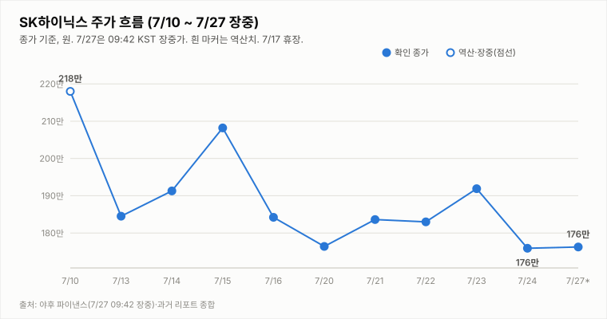
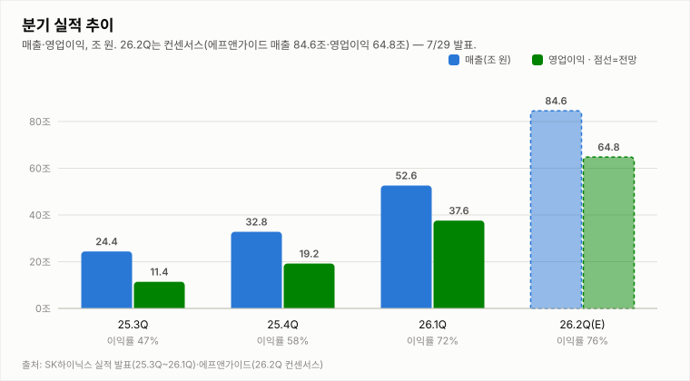
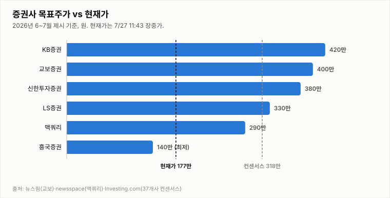

# SK하이닉스 (000660.KS)

## [아침 리포트] 7/24 −8.34% 급락 후 첫 거래일 — 173.5만 방어선 위 175.9만, 7/29 실적(D-2) 대기

**Company Report | 반도체/메모리 | 2026-07-27 (월) 09:10 KST · 7/24 종가 확정 기준**

| 투자의견 | 현재가 (7/24 종가) | 컨센서스 목표주가 | 상승여력 | 차기 촉매 |
|:---:|:---:|:---:|:---:|:---:|
| **중립** (유지·하방 경계) | ₩1,759,000 (−8.34%) | ₩3,175,529 (37개사) | +80.5% | 7/29 2Q 실적 발표 (D-2) |

> 작성 시점: 2026-07-27 09:10 KST · **아침 리포트**(7/24 확정 종가 기준). 헤더 시세는 오늘 장중 자동 갱신. 본 자료는 정보 제공 목적이며 투자 권유가 아닙니다.

---

## 1. 투자 요약 (Investment Summary)

- **7/24 −8.34% 급락 후 첫 거래일.** 지난 금요일 −8.34%(종가 175.9만) 급락으로 1차 방어선(176.4만)을 이탈했으나, **매도 전환 라인(173.5만, 7/20 저가)은 +1.4% 위에서 사수**했습니다. 오늘(7/27)은 이 방어선을 지키는지, 아니면 이탈하는지가 판단의 분기점입니다.
- **주말 사이 긍정 신호: 씨티증권 목표가·추정 상향.** 씨티증권이 SK하이닉스 **2026년 영업이익 추정치를 81.5조로 상향**하며 목표주가를 올렸습니다. 이번 주는 전자업계 릴레이 실적 발표 주간으로, AI 메모리 슈퍼사이클 지속론이 급락과 맞서는 구도입니다.
- **지표는 하락 추세 확정 상태.** KDJ가 **K24.3 < D24.5로 데드크로스**(단기 하락 우위), −DI(34.5)가 +DI(18.3)에 우위, MACD 음(-)입니다. 거래량은 494만 주(20일 평균의 0.80배)로 급락 대비 투매급은 아니었습니다.
- **결론: 중립 유지(하방 경계).** 매도 전환 라인(종가 173.5만)이 지켜져 규칙상 중립을 유지합니다. **오늘 종가가 173.5만을 이탈하면 매도로 하향**, 176.4만을 회복하면 과매도 반등으로 재평가합니다. 어느 쪽이든 방향은 **7/29 2Q 실적(D-2)** 이 최종 확정합니다.

### 핵심 지표

| 구분 | 값 | 기준·출처 |
|---|---|---|
| 현재가(7/24 종가) | ₩1,759,000 (−8.34%) | 야후 파이낸스 7/24 확정 |
| 당일 레인지(7/24) | 175.2만 ~ 189.4만 (시 189.4만) | 야후 파이낸스 |
| 기술 지표 | MACD히스트 -5.0만 · ADX 28.4(-DI 우위) · KDJ **K<D 데드크로스** · ATR 12.1% · 거래량 0.80배 | 7/24 종가 확정 |
| 2Q26 컨센서스 | 매출 84.2조 · 영업이익 64.2조 (이익률 76.3%) | 증권가 종합 |
| 씨티증권 | 2026년 영업이익 추정 81.5조로 상향·목표가 인상 | 파이낸셜뉴스 |

---

## 2. 주가 동향 (직전 거래일 7/24 종가)

7/23 강세 마감(191.9만) → 7/24 **−8.34% 급락 마감(175.9만)**으로 어제 상승분을 하루 만에 반납했습니다. **1차 방어선(176.4만, 7/20 종가)을 종가로 이탈**(저가 175.2만)했으나, **매도 전환 라인(173.5만, 7/20 저가)은 종가로 사수**(175.9만 > 173.5만)했습니다. 오늘(7/27)은 이 방어선의 사수·이탈 여부가 관건입니다.

**직전 거래일(7/24) 확정 시세 — 종가 기준**

| 항목 | 값 |
|---|---|
| 시가 | ₩1,894,000 (−1.30%) |
| 고가 | ₩1,894,000 |
| 저가 | ₩1,752,000 |
| 종가 | ₩1,759,000 (**−8.34%**, −160,000) |
| 거래량 | 4,935,624주 (20일 평균의 0.80배) |

7/23 종가 1,919,000 대비 −160,000원(−8.34%)입니다. 시가(189.4만)가 당일 고가로 개장부터 마감까지 **줄곧 흘러내린 약세 캔들**이며, 종가(175.9만)는 저가(175.2만) 부근에서 마감했습니다. 확정 거래량 494만 주는 20일 평균(614만)의 0.80배로, 급락 대비 투매급은 아니었습니다.

**기술적 지표 (7/24 종가 확정, quote.yml 자동 산출)**

| 지표 | 값 | 해석 |
|---|---|---|
| MACD | -132,537 / 시그널 -82,763 / 히스트 **-49,774** | 하락 모멘텀(음) 지속 |
| ADX / DMI | ADX 28.4 · +DI **18.3** · -DI **34.5** | -DI 우위 강화(하락), 격차 확대 |
| KDJ | K 24.3 · D 24.5 · J 23.7 | **K<D로 데드크로스 — 단기 하락 우위 전환** |
| ATR | 213,429 (12.1%) | 변동성 매우 큼 |
| 거래량 / 20일 이평 | 494만 / 614만 주 (0.80배) | 급락 대비 투매급은 아님 |

지표는 **하락 추세가 확정**된 모습입니다 — KDJ가 **K<D로 데드크로스**하며 단기 우위가 하락으로 넘어갔고, −DI 우위·MACD 음(-)도 지속됩니다. 다만 거래량이 투매급이 아니고 매도 전환 라인(173.5만)은 지켜져, 과매도 반등 여지도 남아 있습니다.

**일별 종가**

| 날짜 | 7/21 | 7/22 | 7/23 | 7/24 |
|---|---|---|---|---|
| 종가(만 원) | 183.6 (+4.1%) | 183.0 (-0.3%) | 191.9 (+4.9%) | **175.9 (-8.3%)** |

---

## 3. 최신 뉴스 Top 5

1. **증권가 2Q 실적 눈높이 하향 릴레이 — 한투 영업익 60.4조·미래 62.3조로 하향** ⚪ — D램·낸드 ASP 전망 하향(LTA 가격 현실화). "수요 우려 아냐, 이미 주가 급락에 선반영" — 목표가·매수의견은 유지 ([서울경제TV](https://www.sentv.co.kr/article/view/sentv202607140012), [머니투데이](https://www.mt.co.kr/stock/2026/07/14/2026071408500455654))
2. **씨티증권, SK하이닉스 2026년 영업이익 추정 81.5조로 상향·목표가 인상** 🟢 — AI 메모리 슈퍼사이클 장기화 근거. 이번 주는 전자업계 릴레이 2Q 실적 발표 주간 ([파이낸셜뉴스](https://www.fnnews.com/news/202607270530350900), [관련 코멘트](https://www.teamblind.com/kr/post/씨티증권-하이닉스-26년-추정치-상향-feat-영업이익-81조-xpq5bbsd))
3. **7/29 2Q 실적 D-2 — 컨센 매출 84.2조·영업이익 64.2조, '영업이익률 76%대' 관전** 🟢 — 전년 동기 대비 매출 +278.6%·영업이익 +597%. 이익률 76.3%로 1Q(71.5%) 대비 개선 전망 ([파이낸셜뉴스](https://www.fnnews.com/news/202607260555359670), [중부매일](https://www.jbnews.com/news/articleView.html?idxno=1507136))
4. **7월(1~20일) 반도체 수출 $221억, +180.6% YoY '사상 최대'** 🟢 — 전체 수출의 40.3%. AI 서버 HBM·고용량 SSD 수요가 견인 ([뉴스핌](https://www.newspim.com/news/view/20260721000263), [이데일리](https://edaily.co.kr/News/Read?mediaCodeNo=257&newsId=03125846645516816))
5. **목표가 편차 확대 — 최고 한화 430만 vs 최저 BNK 185만, 37개사 평균 317.6만** ⚪ — AI 캐펙스 지속성·ADR 상장 효과 해석차. HBM 공급난 장기화가 상향론 근거 ([인베스트조선](https://www.investchosun.com/site/data/html_dir/2026/07/09/2026070980118.html), [중부매일](https://www.jbnews.com/news/articleView.html?idxno=1507136))

---

## 4. 실적 분석

2Q26 컨센서스는 **매출 84.2조·영업이익 64.2조·영업이익률 76.3%**로 분기 역대 최대이며, 1Q(이익률 71.5%) 대비 4.8%p 개선 전망입니다. 전년 동기 대비 매출 +278.6%·영업이익 +597%로, AI 메모리 슈퍼사이클을 반영합니다. 발표(7/29·D-2)를 앞두고 시각은 엇갈립니다 — 한국투자증권(60.4조)·미래에셋(62.3조)은 D램·낸드 ASP 현실화로 2Q 눈높이를 낮췄으나, 씨티증권은 **2026년 연간 영업이익 추정치를 81.5조로 상향**하며 목표가를 올렸습니다. 관전 포인트는 숫자 자체보다 **3분기 가이던스와 수주·LTA 코멘트**로, 회사가 수요 견조를 확인해주면 'AI 캐펙스 취소' 우려(모건스탠리)를 되받는 1차 판정이 됩니다. (7/29 특별판에서 확정 실적으로 차트를 교체합니다.)

---

## 5. 산업 동향 — HBM·NAND

**HBM · DRAM**
- **공급난 장기화** — 메모리 2028년 공급격차 확대 전망 속 삼성·SK 모두 HBM 증설 가속(SK는 청주 M15X 가동). 맥쿼리는 이를 목표가 상향 근거로 제시.
- **점유율** — 26.1Q 매출 기준 SK하이닉스 58%(삼성 21%·마이크론 21%). 연간(E)로는 50%대 수렴 — 리더십 유지, 독점도는 완화.
- **가격** — 2026년 D램 평균 +62%, 낸드 +75% 전망(교보). 3Q도 D램·낸드 추가 상승(트렌드포스). 단, 증권가는 최근 ASP 가정을 소폭 하향(LTA 현실화).

**NAND**
- **가격 강세 지속** — eSSD·고용량 SSD 수요가 수출을 견인, 2026년 낸드 +75% 전망.
- **이익 기여 확대** — SK하이닉스 NAND 부문 2026년 영업이익 5조 원 전망, 수급 균형 양호.

---

## 6. 밸류에이션 — 증권사 목표주가

37개사 컨센서스 목표주가 **317.6만 원**은 종가(175.9만) 대비 **+80.5%** 괴리입니다. 목표가 편차가 큰 국면으로 **최저 185만(BNK)~최고 430만(한화투자증권)** 까지 벌어져 있으며, 주말 씨티증권도 목표가를 상향했습니다. **강세론**은 역대 실적·수출 사상 최대·HBM 공급난 장기화, **신중론**은 AI 캐펙스 지속성 논쟁·변동성(ATR 12%)·괴리 부담을 근거로 실적 증명을 요구합니다. 7/24 급락으로 괴리가 +80%대로 더 벌어졌으나, 이는 실적 확인 전 눈높이 되돌림 성격이 큽니다.

---

## 7. Bull vs Bear

| 🟢 투자 포인트 (Bull) | 🔴 리스크 요인 (Bear) |
|---|---|
| 매도 전환 라인(종가 173.5만) 사수 — 규칙상 매도 조건 미해당 | 7/24 −8.34% 급락, 1차 방어선(176.4만) 종가 이탈 |
| 씨티 2026년 OP 81.5조 상향 등 반등 재료 | KDJ 데드크로스(K<D), −DI(34.5) 우위 강화 — 추세 하락 |
| 2Q 역대 최대 실적 전망(84.2조/64.2조·이익률 76%대, D-2) | 실적 앞둔 경계 매물·차익실현, 눈높이 하향 부담 |
| HBM 공급난 장기화·7월 수출 +180.6% 사상 최대 | 컨센 +80% 괴리 — 실적 하회 시 추가 하락 여지 |

---

## 8. 투자 판단

**의견: 중립 유지 (하방 경계)** — 7/24 종가 기준, 오늘 173.5만 이탈 시 매도 전환

- **급락 후 방어선 위에서 실적 대기**: 7/24 −8.34%(175.9만)로 1차 방어선(176.4만)은 내줬으나 매도 전환 라인(173.5만)은 사수했습니다. KDJ 데드크로스·−DI 우위로 추세는 하락이나, 주말 씨티증권의 **2026년 영업이익 81.5조 상향**이 반등 재료로 맞섭니다.
- **매수 복귀 2조건 판정 → 요원**: ① 종가 200만 회복 = **실패**(175.9만, 200만 대비 −12.1%) ② −DI 우위 해소 = **실패**(−DI 34.5 vs +DI 18.3).
- **매도 전환 3조건 판정 → 미해당(아슬아슬)**: ① 7/29 실적 하회 미발생(D-2) ② **종가 173.5만(7/20 저가) 이탈 = 미발생**(7/24 종가 175.9만으로 +1.4% 위 사수) ③ HBM·낸드 가격 반전 미발생.
- **결론**: 매도 전환 라인이 지켜져 규칙상 중립을 유지합니다. 판단 분기는 명확합니다 — **오늘(7/27) 종가가 173.5만을 이탈하면 매도로 하향**, 176.4만을 회복하면 과매도 반등으로 상향 재평가. 어느 쪽이든 방향은 7/29 2Q 실적(D-2)이 최종 확정합니다. → **중립 유지(하방 경계)**.

**매수 복귀 조건**: ① **종가 200만 회복 + −DI 우위 해소**(거래량 동반 필수) ② 7/29 실적이 컨센서스(84.2조/64.2조) 부합·상회 + 수주·LTA로 수요 우려 반박.

**매도 전환 조건**: ① 7/29 실적/가이던스 기대 하회 또는 AI 수요 둔화 확인 ② **종가 173.5만(7/20 저가) 이탈 후 추가 하락** ③ HBM/낸드 가격 상승세의 하락 반전.

**직전(7/24 마감) 대비 변화**: 중립 유지 — 종가·판단 프레임 불변, 주말 씨티 상향(반등 재료)을 반영하고 D-day를 D-2로 갱신.

---

## 9. 오늘(7/27 월) 관전 포인트

| 구분 | 레벨·내용 |
|---|---|
| **지지** | 1차 **173.5만**(7/20 저가·**매도 전환 라인**) · 2차 **170만**(심리) · 3차 **164만대**(전저점권) |
| **저항** | 1차 **176.4만**(이탈한 7/20 종가·회복 시 반등 신호) · 2차 **183.0만**(7/22 종가) · 3차 **188.9만** |
| **예정 이벤트** | **7/29 2Q 실적 D-2**(컨센 매출 84.2조·영업이익 64.2조·이익률 76%대) · 이번 주 전자업계 릴레이 실적 주간 |
| **관찰 포인트** | ① **종가 173.5만 방어선 사수** 여부(이탈 시 매도 전환) ② 176.4만 회복 여부(반등 전환 신호) ③ 과매도 반발 매수·외국인 수급 ④ 씨티 상향 등 실적 프리뷰 뉴스플로우 |

- **반등(과매도) 시나리오**: 씨티 상향·저가 매수로 176.4만 회복 시 183.0만 재시도. 실적 기대가 받쳐주면 급락이 저점 확인 후 반등으로 전환.
- **기본(중립) 시나리오**: **173.5만~176.4만 좁은 박스**에서 7/29 실적 대기하며 방향 탐색. 변동성(ATR 12%) 유의.
- **하방(매도 전환) 시나리오**: 매물 출회 지속으로 **종가 173.5만 이탈** 시 투자의견을 **매도로 하향**, 170만·전저점권까지 조정 경계.

※ 전망은 7/24 종가·지표 기준의 시나리오이며 확정 예측이 아닙니다. 오늘 장중 수치는 상단 헤더에서 자동 갱신됩니다.

---

*본 자료는 공개 보도·자료를 종합해 작성한 정보 제공 목적의 리포트이며 투자 권유가 아닙니다. 투자 판단과 책임은 투자자 본인에게 있습니다.*
