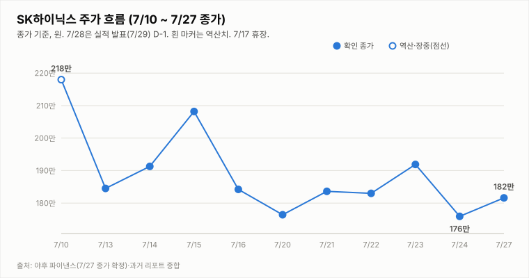
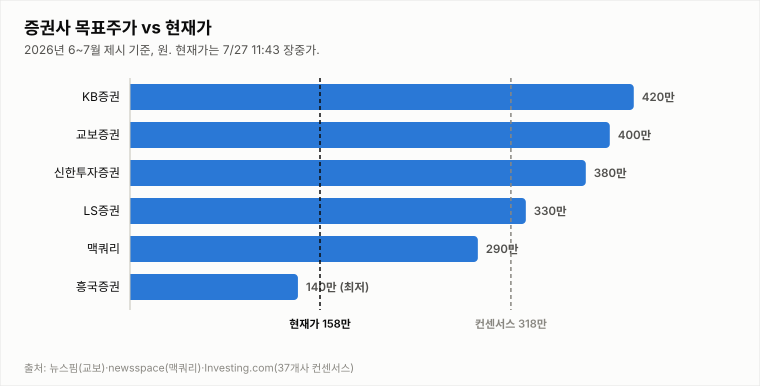

# SK하이닉스 (000660.KS)

## [장중·실적 D-1] −13% 저점권 횡보(157.9만) — 거래량 급증(0.8배)·투매 국면, 7/29 실적이 분수령

**Company Report | 반도체/메모리 | 2026-07-28 (화) 14:05 KST · 장중 업데이트(13:43 기준, 실적 D-1)**

| 투자의견 | 현재가 (7/28 13:43 장중) | 컨센서스 목표주가 | 상승여력 | 차기 촉매 |
|:---:|:---:|:---:|:---:|:---:|
| **중립** (하방 경계 최고조·매도 임박) | ₩1,578,500 (−13.08%) | ₩3,175,529 (37개사) | +101.2% | 7/29 2Q 실적 발표 (D-1) |

> 작성 시점: 2026-07-28 14:05 KST · **장중 실시간 업데이트**(13:43 KST 기준, 마감 전 · **7/29 2Q 실적 D-1**). 시세는 약 10~20분 지연될 수 있으며 장 마감 시 확정치와 다를 수 있습니다. 본 자료는 정보 제공 목적이며 투자 권유가 아닙니다.

---

## 1. 투자 요약 (Investment Summary)

- **−13% 저점권 횡보.** 12:05의 −12.8%(158.4만)에서 큰 추가 하락 없이 **13:43 현재 157.9만(−13.08%, −237,500)**으로, 156~158만 저점권에서 횡보 중입니다. 저가는 156.2만으로 소폭 갱신됐으나 오후 들어 낙폭 확대 속도는 둔화됐습니다.
- **거래량 급증 — 투매(capitulation) 국면.** 거래량이 **469만 주(20일 평균의 0.8배)로 급증**, 오전(319만·0.54배) 대비 크게 늘며 20일 평균에 근접했습니다. 대규모 투매는 **바닥 다지기의 전조**일 수도, 추가 하락의 신호일 수도 있어 마감 흐름이 중요합니다.
- **지표 하락 지속·여전히 과매도.** **KDJ K17.9 < D22.5(J8.6, 과매도)**, −DI(36.6)가 +DI(16.1)에 우위, MACD 히스토그램 −4.8만·ATR 13.3%. 추세 지표는 하락을 가리키나 과매도가 깊어 낙폭 과대 반등 여지도 병존합니다.
- **결론: 중립 유지(하방 경계 최고조·매도 임박).** **매도 전환 라인(173.5만)을 장중 대폭 이탈**했으나 기준은 종가이고, **7/29 실적(D-1)**이 하루 뒤인 데다 투매·과매도가 겹쳐 **실적발 되돌림 여지**도 있어, 공식 매도 하향은 **종가·실적 확인 후**로 둡니다.

### 핵심 지표

| 구분 | 값 | 기준·출처 |
|---|---|---|
| 현재가 | ₩1,578,500 (−13.08%) | 야후 파이낸스 13:43 KST 장중 |
| 당일 레인지 | 156.2만 ~ 167.4만 (시 166.2만·−8.5% 갭다운) | 야후 파이낸스(장중) |
| 기술 지표 | MACD히스트 -4.8만 · ADX 29.5(-DI 우위) · KDJ **데드크로스·J8.6 과매도** · ATR 13.3% · 거래량 **0.8배(급증·투매)** | 13:43 장중 |
| 2Q26 컨센서스 | 매출 83.6~84.2조 · 영업이익 64조+ (이익률 75~76%대) | 증권가 종합 |
| 실적 발표 | **7/29(수) 오전 — D-1** | DART·언론 종합 |

---

## 2. 주가 동향 (장중)

전일(7/27) 종가 181.6만(+3.24%) → 7/28 **−13.5만 갭다운(166.2만) 출발 후 저가 156.2만까지 밀리며 13:43 현재 157.9만(−13.08%)**으로, 12:05(158.4만) 대비 저점권에서 횡보 중입니다. 어제의 V자 반등을 하루 만에 되돌리고 **176.4·173.5(매도 전환 라인)·170.7·160만 전 지지선을 붕괴**했습니다. 다만 오후 들어 낙폭 확대 속도가 둔화되고 **거래량이 469만(0.8배)으로 급증**해, 투매(capitulation) 속 바닥 다지기 여부가 관건입니다. CXMT 상장·엔비디아 순환투자 논란·미 반도체 약세라는 섹터 리스크가 방아쇠입니다.

**당일(7/28) 장중 시세 — 13:43 KST 기준**

| 항목 | 값 |
|---|---|
| 시가 | ₩1,662,000 (−8.48% 갭다운) |
| 고가 | ₩1,674,000 |
| 저가 | ₩1,562,000 |
| 현재가 | ₩1,578,500 (**−13.08%**, −237,500) |
| 거래량(장중) | 4,686,905주 (0.8배·급증) |

전일(7/27) 종가 1,816,000 대비 −237,500원(−13.08%)입니다. 시가 166.2만(−8.5% 갭다운)으로 출발해 저가 156.2만까지 밀렸고, 오후 들어 **156~158만 저점권에서 횡보** 중입니다. 거래량 **469만 주(20일 평균의 0.8배)로 급증**해 오전(319만·0.54배)보다 크게 늘며 20일 평균에 근접했습니다 — **투매(capitulation) 성격이 짙어진 것으로, 바닥 다지기의 전조일 수도 추가 하락 신호일 수도** 있어 마감 흐름이 중요합니다.

**기술적 지표 (13:43 장중 기준, quote.yml 자동 산출)**

| 지표 | 값 | 해석 |
|---|---|---|
| MACD | -152,415 / 시그널 -104,882 / 히스트 **-47,533** | 하락 모멘텀(음) 지속 |
| ADX / DMI | ADX 29.5 · +DI **16.1** · -DI **36.6** | -DI 우위 지속(하락 강화) |
| KDJ | K 17.9 · D 22.5 · J 8.6 | **데드크로스(K<D)·과매도 지속** |
| ATR | 209,732 (13.3%) | 변동성 매우 큼 |
| 거래량(장중) / 20일 이평 | 469만 / 587만 주 (0.8배) | 장중 급증·투매 국면 — 마감 시 갱신 |

지표는 **하락 우위가 지속**됩니다 — KDJ 데드크로스(J8.6 과매도), −DI 우위(36.6), MACD 음(-), ATR 13.3%. 다만 거래량이 20일 평균의 0.8배로 급증한 **투매 국면**인 점은 저점 확인 신호일 수 있어, **과매도 반등과 추세 하락이 맞서는** 국면입니다. 방향은 종가와 내일 실적이 가릅니다.

**일별 종가**

| 날짜 | 7/23 | 7/24 | 7/27 | 7/28(장중) |
|---|---|---|---|---|
| 종가(만 원) | 191.9 (+4.9%) | 175.9 (-8.3%) | 181.6 (+3.2%) | **157.9 (-13.1%)** |

---

## 3. 최신 뉴스 Top 5

1. **실적 D-1 −13% 급락 — 美·中 연타에 삼성·SK 동반 급락, 반도체 투자심리 냉각** 🔴 — 미 반도체株 약세(엔비디아 순환투자 논란·중국 DUV 노광장비 개발)에 중국 CXMT 상장 악재가 겹쳐 SK하이닉스 −13%·삼성전자 동반 급락 ([한국경제](https://www.hankyung.com/article/2026072897296), [인베스팅닷컴](https://kr.investing.com/news/stock-market-news/article-93CH-2028808))
2. **중국 메모리 CXMT 과창판 상장 첫날 +465% 폭등 — 메모리 경쟁 심화 우려** 🔴 — 중국 CXMT 상장·주가 폭등이 국내 메모리주 수급 심리에 부정적. 엔비디아發 AI 투자 지속성 논란과 겹쳐 밸류에이션 경계 확산 ([한국경제](https://www.hankyung.com/article/2026072897296))
3. **7/29 2Q 실적 D-1 — 컨센 매출 83.6~84.2조·영업이익 64조+ 돌파, '영업이익률 75~76%대' 관전** ⚪ — 전년 동기 대비 매출 +278.6%·영업이익 +597%. 관전 포인트는 숫자보다 3Q 가이던스·HBM 수주·LTA 코멘트 ([파이낸셜뉴스](https://www.fnnews.com/news/202607260555359670), [중부매일](https://www.jbnews.com/news/articleView.html?idxno=1507136))
4. **증권가 2Q 실적 눈높이 하향 릴레이 — 한투 영업익 60.4조·미래 62.3조로 하향** ⚪ — D램·낸드 ASP 전망 하향(LTA 가격 현실화). 목표가·매수의견은 유지(한투 380만·미래 420만) ([서울경제TV](https://www.sentv.co.kr/article/view/sentv202607140012), [머니투데이](https://www.mt.co.kr/stock/2026/07/14/2026071408500455654))
5. **씨티증권, SK하이닉스 2026년 영업이익 추정 81.5조로 상향·목표가 인상** 🟢 — AI 메모리 슈퍼사이클 장기화 근거(급락 前 발표). 강세론과 오늘의 섹터 급락이 실적 발표를 앞두고 정면 충돌 ([파이낸셜뉴스](https://www.fnnews.com/news/202607270530350900))

---

## 4. 실적 분석

2Q26 컨센서스는 **매출 83.6~84.2조·영업이익 64조+ 돌파·영업이익률 75~76%대**로 분기 역대 최대이며, 1Q(이익률 71.5%) 대비 개선 전망입니다. 전년 동기 대비 매출 +278.6%·영업이익 +597%로, AI 메모리 슈퍼사이클을 반영합니다. 발표(**7/29·D-1**)를 앞두고 오늘 −13% 급락이 겹치며 **실적 발표가 급락 진정/심화의 분수령**이 됐습니다. 관전 포인트는 숫자 자체보다 **3분기 가이던스·HBM 수주·LTA 코멘트, 그리고 CXMT 경쟁에 대한 회사의 대응**으로, 회사가 수요 견조와 기술 격차를 확인해주면 오늘의 낙폭을 되돌릴 여지가 있습니다. (7/29 특별판에서 확정 실적으로 차트를 교체합니다.)

---

## 5. 산업 동향 — HBM·NAND

**HBM · DRAM**
- **공급난 장기화(펀더멘털 유지)** — 메모리 2028년 공급격차 확대 전망, SK는 청주 M15X 가동. HBM 실수요·수출 지표는 여전히 견조하며, 오늘 급락은 펀더멘털이 아닌 **경쟁 구도·심리 이슈**.
- **신규 경쟁 변수 — CXMT** — 중국 CXMT 상장·급등으로 중장기 범용 D램 경쟁 심화 우려가 부각. 다만 HBM·선단공정 격차는 여전히 크다는 것이 중론.
- **가격** — 2026년 D램 평균 +62%, 낸드 +75% 전망(교보). 단, 증권가는 ASP 가정을 소폭 하향(LTA 현실화).

**NAND**
- **가격 강세 지속** — eSSD·고용량 SSD 수요가 수출을 견인, 2026년 낸드 +75% 전망.
- **이익 기여 확대** — SK하이닉스 NAND 부문 2026년 영업이익 5조 원 전망, 수급 균형 양호.

---

## 6. 밸류에이션 — 증권사 목표주가

37개사 컨센서스 목표주가 **317.6만 원**은 장중가(157.9만) 대비 **+101.2%** 괴리입니다. 오늘 −13% 급락으로 괴리가 +100%로 벌어졌으나, 목표가 대부분이 급락 전 산정치여서 **섹터 리스크(CXMT 경쟁·AI 투자 논란)를 반영한 하향 조정 가능성**에 유의해야 합니다. **강세론**(역대 실적·HBM 공급난 장기화)과 **신중론**(AI 캐펙스 지속성·경쟁 심화)이 내일 실적 발표를 앞두고 정면 충돌하는 국면입니다.

---

## 7. Bull vs Bear

| 🟢 투자 포인트 (Bull) | 🔴 리스크 요인 (Bear) |
|---|---|
| 내일(7/29) 2Q 역대 최대 실적(84조/64조·이익률 76%대) 발표 — 서프라이즈 시 급락 되돌림 여지 | −13% 급락으로 176.4·173.5·170.7·160만 전 지지선 붕괴 — 매도 전환 라인 장중 대폭 이탈 |
| 과매도(KDJ J8.6)·투매(0.8배)·컨센 +101% 괴리 — 낙폭 과대 기술적 반등 가능성 | KDJ 데드크로스·−DI 우위 확대·MACD 심화 — 하락 추세 지속 |
| HBM 공급난 장기화·7월 수출 +180.6% 사상 최대 등 펀더멘털 훼손은 아직 없음 | **CXMT 상장(+465%)·엔비디아 순환투자 논란** — 구조적 경쟁·AI 투자 지속성 우려 |
| 씨티 26년 OP 81.5조 상향 등 강세론 유지(급락 前) | 실적 D-1 불확실성 + 미 반도체 약세 지속 시 추가 하락 여지 |

---

## 8. 투자 판단

**의견: 중립 유지 (하방 경계 최고조·매도 전환 임박)** — −13% 저점권 횡보·투매 급증, 종가·실적 확인 후 공식 하향

- **−13% 저점권 횡보·거래량 급증**: 전일 종가 181.6만 → 10:05 −10%(163.4만) → 12:05 −12.8%(158.4만) → **13:43 −13.08%(157.9만)**으로, 오후엔 156~158만 저점권에서 횡보 중입니다. 거래량이 **469만(0.8배)으로 급증**해 투매(capitulation) 성격이 짙어졌습니다.
- **매수 복귀 2조건 판정 → 완전 후퇴**: ① 종가 200만 회복 = **실패**(장중 157.9만) ② −DI 우위 해소 = **실패**(−DI 36.6로 확대 vs +DI 16.1). 어제의 KDJ 골든크로스도 **데드크로스로 무효화**.
- **매도 전환 3조건 판정 → 장중 2/3 충족**: ① 7/29 실적 하회 = 미확정(D-1) ② **종가 173.5만 이탈 = 장중 충족**(157.9만 << 173.5만, 종가 확정 대기) ③ **HBM/낸드 경쟁 우려 부각 = CXMT 상장으로 사실상 발현**. 3개 중 2개가 장중 충족됐습니다.
- **결론**: 매도 전환 조건이 장중 대부분 충족돼 **종가로 173.5만 이탈이 확정되면 투자의견을 매도로 하향**합니다. 다만 하루 뒤 2Q 실적(D-1)이 대형 변수이고 **투매·과매도(J8.6)가 겹쳐**, 공식 하향은 **오늘 종가와 7/29 실적**을 확인한 뒤로 둡니다 — 실적 서프라이즈 시 낙폭 과대 되돌림도 가능하기 때문입니다. → **중립 유지(하방 경계 최고조·매도 임박)**.

**매수 복귀 조건**: ① **종가 200만 회복 + −DI 우위 해소**(거래량 동반 필수) ② 7/29 실적이 컨센서스(84조/64조) 부합·상회 + 수주·LTA로 수요 우려 반박 + CXMT 경쟁 우려 진화.

**매도 전환 조건(장중 대부분 충족)**: ① 7/29 실적/가이던스 기대 하회 또는 AI 수요 둔화 확인 ② **종가 173.5만(7/20 저가) 이탈 후 추가 하락**(장중 충족) ③ HBM/낸드 경쟁 심화·가격 반전(CXMT 상장으로 발현).

**직전(7/28 12:05) 대비 변화**: 중립(하방 경계 최고조) 유지 — −12.8%→−13.08%로 저점권 횡보, 거래량이 0.8배로 급증한 **투매 국면**을 반영. 판단 프레임(종가·실적이 분수령)은 동일하며, 투매·과매도는 낙폭 과대 반등의 빌미도 됩니다.

---

## 9. 오늘(7/28 화) 관전 포인트 · 7/29 실적 D-1

| 구분 | 레벨·내용 |
|---|---|
| **지지** | 1차 **156.2만**(오늘 저가) · 2차 **155만**(추가 조정권) · 3차 **150만**(심리) |
| **저항** | 1차 **163만**(장중 반등권) · 2차 **170.7만**(7/27 저가) · 3차 **173.5만**(붕괴한 매도 전환 라인·회복 시 급락 진정) |
| **D-day** | **7/29(수) 오전 2Q 실적 발표 (D-1)** — 컨센 매출 83.6~84.2조·영업이익 **64조+ 돌파**·이익률 75~76%대. 급락 국면에서 **서프라이즈 여부·3Q 가이던스·CXMT 경쟁 대응 코멘트**가 급락 진정/심화의 분수령 |
| **관찰 포인트** | ① **종가 173.5만 이탈 확정** 여부(→ 매도 전환) ② 과매도(J8.6)·투매(0.8배) **바닥 다지기 vs 추가 하락** ③ 외국인·기관 순매도 강도 ④ 미 반도체株·CXMT·엔비디아 뉴스플로우 ⑤ 마감 거래량(투매 클라이맥스 확인) |

- **낙폭 과대 반등 시나리오**: 투매 속 과매도(KDJ J8.6)에서 저가 매수·실적 서프라이즈 기대로 **163만~170.7만 되돌림**. 종가로 173.5만을 회복하면 급락은 일단 진정.
- **기본(약세) 시나리오**: **155만~163만에서 실적 대기**, 투매와 저가 매수가 맞서며 변동성(ATR 13.3%) 지속. 종가가 173.5만을 밑돌면 매도 전환 판정은 실적으로 넘어감.
- **하방(매도 전환) 시나리오**: 미·중 악재 지속·추가 투매로 **155만·150만 이탈** 시 투자의견 **매도로 하향**. 종가 173.5만 이탈은 이미 장중 확정적.
- **실적 판정(7/29) 시나리오**: 컨센 부합·상회 + 3Q 가이던스 견조 + CXMT 경쟁 우려 반박 시 **낙폭 과대 되돌림**, 하회·실망 시 **매도 전환 확정**. 7/29 특별판에서 확정 실적으로 최종 판정합니다.

※ 전망은 7/28 장중(13:43) 시세·지표 기준의 시나리오이며 확정 예측이 아닙니다. 방향은 7/29 2Q 실적(D-1)이 최종 확정합니다. 장중가는 미확정입니다.

---

*본 자료는 공개 보도·자료를 종합해 작성한 정보 제공 목적의 리포트이며 투자 권유가 아닙니다. 장중 수치는 미확정이며 오류가 있을 수 있습니다. 투자 판단과 책임은 투자자 본인에게 있습니다.*
