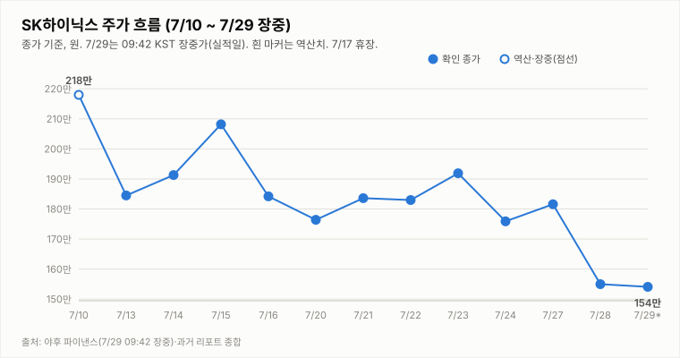
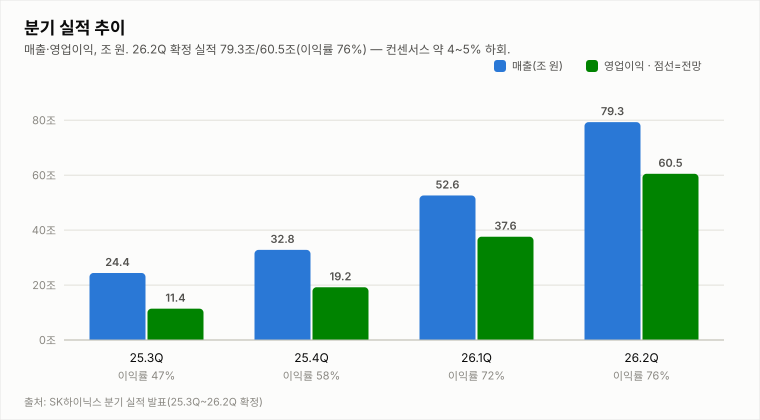
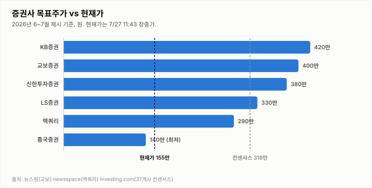

# SK하이닉스 (000660.KS)

## [2Q 실적 발표 특별판] 영업이익 60.5조·컨센 약 5% 하회 — 발표 후 −6.7% 추가 급락, 투자의견 매도 유지

**Company Report | 반도체/메모리 | 2026-07-29 (수) 09:15 KST · 2Q 실적 발표 특별판(확정 실적 반영)**

| 투자의견 | 현재가 (7/28 종가·7/29 반응 별도) | 2Q 영업이익 (확정) | 상승여력 (종가 기준) | 차기 촉매 |
|:---:|:---:|:---:|:---:|:---:|
| **매도** (유지·실적 컨센 하회) | ₩1,550,000 (−14.65%) | 60.5조 원 | +104.9% | 컨콜 3Q 가이던스·주가 안정화 |

> 작성 시점: 2026-07-29 09:15 KST · **2Q 실적 발표 특별판**(7/28 종가·7/29 확정 실적 기준). 헤더 현재가는 7/29 장중 반응을 자동 갱신합니다(야후 지연). 본 자료는 정보 제공 목적이며 투자 권유가 아닙니다.

---

## 1. 투자 요약 (Investment Summary)

- **2Q 실적, 역대 최대이나 컨센 하회.** 매출 **79.3조**·영업이익 **60.5조**·영업이익률 **76%**(전분기 72%→개선)로 분기 역대 최대, YoY 매출 +257%·영업이익 +557%입니다. 그러나 컨센서스(매출 ~84조·영업이익 ~64조)를 **약 4~5% 하회**했습니다.
- **발표 후 −6.7% 추가 급락.** 7/28 −14.65%(종가 155.0만)에 이어 **7/29 실적 발표 후 장중 약 144.6만(−6.7%)**까지 밀렸습니다(야후 지연으로 헤더는 155만 표기 후 자동 갱신). 이틀간 181.6만 → 144만대로 **약 −20%** 조정입니다.
- **긍정 요인도 확인 — LTA 체결.** D램·낸드 가격 상승, HBM·AI 서버 D램·eSSD 판매 확대가 실적을 견인했고, **핵심 고객 포함 10여 곳과 장기공급계약(LTA) 마무리·추가 협상** 중이라 밝혔습니다(수요 가시성 긍정). 다만 지표는 KDJ J6.5 극단 과매도·−DI 우위로 하락 우위입니다.
- **결론: 투자의견 매도 유지.** 사전 제시한 **매도 전환 3조건이 모두 확정**됐습니다 — ① 실적 컨센 하회(확정) ② 종가 173.5만 이탈(확정) ③ CXMT 경쟁 부각. 어제 하향이 실적으로 검증된 만큼 매도를 유지하되, 하회폭이 modest하고 절대 실적·이익률·LTA가 견조해 **주가 안정화·컨콜 가이던스에 따라 중립 복귀**를 검토합니다.

### 핵심 지표

| 구분 | 값 | 기준·출처 |
|---|---|---|
| 2Q26 매출 / 영업이익 | 79.3조 / 60.5조 (이익률 76%) | SK하이닉스 실적 발표(7/29) |
| 컨센서스 대비 | 매출·영업이익 각 **약 4~5% 하회** | 에프앤가이드 |
| 성장률 | YoY 매출 +256.8%·영업익 +557.2% / QoQ 매출 +50.9%·영업익 +61.0% | 실적 발표 |
| 7/28 종가 | ₩1,550,000 (−14.65%) · 거래량 812만(1.38배) | 야후 파이낸스 확정 |
| 7/29 실적 후 반응 | 장중 약 144.6만 (−6.7%) | 언론 종합 |
| 기술 지표(7/28 종가) | KDJ J6.5 극단 과매도 · −DI 우위 · MACD 음(-) · ATR 13.6% | quote.yml |

---

## 2. 주가 동향 (전일 종가 + 실적일 반응)

7/27 종가 181.6만 → 7/28 **−14.65% 폭락(종가 155.0만)** → 7/29 **2Q 실적(컨센 하회) 발표 후 장중 약 144.6만(−6.7%)**까지, 이틀간 **약 −20%** 조정 중입니다. CXMT 상장·엔비디아 순환투자 논란·미 반도체 약세로 촉발된 급락에 **실적 컨센 하회가 더해진** 흐름입니다. 7/28 확정 거래량은 **812만(20일 평균의 1.38배)**으로 대량 투매(capitulation)를 확인했고, 176.4·173.5(매도 전환 라인)·170.7·160만 전 지지선을 이미 종가로 이탈한 상태입니다. (7/29 장중 시세는 야후 지연으로 상단 헤더가 자동 갱신합니다.)

**전일(7/28) 확정 시세 — 종가 기준**

| 항목 | 값 |
|---|---|
| 시가 | ₩1,662,000 (−8.48% 갭다운) |
| 고가 | ₩1,674,000 |
| 저가 | ₩1,550,000 |
| 종가 | ₩1,550,000 (**−14.65%**, −266,000) |
| 거래량 | 8,120,587주 (1.38배·대량 투매) |

7/28 종가는 1,550,000원(−14.65%)으로 저가에 마감했고, 확정 거래량은 **812만 주(20일 평균의 1.38배)**로 대량 투매를 확인했습니다. 이어 **7/29 실적 발표 후에도 장중 약 144.6만(−6.7%)**까지 밀려, 컨센 하회에 대한 실망이 반영되고 있습니다. 아래 기술적 지표는 7/28 종가 기준(7/29 장중 미확정)입니다.

**기술적 지표 (7/28 종가 확정, quote.yml 자동 산출)**

| 지표 | 값 | 해석 |
|---|---|---|
| MACD | -154,691 / 시그널 -105,340 / 히스트 **-49,351** | 하락 모멘텀(음) 심화 |
| ADX / DMI | ADX 29.5 · +DI **16.0** · -DI **36.9** | -DI 우위 확대(하락 강함) |
| KDJ | K 17.0 · D 22.2 · J 6.5 | **데드크로스·극단 과매도(J6.5)** |
| ATR | 210,589 (13.6%) | 변동성 매우 큼 |
| 거래량 / 20일 이평 | 812만 / 587만 주 (1.38배) | 20일 평균의 1.38배 — 대량 투매(capitulation) |

지표는 **강한 하락 우위**입니다 — KDJ 데드크로스에 J6.5로 극단 과매도, −DI 우위(36.9), MACD 음(-) 심화, ATR 13.6%. 대량 투매(1.38배)와 극단 과매도는 **낙폭 과대 반등**의 기술적 조건이나, 실적 컨센 하회가 확인되며 **반등 트리거(실적 서프라이즈)는 소멸**했습니다. 이제 관건은 컨콜 3Q 가이던스와 주가 안정화 여부입니다.

**일별 종가**

| 날짜 | 7/24 | 7/27 | 7/28 | 7/29(실적일) |
|---|---|---|---|---|
| 종가(만 원) | 175.9 (-8.3%) | 181.6 (+3.2%) | 155.0 (-14.7%) | **~144.6 (장중 -6.7%)** |

---

## 3. 최신 뉴스 Top 5

1. **🔴 2Q 확정 실적 — 매출 79.3조·영업이익 60.5조·이익률 76%, 컨센 약 4~5% 하회** 🔴 — 분기 역대 최대(YoY 매출 +257%·영업익 +557%)이나 컨센(매출 ~84조·영업익 ~64조)엔 미달. D램·낸드 가격 상승·HBM·eSSD 판매 확대가 견인 ([인사이트](https://www.insight.co.kr/news/565222), [네이트](https://news.nate.com/view/20260729n05031))
2. **실적 발표 후 −6.7% 추가 급락(약 144.6만) — 이틀간 약 −20% 조정** 🔴 — 7/28 −14.65%에 이어 실적 컨센 하회 실망으로 추가 하락. 삼성전자 동반 약세 ([네이트](https://news.nate.com/view/20260729n05031), [파이낸셜뉴스](https://www.fnnews.com/news/202607290501215188))
3. **SK하이닉스, 핵심 고객 포함 10여 곳 LTA(장기공급계약) 마무리·추가 협상** 🟢 — 회사가 실적 발표에서 밝힌 하반기 수요 가시성 요인. HBM·AI 서버 수요 견조 주장 ([네이트](https://news.nate.com/view/20260729n05031))
4. **중국 메모리 CXMT 과창판 상장 첫날 +465% 폭등 — 메모리 경쟁 심화 우려** 🔴 — CXMT 상장·급등 + 엔비디아 순환투자 논란·미 반도체 약세가 7/28 −14.5% 급락의 방아쇠. 구조적 경쟁·밸류에이션 경계 ([한국경제](https://www.hankyung.com/article/2026072897296))
5. **증권가 눈높이 하향이 결과적으로 근접 — 한투 60.4조 등 보수적 추정치에 부합** ⚪ — 발표 前 한투(60.4조)·미래(62.3조)의 하향 추정치가 실제(60.5조)에 근접. 씨티는 26년 OP 81.5조 상향(급락 前) ([서울경제TV](https://www.sentv.co.kr/article/view/sentv202607140012))

---

## 4. 실적 분석

**2Q26 확정 실적: 매출 79.3조·영업이익 60.5조·영업이익률 76%**로 분기 역대 최대입니다. 전분기 대비 매출 +50.9%·영업이익 +61.0%, 전년 동기 대비 매출 +256.8%·영업이익 +557.2%로 AI 메모리 슈퍼사이클을 반영하며, 이익률은 1Q 72%에서 76%로 4%p 개선됐습니다. D램·낸드 가격 상승과 HBM·AI 서버 D램·eSSD 판매 확대가 견인했습니다.

다만 **컨센서스(매출 ~84조·영업이익 ~64조)를 약 4~5% 하회**했습니다. 실제치는 발표 前 눈높이를 낮췄던 한국투자증권(60.4조) 등 **보수적 추정치에는 부합**했으나, 시장 평균에는 미달해 발표 후 주가가 추가 하락했습니다. 회사는 **핵심 고객 포함 10여 곳과 장기공급계약(LTA)을 마무리**했고 추가 계약을 논의 중이라 밝혀, 하반기 수요 가시성은 긍정적입니다. 관건은 **컨콜의 3분기 가이던스·HBM 출하·CXMT 경쟁 대응 코멘트**로, 이것이 주가 안정화 여부를 좌우합니다.

---

## 5. 산업 동향 — HBM·NAND

**HBM · DRAM**
- **공급난 장기화(펀더멘털 유지)** — 메모리 2028년 공급격차 확대 전망, SK는 청주 M15X 가동. HBM 실수요·수출 지표는 여전히 견조하며, 최근 급락은 펀더멘털이 아닌 **경쟁 구도·심리 이슈** + 실적 컨센 하회.
- **신규 경쟁 변수 — CXMT** — 중국 CXMT 상장·급등으로 중장기 범용 D램 경쟁 심화 우려가 부각. 다만 HBM·선단공정 격차는 여전히 크다는 것이 중론.
- **가격** — 2026년 D램 평균 +62%, 낸드 +75% 전망(교보). 2Q에도 D램·낸드 가격 상승이 실적을 견인.

**NAND**
- **가격 강세 지속** — eSSD·고용량 SSD 수요가 실적 견인, 2026년 낸드 +75% 전망.
- **이익 기여 확대** — SK하이닉스 NAND 부문 2026년 영업이익 5조 원 전망, 수급 균형 양호.

---

## 6. 밸류에이션 — 증권사 목표주가

37개사 컨센서스 목표주가 **317.6만 원**은 7/28 종가(155.0만) 대비 **+104.9%**, 7/29 장중가(약 144.6만) 대비 **약 +120%** 괴리입니다. 목표가 대부분이 급락·실적 前 산정치(최저 185만 BNK~최고 420만 미래에셋)여서, **실적 컨센 하회·CXMT 경쟁을 반영한 목표가 하향 조정**이 뒤따를 가능성이 큽니다. 다만 이틀간 −20% 조정으로 밸류에이션 부담은 크게 완화됐고, 절대 실적·이익률(76%)·LTA는 견조해 **주가 안정화 시 낙폭 과대 매력**이 부각될 수 있습니다.

---

## 7. Bull vs Bear

| 🟢 투자 포인트 (Bull) | 🔴 리스크 요인 (Bear) |
|---|---|
| 2Q 역대 최대 실적(79.3조/60.5조·이익률 76%)·YoY 영업익 +557% — 절대 이익 규모 견조 | **2Q 실적 컨센 약 4~5% 하회** — 발표 후 −6.7% 추가 급락, 매도 전환 3조건 전부 확정 |
| LTA(장기공급계약) 10여 곳 마무리·HBM·eSSD 판매 확대 — 하반기 수요 가시성 | KDJ 데드크로스·−DI 우위·MACD 심화 — 하락 추세 강함, 반등 트리거(실적) 소멸 |
| 이틀간 −20% 조정·극단 과매도(J6.5)·대량 투매(1.38배) — 낙폭 과대 반등 조건 | **CXMT 상장(+465%)·엔비디아 순환투자 논란** — 구조적 경쟁·AI 투자 지속성 우려 |
| 밸류 부담 완화(컨센 +105~120% 괴리)·안정화 시 저평가 매력 | 실적 컨센 하회로 증권사 목표가 하향 조정 리스크 |

---

## 8. 투자 판단

**의견: 매도 유지** — 2Q 실적 컨센 하회 확정, 매도 전환 3조건 모두 충족 · 단, 안정화 시 중립 복귀 검토

- **2Q 실적 컨센 하회 확정**: 매출 79.3조·영업이익 60.5조·이익률 76%로 역대 최대이나 **컨센(매출 ~84조·영업익 ~64조)을 약 4~5% 하회**했습니다. 발표 후 주가는 **추가 −6.7%(약 144.6만)**로, 7/28 −14.65%에 이어 이틀간 약 −20% 조정입니다.
- **매도 전환 3조건 판정 → 3/3 전부 확정**: ① **실적 컨센 하회 = 확정**(오늘 발표) ② **종가 173.5만 이탈 = 확정**(7/28 종가 155.0만) ③ **HBM/낸드 경쟁 우려 = CXMT 상장으로 발현**. 어제 종가로 매도 하향한 근거가 **실적으로 검증**됐습니다.
- **매수 복귀 2조건 판정 → 완전 미달**: ① 종가 200만 회복 = **실패**(144만대) ② −DI 우위 해소 = **실패**(−DI 36.9 vs +DI 16.0). 반등 트리거였던 실적 서프라이즈가 **하회로 소멸**했습니다.
- **결론**: 3조건 전부 충족으로 매도가 타당합니다. 다만 ① 하회폭이 4~5%로 modest하고 이미 눈높이 하향에 상당 부분 선반영 ② 절대 실적·이익률(76%)·LTA 견조 ③ 이틀간 −20% 조정으로 밸류 부담 완화 — 이 세 가지에서 **주가 안정화·컨콜 3Q 가이던스 확인 시 중립 복귀**를 검토합니다. 극단 과매도(J6.5)는 기술적 반등 빌미이나 추세는 강한 하락입니다. → **매도 유지**.

**중립 복귀 조건**: ① 컨콜 3Q 가이던스 견조(HBM 출하·가격) + CXMT 경쟁 우려 진화 ② 종가 안정화(추가 급락 중단, 낙폭 과대 반등 확인) ③ 종가 173.5만 회복.

**매도 심화 조건**: ① 3Q 가이던스 실망·수요 둔화 확인 ② 종가 140만·135만 추가 이탈 ③ 미 반도체 약세·CXMT 경쟁 우려 지속·목표가 하향 릴레이.

**직전(7/28 마감·매도) 대비 변화**: **매도 유지**. 실적 컨센 하회로 매도 전환 조건 ①이 추가 확정돼 3조건 모두 충족. 형식상 매도를 유지하되, modest한 하회폭·견조한 절대 실적·LTA를 감안해 안정화 시 중립 복귀 여지를 명시합니다.

---

## 9. 오늘(7/29 수) 관전 포인트 · 실적 발표 후

| 구분 | 레벨·내용 |
|---|---|
| **지지** | 1차 **144만**(실적일 장중 저가권) · 2차 **140만**(심리) · 3차 **135만**(추가 조정권) |
| **저항** | 1차 **150만**(단기) · 2차 **155만**(7/28 종가) · 3차 **173.5만**(이탈한 매도 전환 라인·종가 회복 시 매도 재검토) |
| **이벤트** | **실적 발표 완료(컨센 하회)** · **컨퍼런스콜(3Q 가이던스·HBM 출하·CXMT 경쟁 대응)**이 남은 최대 변수 · 증권사 목표가 조정 릴레이 주시 |
| **관찰 포인트** | ① **컨콜 3Q 가이던스**(견조 시 낙폭 과대 반등 트리거) ② 실적 발표 후 **주가 안정화 여부**(추가 급락 vs 저가 매수) ③ 극단 과매도(J6.5) 기술적 반등 ④ 외국인·기관 순매도 지속 ⑤ 미 반도체株·CXMT 후속 뉴스 |

- **안정화·낙폭 과대 반등 시나리오**: 컨콜 3Q 가이던스 견조 + 저가 매수 유입 시, 극단 과매도(J6.5)와 맞물려 **150만·155만 되돌림**. 안정화가 확인되면 **매도 → 중립 복귀 검토**.
- **기본(약세 지속) 시나리오**: 컨센 하회 실망·목표가 하향으로 **140~150만 등락**. 변동성(ATR 13.6%) 큰 등락 반복 속 방향 탐색.
- **하방(매도 심화) 시나리오**: 컨콜 가이던스 실망·미 반도체 약세 지속 시 **140만·135만 추가 이탈**, 매도 의견 유지·목표 하향.
- **판정 계획**: 확정 실적을 반영해 **매도 유지**로 판정했습니다. 컨콜 가이던스·주가 안정화를 확인해 다음 리포트에서 중립 복귀 여부를 재검토합니다.

※ 전망은 7/28 종가·7/29 확정 실적 기준의 시나리오이며 확정 예측이 아닙니다. 7/29 장중 시세는 야후 지연으로 상단 헤더가 자동 갱신합니다.

---

*본 자료는 공개 보도·자료를 종합해 작성한 정보 제공 목적의 리포트이며 투자 권유가 아닙니다. 수치는 조사 시점 기준이며 오류가 있을 수 있습니다. 투자 판단과 책임은 투자자 본인에게 있습니다.*
