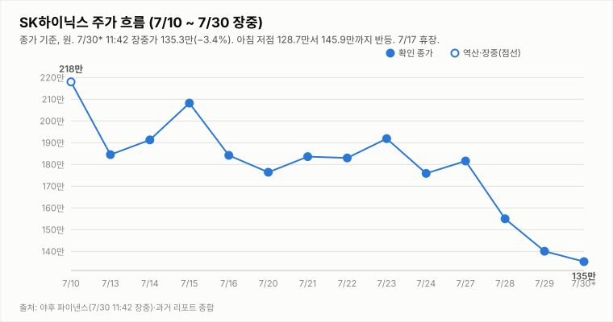
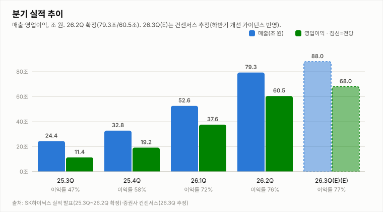
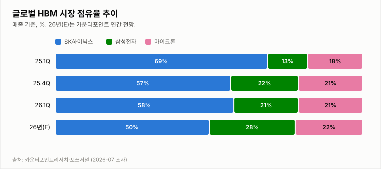
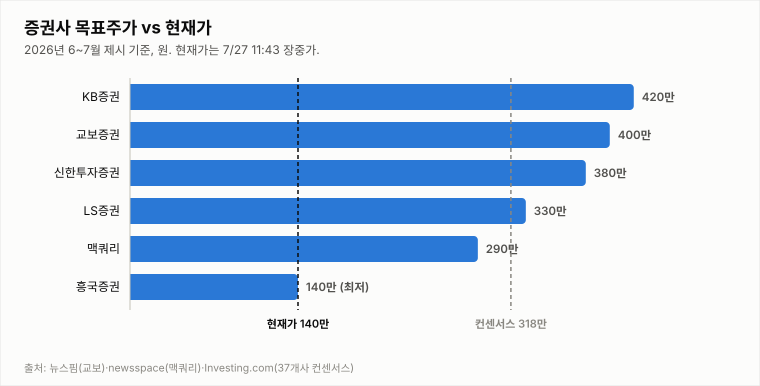

# SK하이닉스 (000660.KS)

## [아침·실적 급락 다음 날] 7/29 종가 140.1만(−9.6%, 저가서 +12% 반등·거래량 2.1배) — 투매 정점 확인 대기, 매도 유지

**Company Report | 반도체/메모리 | 2026-07-30 (목) 09:10 KST · 아침 리포트(7/29 종가 확정 기준·실적 급락 다음 날)**

| 투자의견 | 현재가 (7/29 종가) | 2Q 영업이익 (확정) | 상승여력 (종가 기준) | 차기 촉매 |
|:---:|:---:|:---:|:---:|:---:|
| **매도** (유지·투매 정점 관찰) | ₩1,401,000 (−9.61%) | 60.5조 원 | +126.7% | 7/30 반등 지속 여부·−DI 해소 |

> 작성 시점: 2026-07-30 09:10 KST · **아침 리포트**(7/29 종가 확정 기준, 실적 급락 다음 날). 현재가는 7/30 장중 개장 후 자동 갱신됩니다(야후 지연). 본 자료는 정보 제공 목적이며 투자 권유가 아닙니다.

---

## 1. 투자 요약 (Investment Summary)

- **실적 급락 다음 날 — 7/29 종가는 저점서 크게 반등.** 7/29 실적일 장중 −19%(저가 124.6만)까지 폭락했으나 **종가 140.1만(−9.61%)**으로, 저점 대비 **+12.4% 반등** 마감했습니다(장중 −11.5%보다 확정 종가가 더 회복). 3일 누적(7/27 181.6만 → 140.1만) 약 −22.8% 조정입니다.
- **거래량 2.1배 — 투매 정점(selling climax) 신호 강화.** 확정 거래량 **1,243만 주(20일 평균의 2.07배)**로 연중 최대급입니다. 패닉 저점이 대량 거래 속에 강하게 매수돼 종가를 −9.6%로 만회한 점은 **투매 정점(capitulation)**의 유력한 신호입니다.
- **지표도 저점서 반등.** **KDJ J값이 장중 −2.2에서 종가 12.7로 반등**(K18.1 여전히 D20.9 아래), MACD 히스토그램도 개선. 다만 −DI(42.2)가 +DI(14.1)에 우위, ATR 15.9%로 추세·변동성은 여전히 하락·큼입니다.
- **결론: 매도 유지(투매 정점 관찰).** 하방 3조건은 모두 충족돼 매도를 유지하나, 저점 반등·연중 최대 거래량·지표 반등이 겹쳐 **투매 정점 가능성은 한층 높아졌습니다**. **오늘(7/30) 반등 지속·−DI 해소**가 확인되면 **중립 복귀**를 검토합니다.

### 핵심 지표

| 구분 | 값 | 기준·출처 |
|---|---|---|
| 현재가(전일 종가) | ₩1,401,000 (−9.61%) | 야후 파이낸스 7/29 종가 확정 |
| 7/29 레인지 | 124.6만 ~ 161.9만 (종가 140.1만·저점 대비 +12.4%) | 야후 파이낸스 |
| 2Q26 실적 | 매출 79.3조·영업이익 60.5조·이익률 76% (컨센 약 4~5% 하회) | SK하이닉스(7/29) |
| 기술 지표 | KDJ J −2.2→12.7 반등 · −DI 42.2 우위 · MACD 음(-) · ATR 15.9% · 거래량 **2.07배** | 7/29 종가 확정 |
| 컨콜 가이던스 | 하반기 실적 개선 강화(HBM4 본격 확대·비트그로스 상반기 상회) | SK하이닉스 컨퍼런스콜 |

---

## 2. 주가 동향 (전일 종가 기준)

7/27 181.6만 → 7/28 **−14.65%(155.0만)** → 7/29 실적 발표일 **장중 저가 124.6만(−19%)까지 폭락 후 종가 140.1만(−9.61%)으로 반등 마감**했습니다. 오전 고가 161.9만서 저가 124.6만까지 밀린 뒤 저점에서 **+12.4% 되돌려**, 패닉 장세 끝에 낙폭을 크게 만회했습니다. 3일 누적 **약 −22.8%** 조정입니다. 확정 거래량은 **1,243만(20일 평균의 2.07배)**으로 연중 최대급이며, 패닉 저점이 대량 거래 속에 매수된 **투매 정점(selling climax)** 성격이 뚜렷합니다. 오늘(7/30)은 이 반등이 이어지는지가 관건입니다.

**전일(7/29) 확정 시세 — 종가 기준**

| 항목 | 값 |
|---|---|
| 시가 | ₩1,567,000 |
| 고가 | ₩1,619,000 |
| 저가 | ₩1,246,000 (−19% 저점) |
| 종가 | ₩1,401,000 (**−9.61%**, −149,000, 저점 대비 +12.4%) |
| 거래량 | 12,428,883주 (2.07배·투매 정점) |

7/28 종가 1,550,000원 대비 −149,000원(−9.61%)입니다. 장중 저가 124.6만(−19%)까지 폭락했으나 매수세가 유입돼 **종가 140.1만으로 저점 대비 +12.4% 반등**했습니다. 확정 거래량 **1,243만 주(20일 평균의 2.07배)**로 연중 최대급 대량 거래이며, 패닉 저점이 강하게 매수된 **투매 정점(capitulation)** 성격이 뚜렷합니다.

**기술적 지표 (7/29 종가 확정, quote.yml 자동 산출)**

| 지표 | 값 | 해석 |
|---|---|---|
| MACD | -181,092 / 시그널 -120,496 / 히스트 **-60,596** | 음(-) 지속이나 저점 대비 개선 |
| ADX / DMI | ADX 30.9 · +DI **14.1** · -DI **42.2** | -DI 우위 지속(하락) |
| KDJ | K 18.1 · D 20.9 · J 12.7 | **J 장중 -2.2→12.7 반등** — 저점 신호 |
| ATR | 222,189 (15.9%) | 변동성 매우 큼 |
| 거래량 / 20일 이평 | 1,243만 / 602만 주 (2.07배) | 20일 평균의 2.07배 — 투매 정점(연중 최대급) |

추세 지표(−DI 42.2 우위·MACD 음)는 여전히 하락이나, **KDJ J값이 장중 −2.2에서 종가 12.7로 반등**하고 MACD 히스토그램도 저점 대비 개선되며, 연중 최대급 거래량(2.07배)이 저점 매수와 맞물린 점은 **투매 정점의 유력한 신호**입니다. 다만 −DI 우위가 여전해 추세 전환 확인에는 **오늘(7/30) 반등 지속과 −DI 우위 해소**가 필요합니다.

**일별 종가**

| 날짜 | 7/24 | 7/27 | 7/28 | 7/29 |
|---|---|---|---|---|
| 종가(만 원) | 175.9 (-8.3%) | 181.6 (+3.2%) | 155.0 (-14.7%) | **140.1 (-9.6%)** |

---

## 3. 최신 뉴스 Top 5

1. **🔴 2Q 확정 실적 — 매출 79.3조·영업이익 60.5조·이익률 76%, 컨센 약 4~5% 하회** 🔴 — 분기 역대 최대(YoY 매출 +257%·영업익 +557%)이나 컨센(매출 ~84조·영업익 ~64조)엔 미달. D램·낸드 가격 상승·HBM·eSSD 판매 확대가 견인 ([인사이트](https://www.insight.co.kr/news/565222), [네이트](https://news.nate.com/view/20260729n05031))
2. **7/29 실적일 −9.6% 마감(장중 −19% 후 +12% 반등)·거래량 2.1배 — 투매 정점 유력** ⚪ — 저가 124.6만서 종가 140.1만으로 반등, 연중 최대급 거래량 속 패닉 저점 매수. 3일 누적 −22.8% ([파이낸셜뉴스](https://www.fnnews.com/news/202607290501215188), [머니투데이](https://www.mt.co.kr/stock/2026/07/28/2026072816251241828))
3. **[컨콜] "하반기 실적 개선 강화 — HBM4 본격 확대·비트그로스 상반기 상회"** 🟢 — 2Q HBM4 양산 출하 개시·하반기 본격 확대, 1c D램 출하 확대, 핵심 고객 포함 10여 곳 LTA 마무리. 가이던스는 견조하나 주가는 CXMT·매크로에 반응 ([서울경제TV](https://www.sentv.co.kr/article/view/sentv202607290048), [뉴스핌](https://www.newspim.com/news/view/20260729000286))
4. **중국 메모리 CXMT 과창판 상장 첫날 +465% 폭등 — 메모리 경쟁 심화 우려** 🔴 — CXMT 상장·급등 + 엔비디아 순환투자 논란·미 반도체 약세가 반도체 업종 전반 급락의 방아쇠. 구조적 경쟁·밸류에이션 경계 ([한국경제](https://www.hankyung.com/article/2026072897296))
5. **증권가 눈높이 하향이 결과적으로 근접 — 한투 60.4조 등 보수적 추정치에 부합** ⚪ — 발표 前 한투(60.4조)·미래(62.3조)의 하향 추정치가 실제(60.5조)에 근접. 목표가 조정 릴레이 가능성 주시 ([서울경제TV](https://www.sentv.co.kr/article/view/sentv202607140012))

---

## 4. 실적 분석

**2Q26 확정 실적: 매출 79.3조·영업이익 60.5조·영업이익률 76%**로 분기 역대 최대입니다. 전분기 대비 매출 +50.9%·영업이익 +61.0%, 전년 동기 대비 매출 +256.8%·영업이익 +557.2%로 AI 메모리 슈퍼사이클을 반영하며, 이익률은 1Q 72%에서 76%로 4%p 개선됐습니다.

**컨센서스 대비**: 영업이익 60.5조는 시장의 '60~65조 눈높이' 하단에 부합했으나, 점 추정 컨센(~64조)은 약 4~5% 하회했습니다. **컨퍼런스콜에서 하반기 실적 개선 강화**를 밝혔습니다 — HBM4 2Q 양산 출하 개시·하반기 본격 확대, 하반기 비트그로스 상반기 상회, 1c D램 출하 확대, LTA 10여 곳 마무리. **3Q 컨센서스는 영업이익 ~68조(E)** 수준으로 개선 흐름을 반영합니다. 가이던스는 견조해 펀더멘털 훼손은 확인되지 않으며, 최근 급락은 실적보다 CXMT發 업종 투심 붕괴가 주도했습니다. (차트: 26.2Q 확정치 + 26.3Q(E) 컨센서스)

---

## 5. 산업 동향 — HBM·NAND

**HBM · DRAM**
- **공급난 장기화(펀더멘털 유지)** — 메모리 2028년 공급격차 확대 전망, SK는 청주 M15X 가동. HBM4 양산 출하 개시·하반기 본격 확대. HBM 실수요·수출 지표는 여전히 견조.
- **신규 경쟁 변수 — CXMT** — 중국 CXMT 상장·급등으로 중장기 범용 D램 경쟁 심화 우려가 반도체 업종 투심을 냉각. 다만 HBM·선단공정 격차는 여전히 크다는 것이 중론.
- **가격** — 2026년 D램 평균 +62%, 낸드 +75% 전망(교보). 2Q에도 D램·낸드 가격 상승이 실적을 견인.

**NAND**
- **가격 강세 지속** — eSSD·고용량 SSD 수요가 실적 견인, 2026년 낸드 +75% 전망.
- **이익 기여 확대** — SK하이닉스 NAND 부문 2026년 영업이익 5조 원 전망, 수급 균형 양호.

---

## 6. 밸류에이션 — 증권사 목표주가

37개사 컨센서스 목표주가 **317.6만 원**은 종가(140.1만) 대비 **+126.7%** 괴리입니다. 목표가 대부분이 급락·실적 前 산정치(최저 185만 BNK~최고 420만 미래에셋)여서, **실적 컨센 하회·CXMT 경쟁을 반영한 목표가 하향 조정**이 뒤따를 가능성이 큽니다. 3일간 −22.8% 조정으로 밸류에이션 부담은 크게 완화됐고 절대 실적·이익률(76%)·컨콜 하반기 가이던스는 견조하나, **투매 정점이 확인되고 반등이 이어지기 전까지는** 저평가 매력이 본격 작동하기 어렵습니다.

---

## 7. Bull vs Bear

| 🟢 투자 포인트 (Bull) | 🔴 리스크 요인 (Bear) |
|---|---|
| 저가 124.6만서 +12.4% 반등·종가 −9.6%·거래량 2.07배 — 투매 정점(selling climax) 유력 | 3일 −22.8%·매도 전환 3조건 유효·−DI 42.2 우위 지속 — 추세는 아직 하락 |
| 2Q 역대 최대(79.3조/60.5조·이익률 76%)·컨콜 하반기 개선(HBM4)·LTA 10여 곳 — 펀더멘털·수요 견조 | KDJ K<D·MACD 음(-)·ATR 16% — 변동성 극심, 추세 전환 미확인 |
| KDJ J −2.2→12.7 반등·컨센 +127% 괴리·밸류 부담 완화 — 낙폭 과대 반등 조건 | **CXMT 상장(+465%)·엔비디아 순환투자 논란** — 구조적 경쟁·AI 투자 지속성 우려 |
| 펀더멘털 훼손 없음(HBM 공급난·선단공정 격차) — 안정화 시 저평가 매력 | 실적 컨센 하회로 증권사 목표가 하향 릴레이 리스크 |

---

## 8. 투자 판단

**의견: 매도 유지 (투매 정점 관찰)** — 7/29 종가 140.1만, 저가서 +12.4% 반등·거래량 2.07배 · 투매 정점 유력

- **패닉 저점서 크게 반등 마감**: 7/29 장중 −19%(저가 124.6만)까지 폭락했으나 **종가 140.1만(−9.61%)**으로 저점 대비 +12.4% 반등했습니다. 확정 거래량 **1,243만(20일 평균의 2.07배)**의 연중 최대급 거래로, 패닉 저점이 강하게 매수된 **투매 정점(selling climax)** 성격이 뚜렷합니다. 3일 누적 약 −22.8%.
- **7/17 설정 '중립→매수 복귀' 조건 판정 → 미충족**: ⓐ 하향 눈높이 방어 + 수요 우려 반박 = **부분 충족**(영업이익 60.5조로 보수적 추정치 60.4조는 방어·컨콜 하반기 개선/HBM4/LTA로 수요 반박, 그러나 점 컨센 64조 하회 + CXMT 경쟁 신규 부각) ⓑ 종가 200만 회복 = **실패**(140.1만). 두 경로 모두 미달로, 7/28 종가 173.5만 이탈로 하향된 **매도** 스탠스가 유지됩니다.
- **매도 전환 3조건 판정 → 3/3 충족(유효)**: ① 실적 컨센 하회 ② 종가 173.5만 이탈(종가 140.1만) ③ CXMT 경쟁. 매도 근거는 유효하나, 저점 반등으로 하방 강도는 완화됐습니다.
- **매수 복귀 2조건 판정 → 미달(저점 신호 축적)**: ① 종가 200만 회복 = **실패**(140만대) ② −DI 우위 해소 = **실패**(−DI 42.2 vs +DI 14.1). 단 KDJ J가 −2.2→12.7로 반등해 **저점 신호**가 이어집니다.
- **결론**: 저가서 +12.4% 반등·연중 최대 거래량·지표 반등이 겹쳐 **투매 정점 가능성은 유력**하며, 추가 급락 시 추격 매도는 실익이 낮습니다. 다만 하루 반등으로 추세 전환을 단정할 수 없고 −DI 우위가 여전해, 매도를 유지하되 **오늘(7/30) 반등 지속·−DI 해소 확인 시 중립 복귀**를 검토합니다. → **매도 유지(투매 정점 관찰)**.

**중립 복귀 조건**: ① 오늘 반등 지속·종가 안정화(140만 지지·152만 회복) ② −DI 우위 해소 ③ 미 반도체 반등·CXMT 우려 진정.

**매도 심화 조건**: ① 종가 124.6만(7/29 저가) 이탈(투매 정점 무효) ② 미 반도체 약세·CXMT 우려 지속 ③ 목표가 대폭 하향 릴레이.

**직전(7/29 마감·매도) 대비 변화**: 매도 유지 — 7/29 확정 종가가 140.1만(−9.61%)으로 15:13 스냅샷(−11.5%)보다 더 회복돼 투매 정점 신호가 강화된 점을 반영. 방향은 오늘 반등 지속 여부가 확정합니다.

---

## 9. 오늘(7/30 목) 관전 포인트

| 구분 | 레벨·내용 |
|---|---|
| **지지** | 1차 **135만**(심리) · 2차 **124.6만**(7/29 저가·**투매 정점**) · 3차 **120만**(추가 조정권) |
| **저항** | 1차 **145만**(단기·반등 1차) · 2차 **152만**(7/29 반등권) · 3차 **155만**(7/28 종가) |
| **예정 이벤트** | **실적 소화 마무리** · 증권사 **목표가 조정 릴레이** · 미 증시 반도체 흐름(엔비디아·마이크론) · CXMT 후속 |
| **관찰 포인트** | ① **반등 지속 여부**(140만 지지·145·152만 회복 = 투매 정점 확인) ② −DI 우위 해소 ③ 거래량(반등에 거래 실리는지) ④ 외국인·기관 순매수 전환 ⑤ 미 반도체株·목표가 하향 폭 |

- **반등 지속(투매 정점 확인) 시나리오**: 7/29 저점 반등이 이어지며 **145만·152만 회복**. 반등에 거래량이 실리고 −DI가 해소되면 투매 정점이 확인되며 **매도 → 중립 복귀 검토**.
- **기본(저점 등락) 시나리오**: **135~152만 넓은 박스**에서 실적·목표가 조정 소화. 변동성(ATR 16%) 큰 등락 반복 속 저점 다지기.
- **하방(매도 심화) 시나리오**: **종가 124.6만(7/29 저가) 재이탈** 시 투매 정점 무효·추가 하락, 매도 의견 유지·120만 이하 조정 경계.
- **판정 계획**: 현재 **매도 유지(투매 정점 관찰)**. 오늘 반등 지속·−DI 해소를 확인하면 중립 복귀를 판정합니다.

※ 전망은 7/29 종가·지표 기준의 시나리오이며 확정 예측이 아닙니다. 투자 판단과 책임은 투자자 본인에게 있습니다.

---

*본 자료는 공개 보도·자료를 종합해 작성한 정보 제공 목적의 리포트이며 투자 권유가 아닙니다. 수치는 조사 시점 기준이며 오류가 있을 수 있습니다. 투자 판단과 책임은 투자자 본인에게 있습니다.*
