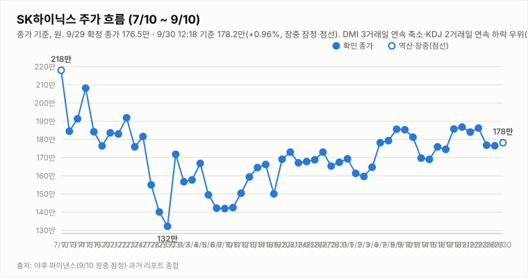

# SK하이닉스 투자 리포트 — 2026-09-30 (수) 장중 업데이트(14:18 기준)

> **작성** 2026-09-30 14:40 KST · 14:18 기준 **177.7만원(+0.68%, 장중 잠정)** 오전 고점 대비 상승폭 재축소 · 투자의견은 **9/29 확정 종가 기준 매수 유지**, 판정은 종가 기준으로만 변경합니다

> **종목** SK하이닉스 (KRX 000660 · NASDAQ 상장 7/10)
> 본 자료는 정보 제공 목적이며 투자 권유가 아닙니다.

## 핵심 요약

- **투자의견: 매수 유지(9/29 종가 기준)** — 방향성 4요소는 긍정 3(②③④)·중립 0·부정 1(①추세/모멘텀)입니다. 개장 직후 갭업은 판정에 반영하지 않습니다.
- **14:18 기준 177.7만원(+0.68%)** — 시가 178.9만·고가 182.4만·저가 177.3만, 거래량 211.4만주(야후 잠정). 전일 고가(178.8만)를 시가부터 상회했습니다. 간밤 미국은 다우 -0.25%·S&P500 -0.17%·나스닥 -0.09%로 혼조였으나 SOX는 +1.3%대로 강세였습니다.
- **장중 잠정 지표(14:18)**: DMI 격차 +4.3, KDJ K-D -8.8, ADX 10.5로 엇갈림이나 판정에는 미반영. **표의 기술 지표는 9/29 종가 기준**: DMI 격차 +1.6(3거래일 연속 축소), KDJ K-D -8.4(2거래일 연속 심화), ADX 10.8. 오늘 종가에서 안정화 여부가 관건입니다.
- 경계 요인: 솔리다임 상장 우려, 원주-ADR 괴리율 약 40%, DS투자증권 목표가 264만원 하향(환율). 3Q26 실적 발표(10/27)까지 D-27.

## 주가 동향

9/29 종가는 176.5만원(-0.17%, 시가 175.5·고가 178.8·저가 173.6, 거래량 2,939,411주 — 야후 최신 집계 기준)이었고, 9/30은 178.9만원에 갭업 개장해 14:18 기준 177.7만원(+0.68%)입니다(야후 집계 잠정, 이후 시세는 다음 갱신에 반영).

## 기술적 지표 (9/29 확정 종가 기준)

| 지표 | 값 | 해석 |
|---|---|---|
| MACD (12,26,9) | +2.75만 / 시그널 +2.40만 / 히스토그램 +0.35만 | 상승 모멘텀 약화 |
| ATR (14) | 9.68만 (5.5%) | 변동성 매우 큼 |
| ADX / DMI | ADX 10.8 · +DI 28.0 · -DI 26.4 | 추세 강도 소멸 직전, 격차 +1.6(3연속 축소) |
| KDJ (9,3,3) | K 50.9 · D 59.3 · J 34.2 | K<D 하락 우위 심화(-8.4) |

## 최신 뉴스 Top 5

1. 🟢 **간밤 필라델피아 반도체지수 +1.3% 강세**: 미 30년물 금리 5.6%대로 지수는 약세였으나 반도체는 견조했습니다.
2. 🟢 **KODEX 미국반도체 ETF, SK하이닉스 ADR 4.8% 편입**: 소폭 우호적 수급 재료입니다. ([서울신문](https://www.seoul.co.kr/news/economy/finance/2026/09/30/20260930024008))
3. 🔴 **DS투자증권 목표가 310만→264만원(환율 하락)**: 컨센서스(322만)보다 보수적입니다. ([파이낸셜뉴스](https://www.fnnews.com/news/202609291039195498))
4. 🔴 **원주-ADR 괴리율 40% 육박·솔리다임 상장 우려**: 9/28 ADR -5% 급락 여파가 남아 있습니다.
5. ⚪ **대신증권 "HBM4 품질 우려 과도…목표가 320만원 유지"**: 증권사 시각이 엇갈립니다. ([이투데이](https://www.etoday.co.kr/news/view/2629652))

## 투자 판단

**의견: 매수 유지 — 9/29 확정 종가 기준(판정은 종가 기준으로만 변경합니다)**

| 요소 | 방향 | 근거 |
|---|---|---|
| ① 추세/모멘텀 | 부정 | DMI 3연속 축소, KDJ 2연속 심화(종가 기준). 오늘 종가 안정화 시 재상향 검토 |
| ② 밸류에이션 갭 | 긍정 | 컨센서스 322만 대비 종가 176.5만 — +82.4% |
| ③ 촉매 | 긍정 | eSSD·솔리다임 재해석, 파트너스데이, ADR ETF 편입(경계 요인 병존) |
| ④ 산업 사이클 | 긍정 | HBM4 공급가 급등, 메모리 공급부족 구조, 3Q 이익 전망 상향 |

**종합: 긍정 3·중립 0·부정 1로 매수 유지.** 장중 갭업은 잠정치이며 판정에 반영하지 않습니다. 오늘 종가에서 DMI·KDJ가 안정되면 ①의 재상향을, 추가 악화되면 종합 판정 재검토를 논의합니다.

---

*본 자료는 공개 보도·자료를 종합해 작성한 정보 제공 목적의 리포트이며 투자 판단과 책임은 투자자 본인에게 있습니다.*
