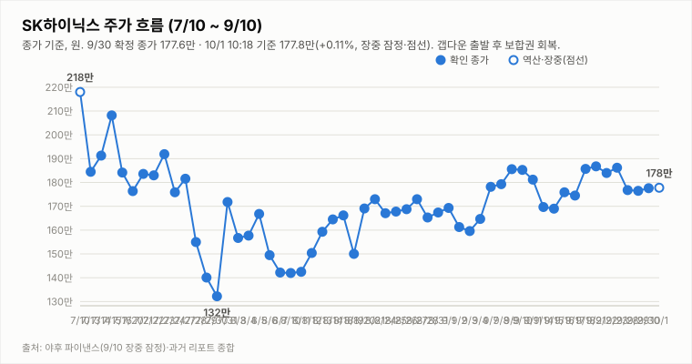

# SK하이닉스 투자 리포트 — 2026-10-01 (목) 장중 업데이트(11:18 기준)

> **작성** 2026-10-01 11:40 KST · 11:18 기준 **178.0만원(+0.23%, 장중 잠정)** 갭다운 후 보합권 유지 · 투자의견은 **9/30 확정 종가 기준 매수 유지**, 판정은 종가 기준으로만 변경합니다

> **종목** SK하이닉스 (KRX 000660 · NASDAQ 상장 7/10)
> 본 자료는 정보 제공 목적이며 투자 권유가 아닙니다.

## 핵심 요약

- **투자의견: 매수 유지(9/30 종가 기준)** — 방향성 4요소는 긍정 3(②③④)·중립 0·부정 1(①추세/모멘텀)로 변동이 없습니다.
- **마이크론이 9/30(현지) 장 마감 후 FY26 4Q 매출 542억 달러(약 73조 원)를 발표**했습니다. 시장 컨센서스(약 515억 달러)를 상회한 어닝 서프라이즈이며 시간외에서 급등한 것으로 보도됐습니다. 그러나 10/1은 **시가 176.2만으로 갭다운 출발**했습니다(아침 리포트의 갭업 가능성은 개장 시점에 나타나지 않음). 이후 보합권으로 회복했으며, 뉴스1은 "마이크론 호실적 불구, 고금리와 싸움…삼전닉스 보합권"으로 전했습니다.
- **10/1 11:18 기준 178.0만원(+0.23%)**: 시가 176.2만·고가 179.0만·저가 174.9만, 거래량 79.0만주(야후 잠정). 9/30 확정 종가는 177.6만원(+0.62%)이었습니다.
- 확정 종가(9/30) 기준 **DMI 격차 +4.3(첫 반등), KDJ K-D -8.9(3거래일 연속 하락 우위)**입니다. 11:18 장중 잠정은 DMI +2.2·KDJ -11.1·MACD 히스토그램 -0.14만으로 약세 쪽이며, 종가 전이라 판정에는 반영하지 않습니다. ①은 부정 유지입니다.
- 경계 요인: 솔리다임 상장 우려, 원주-ADR 괴리율(약 40%), 미 국채금리, 외국인 9월 삼성전자·SK하이닉스 16조원대 순매도. 3Q26 실적 발표(10/27)까지 D-26.

## 시세 — 10/1 장중 잠정 및 9/30 확정

| 시가 | 고가 | 저가 | 종가 | 등락 | 거래량 |
|---|---|---|---|---|---|
| ₩1,789,000 | ₩1,824,000 | ₩1,773,000 | **₩1,776,000** | **+0.62%** | 3,280,459주 |

출처: 야후 파이낸스(15:30 확정). **10/1 11:18 기준(잠정)**: 시가 176.2만·고가 179.0만·저가 174.9만·현재 178.0만(+0.23%), 거래량 79.0만주.

## 기술적 지표 (9/30 확정 종가 기준)

| 지표 | 값 | 해석 |
|---|---|---|
| MACD (12,26,9) | +2.46만 / 시그널 +2.41만 / 히스토그램 +0.05만 | 상승 모멘텀 약화 |
| ATR (14) | 9.41만 (5.3%) | 변동성 매우 큼 |
| ADX / DMI | ADX 10.6 · +DI 29.5 · -DI 25.2 | 추세 강도 매우 약함, 격차 +4.3 첫 반등 |
| KDJ (9,3,3) | K 46.0 · D 54.9 · J 28.3 | K<D 하락 우위 지속(-8.9, 3거래일 연속) |
| 거래량 / 20일 이평 | 328.05만 / 326.97만 | 평균 수준 |

## 최신 뉴스 Top 5

1. 🟢 **마이크론 FY26 4Q 매출 542억 달러, 컨센서스 상회·시간외 급등**: 메모리 업황 우호 재료입니다. ([직식](https://www.ziksir.com/news/articleView.html?idxno=147962))
2. 🔴 **외국인, 9월 삼성전자 4.9조·SK하이닉스 11.6조원 순매도(9/30에도 SK하이닉스 6,085억 순매도)**: 반도체 ETF는 순매수했습니다. 9/30 마감 리포트의 "외국인 순매수 유입" 표현은 장 초반 수급 기준이었고, 마감 기준으로는 순매도였습니다. ([뉴스핌](https://www.newspim.com/news/view/20260930001188))
3. 🔴 **코스피 6838.04 마감(-0.48%), 장 후반 매도 물량**: 미 국채금리 부담이 이어졌습니다. ([위키트리](https://www.wikitree.co.kr/articles/1163083))
4. 🟢 **KODEX 미국반도체 ETF, SK하이닉스 ADR 4.8% 편입**: 소폭 우호적 수급 재료입니다. ([서울신문](https://www.seoul.co.kr/news/economy/finance/2026/09/30/20260930024008))
5. ⚪ **9월 반도체 수출 호조 지속(1~20일 341억 달러, +259.4%)**: 9월 확정치는 10/1 발표 예정으로 확인이 필요합니다. ([위드뉴스](https://car.withnews.kr/economy/semiconductor-export-surge))

## 투자 판단

**의견: 매수 유지 — 9/30 확정 종가 기준(판정은 종가 기준으로만 변경합니다)**

| 요소 | 방향 | 근거 |
|---|---|---|
| ① 추세/모멘텀 | 부정(유지) | DMI 첫 반등(+4.3)이나 KDJ -8.9 하락 우위 3거래일 연속. 단일 세션 반등이라 변경하지 않음 |
| ② 밸류에이션 갭 | 긍정 | 컨센서스 322만 대비 종가 177.6만 — +81.3% |
| ③ 촉매 | 긍정 | 마이크론 호실적, eSSD·솔리다임 재해석, 파트너스데이(경계 요인 병존) |
| ④ 산업 사이클 | 긍정 | HBM4 공급가 급등, 메모리 공급부족 구조, 3Q 이익 전망 상향 |

**종합: 긍정 3·중립 0·부정 1로 매수 유지.** 마이크론 호실적은 ③④에 우호적이나 장중 갭다운은 판정에 반영하지 않고 오늘 종가 확정 후 검토합니다. ① 재상향은 종가 기준 DMI 격차 확대와 KDJ 하락 우위 축소가 다수 세션 확인될 때, 종가 기준 지표가 재악화하면 종합 판정을 재검토합니다.

## 10/1(목) 관전 포인트(11:18 기준 갱신)

| 항목 | 내용 |
|---|---|
| 지지선 | 174.9만(10/1 장중 저가) · 173.6만(9/29 저가) · 168.0만(ATR 하단, 참고용) |
| 저항선 | 179.0만(10/1 장중 고가) · 182.4만(9/30 고가) · 183.6만(9/23 저가) |
| 예상 등락 레인지(참고용) | ATR(9.03만) 기준 168.8만 ~ 186.8만 |
| 관찰 포인트 | 마이크론 호재가 선반영(sell-the-news)인지 시차 반영인지, 174.9만 지지, 종가 기준 DMI·KDJ 방향, 외국인 수급 |
| 상방 시나리오 | 호재가 시차 반영되고 외국인 수급이 돌아오면 179.0만 돌파 후 182.4만 재도전 가능 |
| 하방 시나리오 | 금리 부담과 호재 소멸이 이어지면 174.9만 이탈 후 173.6만 재시험 가능 |

---

*본 자료는 공개 보도·자료를 종합해 작성한 정보 제공 목적의 리포트이며 투자 판단과 책임은 투자자 본인에게 있습니다.*
