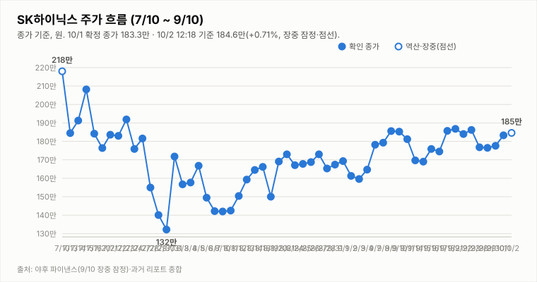

# SK하이닉스 투자 리포트 — 2026-10-02 (금) 장중 업데이트(11:18 기준)

> **작성** 2026-10-02 11:42 KST · 11:18 기준 **184.4만원(+0.60%, 장중 잠정)** 상승폭 유지 · 투자의견은 **10/1 확정 종가(183.3만, +3.21%) 기준 매수 유지**, 판정은 종가 기준으로만 변경합니다

> **종목** SK하이닉스 (KRX 000660 · NASDAQ 상장 7/10)
> 본 자료는 정보 제공 목적이며 투자 권유가 아닙니다.

## 핵심 요약

- **투자의견: 매수 유지(10/1 종가 기준)** — 방향성 4요소는 긍정 3(②③④)·중립 0·부정 1(①추세/모멘텀)로 변동이 없습니다.
- **10/1 확정 종가 183.3만원(+3.21%)**: 시가 176.2만으로 갭다운 출발했으나 저가 174.9만에서 오후 반등해 고가=종가로 마감했습니다. 거래량 220.5만주(야후 확정). 어제 마감 리포트의 15:19 집계(183.1만)와 달리 종가단일가 반영 확정치입니다.
- **확정 종가 기준 지표**: DMI 격차 +2.2(9/30 +4.3 대비 재축소), KDJ K-D -5.2(9/30 -8.9 대비 완화, 하락 우위 5거래일 연속). 엇갈려 ①은 부정을 유지합니다.
- **간밤 미국**: SOX +1.59%(12,829.00), 나스닥 +0.04%, S&P500 +0.19%, 마이크론 +3.03%, **SK하이닉스 ADR +5.08%(193.50달러)**, EWY +1.82%, 원/달러 1,362원대(+0.19%).
- **10/2 장중(야후 11:18 잠정)**: 시가 183.0만·고가 185.5만·저가 182.5만, 현재 184.4만(+0.60%), 거래량 85.7만주로 전일 종가(183.3만)를 넘은 상승폭을 유지하고 있습니다. 개장 직후(09:05) 코스피200 현물은 -0.37%, 주간 선물은 -0.28~-0.36%(트레이딩뷰 실시간)로 약세 출발했습니다. 장중 잠정 지표는 DMI 격차 +3.9·KDJ -1.9·MACD 히스토그램 +0.33만으로 개선 쪽이나 판정에는 미반영합니다. 3Q26 실적 발표(10/27)까지 D-25.

## 직전 거래일 시세 (10/1 확정)

| 시가 | 고가 | 저가 | 종가 | 등락 | 거래량 |
|---|---|---|---|---|---|
| ₩1,762,000 | ₩1,833,000 | ₩1,749,000 | **₩1,833,000** | **+3.21%** | 2,205,296주 |

출처: 야후 파이낸스(15:30 확정). 전일(9/30) 종가 1,776,000원 대비 +57,000원입니다.

## 기술적 지표 (10/1 확정 종가 기준)

| 지표 | 값 | 해석 |
|---|---|---|
| MACD (12,26,9) | +2.66만 / 시그널 +2.46만 / 히스토그램 +0.20만 | 상승 모멘텀 소폭 확대 |
| ATR (14) | 9.33만 (5.1%) | 변동성 매우 큼 |
| ADX / DMI | ADX 10.1 · +DI 27.6 · -DI 25.4 | 추세 강도 매우 약함, 격차 +2.2 |
| KDJ (9,3,3) | K 47.0 · D 52.2 · J 36.5 | K<D 하락 우위 지속(-5.2, 5거래일 연속) |
| 거래량 / 20일 이평 | 220.53만 / 323.5만 | 평균의 0.68배 |

격차 흐름(종가 기준): DMI 9/29 +1.6 → 9/30 +4.3 → 10/1 +2.2, KDJ 9/29 -8.4 → 9/30 -8.9 → 10/1 -5.2.

## 최신 뉴스·지표 Top 5

1. 🟢 **SK하이닉스 ADR +5.08%(193.50달러), SOX +1.59%**: 마이크론 FY26 4Q 호실적(매출 542억 달러)이 반도체 랠리를 이어갔습니다. ([서울신문 서울데이터랩](https://www.seoul.co.kr/news/economy/securities/2026/10/02/20261002500006))
2. 🟢 **10/1 코스피 6971.35(+1.95%) 마감, 삼성전자 +2.79%·SK하이닉스 +3.21%**: 장 초반 약세를 뒤집고 반등했습니다. ([파이낸셜뉴스](https://fnnews.com/news/202610011619453708))
3. 🔴 **개장 직후 코스피200 -0.37%(09:05)**: 간밤 호재에도 지수는 약세로 출발했습니다(트레이딩뷰 실시간, 시장 지표).
4. 🔴 **외국인 수급 소스 상충**: 9월 삼성전자·SK하이닉스 16조원대 순매도 후 10/1에는 순매수 유입과 순매도 보도가 엇갈립니다. ([뉴스핌](https://www.newspim.com/news/view/20260930001188), [Businesskorea](https://www.businesskorea.co.kr/news/articleView.html?idxno=278085))
5. ⚪ **원/달러 1,362.48원(+0.19%)**: 원화 약세 흐름이며 DS투자증권은 9/29 환율 하락을 이유로 목표가를 264만원으로 하향한 바 있습니다. ([파이낸셜뉴스](https://www.fnnews.com/news/202609291039195498))

## 투자 판단

**의견: 매수 유지 — 10/1 확정 종가 기준(판정은 종가 기준으로만 변경합니다)**

| 요소 | 방향 | 근거 |
|---|---|---|
| ① 추세/모멘텀 | 부정(유지) | DMI +2.2 재축소, KDJ -5.2 완화되나 5거래일 연속 하락 우위. 종가 기준 안정화 확인 전 |
| ② 밸류에이션 갭 | 긍정 | 컨센서스 322만 대비 183.3만 — +75.7% |
| ③ 촉매 | 긍정 | 마이크론 호실적·ADR 급등, eSSD·솔리다임 재해석(경계 요인 병존) |
| ④ 산업 사이클 | 긍정 | HBM4 공급가 급등, 메모리 공급부족 구조, 3Q 이익 전망 상향 |

**종합: 긍정 3·중립 0·부정 1로 매수 유지.** ① 재상향은 종가 기준 DMI 격차 확대와 KDJ 하락 우위 해소가 다수 세션 확인될 때, 종가 기준 지표가 재악화하면 종합 판정을 재검토합니다.

## 10/2(금) 관전 포인트(11:18 기준 갱신)

| 항목 | 내용 |
|---|---|
| 지지선 | 183.3만(10/1 종가) · 182.5만(10/2 장중 저가) · 177.6만(9/30 종가) |
| 저항선 | 185.5만(10/2 장중 고가) · 상단은 신고가 영역으로 확인 불가 |
| 예상 등락 레인지(참고용) | ATR(8.88만) 기준 175.5만 ~ 193.3만 |
| 관찰 포인트 | 183.3만(전일 종가) 지지 유지, 185.5만 돌파 여부, 코스피200 약세 출발 지속 여부, 종가 기준 DMI·KDJ 방향, 외국인 수급 |
| 상방 시나리오 | ADR 급등 등 간밤 호재가 시차 반영되고 외국인 수급이 돌아오면 183.6만 저항 돌파 시도 가능 |
| 하방 시나리오 | 차익 매물과 금리·환율 부담이 커지면 182.4만~177.6만 구간 재시험 가능 |

---

*본 자료는 공개 보도·자료를 종합해 작성한 정보 제공 목적의 리포트이며 투자 판단과 책임은 투자자 본인에게 있습니다.*
