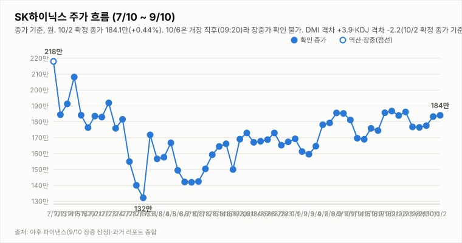

# SK하이닉스 투자 리포트 — 2026-10-06 (화) 장중 업데이트(13:38 기준)

> **작성** 2026-10-06 13:38 KST · **장중 178.1만원(-3.26%, 야후 13:19 집계)** · 전일 확정 종가 184.1만원(+0.44%) · **매수 유지** · 판정은 종가 기준으로만 변경합니다

> **종목** SK하이닉스 (KRX 000660 · NASDAQ 상장 7/10)
> 본 자료는 정보 제공 목적이며 투자 권유가 아닙니다.

## 핵심 요약

- **투자의견: 매수 유지(10/2 종가 기준)** — 방향성 4요소는 긍정 3(②③④)·중립 0·부정 1(①추세/모멘텀)로 유지합니다. 장중 하락만으로 판정을 바꾸지 않습니다.
- **10/6 시가 183.5만 → 고가 183.7만 → 저가 178.0만 → 현재 178.1만(-3.26%)**, 거래량 158.6만주(13:19 집계). 3일 연휴 뒤 갭다운 출발로 10/1 종가 183.3만·10/2 저가 182.5만 지지선을 장중 하회했고, 다음 지지는 177.6만(9/30 종가)입니다.
- **지표(장중 잠정, 종가 미반영)**: DMI 격차 -0.1(-DI 근소 우위, 10/2 +3.9에서 역전), KDJ K 40.2·D 47.5(격차 -7.3, 10/2 -2.2에서 재확대), MACD 히스토그램 -0.04만(10/2 +0.31만, 시그널 하회). 단일 장중 값이라 ①은 부정 유지, 오늘 종가에서 재확인합니다.
- **간밤 미국장(10/5)**: SOX +0.27%·나스닥 +1.05%·엔비디아 +2.12%로 우호적이었으나 마이크론 -1.02%·SK하이닉스 ADR -0.06%·EWY -0.22%로 직접 재료는 보합권이라 갭업이 나오지 않았습니다. 코스피200 현물은 -0.32%(09:19)로 SK하이닉스가 시장보다 약합니다. 원/달러 1,341원대.
- 3Q26 실적 발표(10/27)까지 **D-21**, 10/9(금) 한글날 휴장입니다.

## 당일 시세 (10/6 13:19 집계, 장중 잠정)

| 시가 | 고가 | 저가 | 현재가 | 등락 | 거래량 |
|---|---|---|---|---|---|
| ₩1,835,000 | ₩1,837,000 | ₩1,781,000 | **₩1,781,000** | **-3.26%** | 1,586,275주 |

출처: 야후 파이낸스(docs/quote.json, marketTime 13:19 KST). 전일(10/2) 확정: 시가 1,830,000·고가 1,855,000·저가 1,825,000·종가 1,841,000·거래량 2,032,332주.

## 기술적 지표 (10/6 13:19 장중 잠정)

| 지표 | 값 | 해석 |
|---|---|---|
| MACD (12,26,9) | +2.48만 / 시그널 +2.53만 / 히스토그램 -0.04만 | 하락 전환(MACD<시그널, 장중 잠정) |
| ATR (14) | 8.68만 (4.9%) | 변동성 큼 |
| ADX / DMI | ADX 9.2 · +DI 27.2 · -DI 27.3 | 추세 강도 매우 약함, 격차 -0.1 |
| KDJ (9,3,3) | K 40.2 · D 47.5 · J 25.5 | K<D 하락 우위 재확대(-7.3) |
| 거래량 / 20일 이평 | 158.6만 / 318.2만 | 장 초반이라 의미 제한적 |

종가 기준 격차 흐름: DMI 9/29 +1.6 → 9/30 +4.3 → 10/1 +2.2 → 10/2 +3.9, KDJ 9/29 -8.4 → 9/30 -8.9 → 10/1 -5.2 → 10/2 -2.2. 10/6 값은 종가 확정 전 잠정치입니다.

## 개장 점검 — 간밤 글로벌·환율·코스피200 (09:19 수집)

| 항목 | 내용 |
|---|---|
| 간밤 미국(10/5) | SOX 13,172.74(+0.27%) · 나스닥 27,477.31(+1.05%) · S&P500 7,773.95(+0.66%) · 엔비디아 +2.12% · 마이크론 -1.02% |
| SK하이닉스 ADR·EWY | ADR 195.02달러(-0.06%) · EWY 191.46달러(-0.22%) |
| 코스피200 | 현물 1,105.45(-0.32%, 09:19) · 12월물 주간 선물 1,122.40(+0.83%, 08:59 기준) |
| 야간선물 | 확인 불가(10/5 휴장으로 신규 야간 세션 없음) |

## 최신 뉴스 Top 5 (구글 뉴스 헤드라인 기준)

1. ⚪ **경기도, 이천공장 방류수 염소·황산이온 FAO 권고치 이상 검출 → 용인 가동 전 관리 강화** — 규제·환경 이슈로 주가 영향은 제한적이나 용인 가동 일정 관련 후속 보도 주의 (경인일보·KBS·에너지경제신문, 10/5~10/6)
2. ⚪ **최태원 회장 "솔리다임 IPO·SK 지분 9,440억원 매각은 주주가치 최우선 판단"** (녹색경제신문, 10/6)
3. 🟢 **D램 최고가에 마이크론 호조에도 삼성전자·SK하이닉스 전망치 조정 — 원인은?** (글로벌이코노믹, 10/5) — 업황은 우호적이나 환율 등 변수로 일부 전망 조정
4. 🟢 **"삼성전자·SK하이닉스 수혜주 선별해야"** — 대형주 낙수효과 기대 분석 (뉴시스, 10/6)
5. ⚪ **간밤 미국 반도체 강세(SOX +0.27%·엔비디아 +2.12%) vs 마이크론 -1.02%** — 개장 직후 코스피200 현물 약세(트레이딩뷰)

※ 뉴스는 헤드라인 기준이며 본문 수치는 별도 검증하지 않았습니다.

## 투자 판단

**의견: 매수 유지 — 10/2 종가 기준(판정은 종가 기준으로만 변경합니다) · 장중 178.1만(-3.26%)은 참고**

| 요소 | 방향 | 근거 |
|---|---|---|
| ① 추세/모멘텀 | 부정(유지) | 종가 기준 KDJ -8.9→-5.2→-2.2 완화, DMI +4.3→+2.2→+3.9 등락, K<D 6거래일 지속. 오늘 장중 잠정은 DMI -0.1·KDJ -7.3로 약화(종가 확인 필요) |
| ② 밸류에이션 갭 | 긍정 | 컨센서스 322만 대비 184.1만 — +74.9% |
| ③ 촉매 | 긍정 | 간밤 SOX·엔비디아 강세, eSSD·솔리다임 재해석(마이크론 약세·방류수 이슈 등 경계 요인 병존) |
| ④ 산업 사이클 | 긍정 | HBM4 공급가 급등, 메모리 공급부족 구조, 3Q 이익 전망 상향 |

**종합: 긍정 3·중립 0·부정 1로 매수 유지.** 장중 가격으로는 판정을 바꾸지 않으며, 오늘 종가에서 지표 안정화를 확인합니다. ① 재상향은 종가 기준 KDJ K≥D 전환 또는 DMI 격차 확대가 다수 세션 확인될 때 중립으로 검토하고, 종가 기준 지표가 재악화하면 종합 판정을 재검토합니다.

관찰 포인트: 178.1만 방어·177.6만(9/30 종가) 지지, 183.3만 회복 여부, 오늘 종가 DMI·KDJ, 외국인 수급, 원/달러·미 국채금리.

---

*본 자료는 공개 보도·자료를 종합해 작성한 정보 제공 목적의 리포트이며 투자 판단과 책임은 투자자 본인에게 있습니다.*
