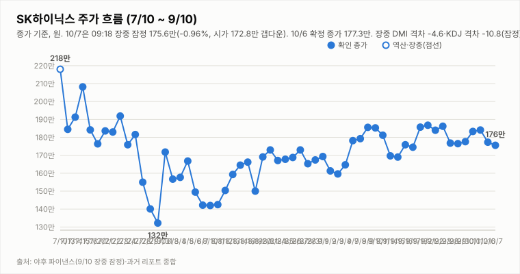

# SK하이닉스 투자 리포트 — 2026-10-07 (수) 마감(종가 확정, 트레이딩뷰 피드)

> **작성** 2026-10-07 16:02 KST · **종가 172.3만원(-2.82%)** · **판정 표시: 매수 유지 — 단, 규칙 문자 그대로면 중립(사용자 결정 대기)** · 종가는 트레이딩뷰 KRX 피드(15:51 갱신, 종가단일가 반영) 기준이며 야후 시세는 15:14 집계(172.55만)에서 지연 — 확정 종가는 다음 거래일 아침 `quote.json`으로 교차 확인합니다

> **종목** SK하이닉스 (KRX 000660 · NASDAQ 상장 7/10)
> 본 자료는 정보 제공 목적이며 투자 권유가 아닙니다.

## 핵심 요약

- **판정 해석 문제**: 방향성 4요소는 긍정 3(②③④)·부정 1(①)입니다. 규칙(매수=긍정 3개 이상·부정 0개, 그 외 중립)을 문자 그대로 적용하면 **중립**이지만, 지금까지는 "조건 미충족 시 기존 판정 유지" 문구를 매수 하향에도 적용해 매수 표시를 유지해 왔습니다. 하향 조건이 규칙에 명시돼 있지 않아 해석이 모호하며, 이전 리포트의 "부정 2개 이상이면 중립 검토" 문구는 규칙에 없는 임의 표현입니다. 사용자 결정(문자 그대로 적용 vs 유지 규칙 명문화) 전까지 표시만 "매수 유지"로 두고 이 사실을 병기합니다. 판정은 종가 기준으로만 변경합니다.
- **10/7 시가 172.8만 → 고가 177.9만 → 저가 172.3만 → 종가 172.3만(-2.82%)**, 거래량 251.9만주(트레이딩뷰). 종가가 일중 저가와 같아 장 막판까지 매도 우위였습니다. 10/6(-3.69%)에 이어 2거래일 연속 하락으로 10/2 종가(184.1만) 대비 -6.4%입니다. 삼성전자 26.85만(-1.29%), 코스피200 12월물 주간 선물 1,080.05(-2.08%, 15:34).
- **개장 전 신호대로 약세**: ADR -6.39%·EWY -2.64%·야간선물 -1.07%. 오전 177.9만까지 반등을 시도했으나 오후에 밀렸습니다. 헤드라인 기준 "삼성전자 실적 D-1" 보도가 있어 10/8 삼성전자 잠정 실적이 변수일 수 있습니다(일정 확인 필요).
- **지표(야후 15:14 집계, 종가 미반영)**: DMI 격차 -4.6(-DI 우위), KDJ K 26.0·D 40.0(격차 -14.0), MACD 히스토그램 -0.67만(시그널 하회).
- 3Q26 실적 발표(10/27)까지 **D-20**(10/8 기준 D-19), 10/9(금) 한글날은 휴장(10/8 다음 거래일은 10/12)입니다.

## 당일 시세 (10/7 15:30 마감)

| 시가 | 고가 | 저가 | 종가 | 등락 | 거래량 |
|---|---|---|---|---|---|
| ₩1,728,000 | ₩1,779,000 | ₩1,723,000 | **₩1,723,000** | **-2.82%** | 2,519,139주 |

출처: 트레이딩뷰 KRX 피드(15:51 갱신, 종가단일가 반영, 20분 지연). 야후 15:14 집계는 1,725,500원·2,230,475주로 종가단일가 반영 전입니다. 전일(10/6) 확정 종가 1,773,000원 대비 -50,000원입니다.

## 기술적 지표 (10/7 야후 15:14 집계 기준, 종가 미반영)

| 지표 | 값 | 해석 |
|---|---|---|
| MACD (12,26,9) | +1.68만 / 시그널 +2.35만 / 히스토그램 -0.67만 | 하락 모멘텀 확대 |
| ATR (14) | 8.51만 (4.9%) | 변동성 큼 |
| ADX / DMI | ADX 9.2 · +DI 25.8 · -DI 30.4 | 추세 강도 매우 약함, 격차 -4.6(-DI 우위) |
| KDJ (9,3,3) | K 26.0 · D 40.0 · J -2.1 | K<D 하락 우위 확대(-14.0), 과매도 접근 |
| 거래량 / 20일 이평 | 223.0만 / 319.1만 | 평균의 0.70배(종가단일가 미반영) |

종가 기준 격차 흐름: DMI 9/29 +1.6 → 9/30 +4.3 → 10/1 +2.2 → 10/2 +3.9 → 10/6 -0.8 → 10/7 -4.6, KDJ 9/29 -8.4 → 9/30 -8.9 → 10/1 -5.2 → 10/2 -2.2 → 10/6 -8.2 → 10/7 -14.0(10/7 값은 15:14 집계).

## 최신 뉴스 Top 5 (구글 뉴스 헤드라인 기준)

1. 🔴 **'실적 D-1' 삼성전자 담고 기판주 던졌다…SK하이닉스는 매도 1위[주식 초고수는 지금]** (매일경제, 10/7) · SBS Biz "美 증시 활황에도 코스피 6900선 밑으로…SK하이닉스 장중 2% 넘게 하락" — 헤드라인 기준이며 수치는 검증하지 않았습니다.
2. 🟢 **IBK증권 "실적에 수급을 더한다" 목표가 400만원 유지** (뉴스핌·시사저널, 10/7) — "저평가에 흔들리지 말아야"
3. 🟢 **SK하이닉스, 4분기 추가 자사주 매입 진행 가능성** (알파경제·Investing.com, 10/7)
4. ⚪ **AMD 리사 수 CEO, 삼성전자 전영현·SK하이닉스 곽노정과 회동** (매일경제, 10/7)
5. 🔴 **SK하이닉스 노동자 3명 집단 산재 신청(뇌종양·유방암·림프종)** (MBC·연합뉴스·연합인포맥스, 10/7) — ESG 리스크

※ 뉴스는 헤드라인 기준이며 본문 수치는 별도 검증하지 않았습니다.

## 투자 판단

**의견 표시: 매수 유지 — 규칙 문자 그대로면 중립(사용자 결정 대기) · 10/7 종가 기준**

| 요소 | 방향 | 근거 |
|---|---|---|
| ① 추세/모멘텀 | 부정(약화) | 2거래일 연속 하락·종가 일중 저가 마감, MACD 시그널 하회·DMI -DI 우위(-4.6)·KDJ 격차 -14.0 (15:14 집계) |
| ② 밸류에이션 갭 | 긍정 | 컨센서스 322만 대비 172.3만 — +86.9% |
| ③ 촉매 | 긍정(경계 확대) | IBK 목표가 400만 유지·4분기 자사주 매입 가능성·AMD 회동은 우호적이나 초고수·외국인 매도, 집단 산재 신청, 실적 눈높이 하향 우려가 2거래일 연속 커짐 |
| ④ 산업 사이클 | 긍정 | HBM4 공급가 급등, 메모리 공급부족 구조, 3Q 이익 전망 상향 |

**종합: 긍정 3·중립 0·부정 1.** 문자 그대로면 매수 조건(부정 0개) 불충족으로 중립입니다. 판정 재검토 조건: 다음 종가에서도 172.3만 지지 실패·종가 기준 지표 악화가 이어지면 ③을 중립으로 이동하는 것을 검토합니다(그 경우 문자 그대로의 중립 판정과도 일치). ① 재상향은 종가 기준 DMI 재역전·KDJ 격차 축소가 다수 세션 확인될 때 검토합니다.

## 다음 거래일(10/8, 목) 전망

| 항목 | 내용 |
|---|---|
| 지지선 | 172.3만(10/7 종가·저가) — 하회 시 뚜렷한 지지 레벨 확인 불가(참고: 종가-ATR 163.8만) |
| 저항선 | 172.8만(10/7 시가) · 177.1만(10/6 저가) · 177.6만(9/30 종가) · 177.9만(10/7 고가) · 183.3만(10/1 종가) |
| 예상 등락 레인지(참고용) | ATR(8.51만) 기준 163.8만 ~ 180.8만 |
| 예정 이벤트 | 3Q26 실적 발표 10/27(D-19, 10/8 기준) · 삼성전자 3Q 잠정 실적(헤드라인 기준 10/8 추정, 확인 필요) · 10/9(금) 한글날 휴장 · 간밤 미국 반도체·마이크론·ADR 흐름 · 외국인 수급 · 원/달러 |
| 관찰 포인트 | 172.3만 종가 지지 여부, 종가 기준 DMI·MACD·KDJ(과매도 접근) 방향, ADR·삼성전자 실적 반응, 외국인·기관 수급 |
| 상방 시나리오 | 삼성전자 실적·간밤 미 반도체가 우호적이면 172.8만~177.6만 구간 되돌림 시도 가능. KDJ 과매도 접근으로 기술적 반등 여지는 있으나 종가 기준 DMI 재역전 전에는 추세 전환으로 보기 어려움 |
| 하방 시나리오 | 172.3만 종가 지지 실패 시 추가 약세·변동성 확대 가능. 종가 기준 약세가 이어지면 ①③ 약화로 판정 재검토 |
| 야간선물 | 다음 프리마켓(08:00)에서 night.yml 스냅샷의 `updateTimeKST`(06:00)와 함께 확인 |

---

*본 자료는 공개 보도·자료를 종합해 작성한 정보 제공 목적의 리포트이며 투자 판단과 책임은 투자자 본인에게 있습니다.*
