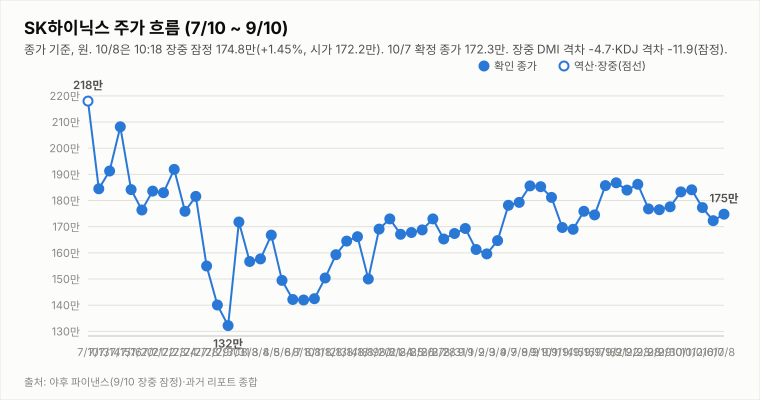

# SK하이닉스 투자 리포트 — 2026-10-08 (목) 장중 업데이트(13:38 기준)

> **작성** 2026-10-08 13:38 KST · **장중 170.3만원(-1.16%, 야후 13:18 집계)** · 전일 확정 종가 172.3만원(-2.82%) · **매수 유지(유지 규칙)** · 판정은 종가 기준으로만 변경합니다

> **종목** SK하이닉스 (KRX 000660 · NASDAQ 상장 7/10)
> 본 자료는 정보 제공 목적이며 투자 권유가 아닙니다.

## 핵심 요약

- **투자의견: 매수 유지(10/7 종가 기준, 유지 규칙)** — 방향성 4요소는 긍정 3(②③④)·부정 1(①)입니다. 종가 기준 긍정 2개 이하 또는 부정 2개 이상이 되면 중립으로 내립니다. 장중 가격으로 판정을 바꾸지 않습니다.
- **10/8 시가 172.2만 → 고가 175.9만 → 저가 169.2만 → 현재 170.3만(-1.16%)**, 거래량 175.8만주(13:18 집계). 오전 175.9만까지 반등했으나 오후에 밀려 10/7 저가·종가(172.3만)를 장중 이탈했고 저가 169.2만을 기록했습니다. 종가 기준 지지 여부가 오늘의 핵심입니다.
- **지표(장중 잠정, 종가 미반영)**: DMI 격차 -7.1(+DI 24.3 < -DI 31.4, 10/7 -4.7에서 확대), KDJ K 19.0·D 33.0(격차 -14.0, 과매도 구간), MACD 히스토그램 -1.17만(시그널 하회).
- **외부 변수**: 간밤 SOX -1.15%·나스닥 -0.22%·ADR -2.36%·EWY -1.45%의 약세 속 마이크론 +4.06%가 우호적이었으나 장중엔 매도가 우세했습니다. 헤드라인 기준 ADR 락업 해제 임박·프리미엄 매물 우려(더구루)가 거론됩니다.
- 3Q26 실적 발표(10/27)까지 **D-19**, 10/9(금) 한글날 휴장(10/8 다음 거래일은 10/12(월))입니다.

## 당일 시세 (10/8 13:18 집계, 장중 잠정)

| 시가 | 고가 | 저가 | 현재가 | 등락 | 거래량 |
|---|---|---|---|---|---|
| ₩1,722,000 | ₩1,759,000 | ₩1,692,000 | **₩1,703,000** | **-1.16%** | 1,757,892주 |

출처: 야후 파이낸스(docs/quote.json, marketTime 13:18 KST). 전일(10/7) 확정: 시가 1,728,000·고가 1,779,000·저가 1,723,000·종가 1,723,000·거래량 2,618,253주.

## 기술적 지표 (10/8 13:18 장중 잠정)

| 지표 | 값 | 해석 |
|---|---|---|
| MACD (12,26,9) | +0.88만 / 시그널 +2.05만 / 히스토그램 -1.17만 | 하락 모멘텀 확대 |
| ATR (14) | 8.39만 (4.9%) | 변동성 큼 |
| ADX / DMI | ADX 9.5 · +DI 24.3 · -DI 31.4 | 추세 강도 매우 약함, 격차 -7.1(-DI 우위 확대) |
| KDJ (9,3,3) | K 19.0 · D 33.0 · J -8.9 | 과매도 구간, K<D 하락 우위(-14.0) |
| 거래량 / 20일 이평 | 175.8만 / 318.0만 | 평균의 0.55배 |

종가 기준 격차 흐름: DMI 9/29 +1.6 → 9/30 +4.3 → 10/1 +2.2 → 10/2 +3.9 → 10/6 -0.8 → 10/7 -4.7, KDJ 9/29 -8.4 → 9/30 -8.9 → 10/1 -5.2 → 10/2 -2.2 → 10/6 -8.2 → 10/7 -14.1. 10/8 값은 종가 확정 전 잠정치입니다.

## 개장 점검 — 간밤 글로벌·ADR·환율·선물 (09:19 수집)

| 항목 | 내용 |
|---|---|
| 간밤 미국(10/7) | SOX 13,066.15(-1.15%) · 나스닥 27,538.69(-0.22%) · S&P500 7,801.77(-0.22%) · 엔비디아 -0.74% · 마이크론 1,088.00달러(+4.06%) |
| SK하이닉스 ADR·EWY | ADR 178.25달러(-2.36%) · EWY 183.69달러(-1.45%) |
| 코스피200 선물 | 야간선물 1,078.7(보합, 06:00 갱신, 야간 저가 1,054.0) · 12월물 주간 선물 1,079.20(+0.04%, 08:58) |
| 환율 | 원/달러 1,336.68원(-0.20%) |

출처: 트레이딩뷰 스캐너(20분 지연 포함)·네이버 선물 시세.

## 최신 뉴스 Top 5 (구글 뉴스 헤드라인 기준)

1. 🔴 **SK하이닉스 미국 ADR 락업 해제 임박…38% 프리미엄에 매물 우려** (더구루, 10/8) · "오늘 SK하이닉스 ADR 주식 하락하는 이유는?" (Investing.com, 10/8)
2. ⚪ **SK하이닉스 손자회사 '솔리다임' 미 상장 본격화 / 美 IPO 주관사 선정, 이르면 내년 상장** (YTN·아시아경제, 10/8)
3. ⚪ **삼성전자 실적 앞두고…초고수는 SK하이닉스 담았다** (한국경제, 10/8) · "최태원 회장님 믿습니다…SK하닉 '400만원 간다'는 이유" (한국경제, 10/7)
4. ⚪ **SK하이닉스 'AI 환경연구소' 설립 추진** (아시아경제, 10/8)
5. ⚪ **SK하이닉스 직업병(집단 산재) 심사 착수** (글로벌이코노믹·경향신문, 10/7) — ESG 리스크

※ 뉴스는 헤드라인 기준이며 본문 수치는 별도 검증하지 않았습니다.

## 투자 판단

**의견: 매수 유지 — 10/7 종가 기준(유지 규칙, 판정은 종가 기준으로만 변경합니다) · 장중 170.3만(-1.16%)은 참고**

| 요소 | 방향 | 근거 |
|---|---|---|
| ① 추세/모멘텀 | 부정(약화) | 10/7 확정 종가 기준 MACD 시그널 하회·DMI -DI 우위(-4.7)·KDJ 격차 -14.1. 10/8 장중 잠정은 DMI -7.1·KDJ -14.0·MACD 히스토그램 -1.17만으로 더 약해지고 10/7 종가 지지선 이탈(종가 확인 필요) |
| ② 밸류에이션 갭 | 긍정 | 컨센서스 322만 대비 172.3만 — +86.9% |
| ③ 촉매 | 긍정(경계 확대) | 목표가 400만 유지·마이크론 +4.06%·솔리다임 IPO 추진은 우호적이나 ADR 락업 해제 임박·프리미엄 매물 우려, 외국인·초고수 매도, 집단 산재 심사 등 경계가 3거래일째 이어짐 |
| ④ 산업 사이클 | 긍정 | HBM4 공급가 급등, 메모리 공급부족 구조, 3Q 이익 전망 상향 |

**종합: 긍정 3·중립 0·부정 1로 매수 유지.** 이탈 조건(규칙): 종가 기준 긍정 2개 이하 또는 부정 2개 이상 — 즉 ③이 긍정에서 빠지면(중립 또는 부정) 곧바로 이탈 조건이 충족됩니다. 오늘 종가에서 4요소를 다시 점검합니다. ① 재상향은 종가 기준 DMI 재역전·KDJ 격차 축소가 다수 세션 확인될 때 검토합니다.

관찰 포인트: 172.3만 지지 여부, 마이크론 급등이 반등으로 이어지는지, 삼성전자 잠정 실적(10/8 전후 추정, 공식 일정 확인 필요) 반응, ADR 락업·프리미엄 이슈, 외국인·기관 수급.

---

*본 자료는 공개 보도·자료를 종합해 작성한 정보 제공 목적의 리포트이며 투자 판단과 책임은 투자자 본인에게 있습니다.*
